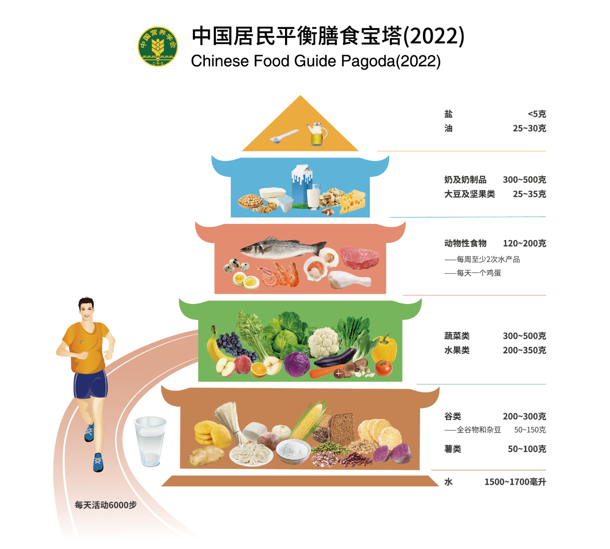

这里将会记录中国居民平衡膳食指南相关概念以及推荐饮食, `饮食多样, 吃动平衡, 健康体重`

## 基本概念
``` md
> 1. 中国居民平衡膳食5层宝塔
- 1. 谷薯类（350g）：`谷类`, 小麦、稻米、玉米、高粱, 米饭、馒头、烙饼、面包、饼干、麦片、米、玉米、绿豆、红豆、荞麦、红小豆、绿豆、芸豆、`薯类`, 马铃薯、红薯、山药等

- 2. 蔬菜水果类（500g）：`蔬菜`, 嫩茎、叶、花菜类、根菜类、鲜豆类、茄果瓜菜类、葱蒜类、菌藻类及水生蔬菜类、`水果`, 仁果、浆果、核果、柑橘类、瓜果及热带水果

- 3. 肉蛋类（150g）：鱼、禽、肉、蛋等动物性食物, 推荐瘦肉为主, 鱼肉, 虾类最佳, 少吃加工肉类, 比如火腿, 火锅丸子等.

- 4. 奶类（300g）、坚果、大豆类（30g）：大豆包括黄豆、黑豆、青豆，其常见的制品如豆腐、豆浆、豆腐干及千张等。坚果包括花生、葵花子、核桃、杏仁、榛子等

- 5. 油盐糖类：建议尽量少用
```

``` md
> 2. 运动和饮水
- 1. 每天进行至少相当于快步走 6000 步以上的身体活动，每周最好进行 150 分钟中等强度的运动，如骑车、跑步、庭院或农田的劳动等

- 2. 每天至少饮水 1500~1700ml（7~8 杯）。一天中饮水和整体膳食（包括食物中的水，汤、粥、奶等）水摄入共计 2700~3000ml。
```

## 饮食建议
``` md
> 1. 一日三餐(食物多样, 12种以上, 吃动平衡)
- 1. 早餐：蛋类(50g) + 奶类(300g)

- 2. 午餐：肉类(150g) + 谷类(300g)

- 3. 晚餐：蔬菜水果类(500g) + 薯类(75g)

- 5. 零食：坚果类(10g)

- 6. 少盐少油(30g)

- 7. 多运动, 5天中强度运动, 累计150分钟; 2天高强度运动, 多动少坐.

- 8. 多饮水(1600ml)
```

## 附录
[参考资料 中国居民平衡膳食指南官网](http://dg.cnsoc.org/article/04/RMAbPdrjQ6CGWTwmo62hQg.html)

[参考资料 中国居民膳食指南视频讲解](https://www.bilibili.com/video/BV1b3411K7px?spm_id_from=333.788.player.player_end_recommend_autoplay&vd_source=d8f1a92a6819b609cd269c666021ba71)

