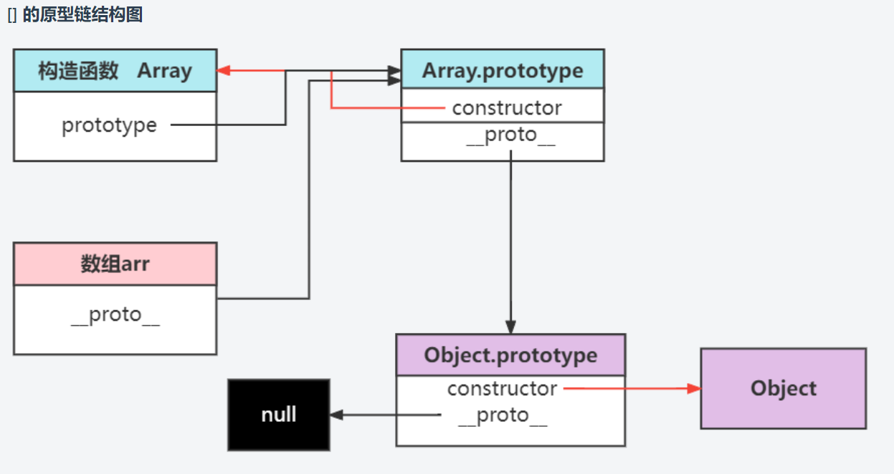
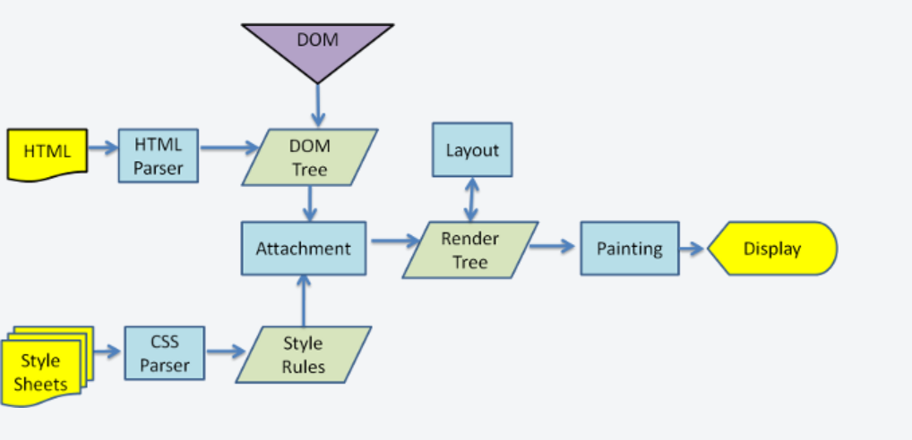
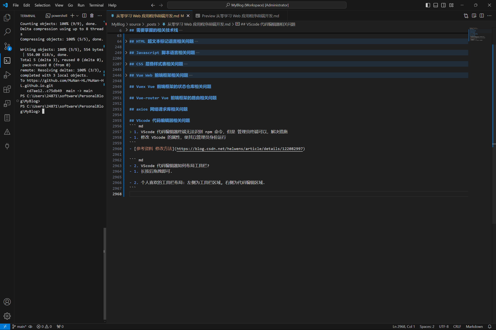
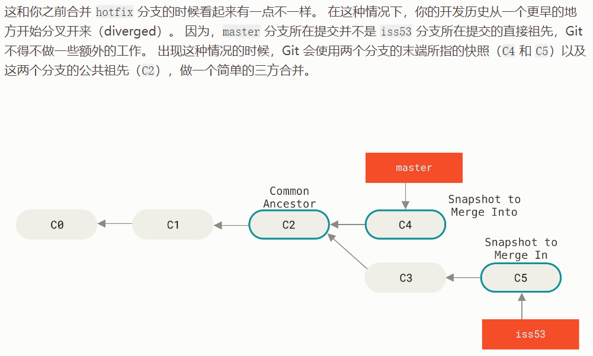
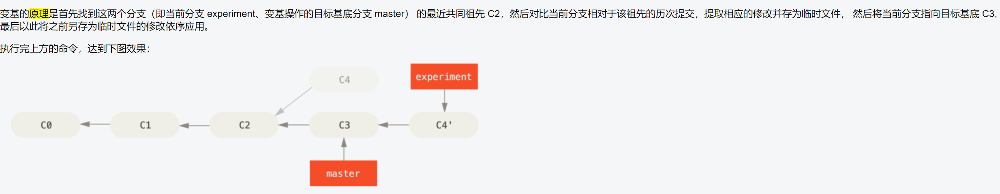

在这里你将学会如何进行 Web 网站前端开发.

## 需要掌握的相关技术栈
- [参考资料1 从零学习 Web 网站前端开发教程](https://class.imooc.com/sale/javafullstack?mc\\\_marking=dcb3a278c9a2b82d158d552ba3613449&mc\\\_channel=imoocsearch)

- [参考资料2 从零学习 Web 网站前端开发教程](https://www.bilibili.com/video/BV14J4114768/?vd_source=d8f1a92a6819b609cd269c666021ba71)
``` md
> 1. HTML /haɪ/t/mɑ/l/ 超文本标记语言

> 2. JavaScript /dʒɑ/s/ 语言

> 3. CSS /kæ/s/ʃi/ 层叠样式表(ʃi 不发音) 

> 4. Vue /v/u/e/ 网站前端框架

> 5. Vuex /v/u/e/kˈs/ 状态管理仓库 

> 6. Vue-router 路由器

> 7. Axios 网络请求库 
               
> 8. Ajax /ə/dʒæ/kˈs/ 异步的 JS 语言和 XML 可扩展标记语言

> 9. HTTP /haɪ/t/træ/p/ 超文本传输协议

> 10. XHR /ekˈs/haɪ/rɪ/ XMLHTTPRequest 可扩展的标记语言超文本传输协议请求

> 11. Nodejs /nəʊd/dʒɑ/s/ JS 语言运行环境

> 12. UML /u/mɑ/l/ 统一标记语言

> 13. Git 分布式版本控制系统

> 14. VScode 代码编辑器

> 15. GitHub 第三方远程仓库

> 16. Chrome 浏览器 

> 17. 设计模式

> 18. ES6 /ei/s/6/ 第六版 JS 语言规范

> 19. GUI /ɡ/u/ɪ/ 图形用户界面

> 20. Sass /s/'ɔ/s/ 语法很棒的样式表

> 21. SSR /se/s/ri/ 服务端渲染

> 22. Webpack 网站打包工具

> 23. SPA /s/p/æ/ 单页面应用程序 

> 24. UI 用户见面
```

## HTML 超文本标记语言相关问题
- [参考资料 HTML 教程](https://developer.mozilla.org/zh-CN/docs/Web/HTML)

- [参考资料 面试题](https://www.arryblog.com/interview/htmlcss/)

- 个人建议: 在进行 HTML 页面布局设计前, 最好在头脑中想象出你想要的效果.

``` md
> 1. HTML 是什么?
- 1. HTML 超文本标记语言, 一种用于定义网页内容和结构的语言.
```
- [参考资料 HTML 超文本标记语言](https://developer.mozilla.org/zh-CN/docs/Web/HTML)

``` md
> 2. 说说你对 HTML 语义化的理解 ？HTML5 新增了哪些语义化标签 ？
- 1. 对语义化的理解 
- HTML 语义化, 即赋予 HTML 元素, 特定的含义, 去做特定的事情.

- 2. HTML 语义化的优点
- 使得 HTML 代码更易维护.

- 页面内容结构化, 没有 CSS 样式, 也能呈现出好的页面内容.

- 更好的支持 SEO 搜索引擎优化.
```
- [参考资料1 语义化](https://developer.mozilla.org/zh-CN/docs/Glossary/Semantics)

- [参考资料2 语义化](https://github.com/YvetteLau/Step-By-Step/issues/8)

``` md
> 3. DOCTYPE /dɒkju/taɪp/ 文档类型是干嘛的，都有哪些属性
- 1. DOCTYPE 文档类型, 是用来定义文档类型的, 目的就是为了防止浏览器在渲染文档时, 使用非标准模式进行渲染.

- 2. 用法: <!DOCTYPE html>
```
- [参考资料1 DOCTYPE](https://developer.mozilla.org/zh-CN/docs/Glossary/Doctype)

- [参考资料2 DOCTYPE](https://www.freecodecamp.org/chinese/news/what-is-the-doctype-declaration-in-html/)

``` md
> 4. meta /metə/ 元元素是干什么的，都有什么属性和作用
- 1. meta 元元素, 用来描述 HTML 超文本标记语言文档的元素.

- 2. 具有的属性:
- charset 字符属性: 该属性定义了文档的字符编码。

- name 名称属性: name 作为元数据的名称.

- content 内容属性: 用于描述 name 或 http-equiv 属性

- http-equiv http 标头属性: 用于指定 HTTP 标头.(因为其所有允许的值都是特定 HTTP 标头的名称) 

- 注意: 当存在 name 名称属性 或 http-equiv 标头属性时, 必须搭配 content 内容属性.

- 补充信息1: 元数据, 描述数据的数据.
```
- [参考资料1 meta 元数据元素](https://juejin.cn/post/6844904083296370702)

- [参考资料2 meta 元数据元素](https://developer.mozilla.org/zh-CN/docs/Web/HTML/Element/meta#http-equiv)

``` md
> 5. 你了解哪些 HTML5 第五代超文本标记语言新特性
- 1. 元素语义化 **核心**

- 2. WebStorage 网站存储 **核心**

- 3. 增强型表单

- 4. 视频音频元素

- 5. 拖拽 API

- 6. 地理定位

- ...
```
- [参考资料 HTML5 新特性](https://juejin.cn/post/7036257361417207821)

``` md
> 6. HTML 超文本标记语言文档结构解释下
- 1. 可分为三部分, 第一部分是 <html> 超文本标记语言文档元素, 第二部分是 <head> 头部元素, 第三部分是 <body> 主体元素.
- 
<!--定义 当前文档类型为 html5标准-->
<!DOCTYPE html>
<!--定义 当前页面的语言类型-->
<html lang="en">
  <head>
    <!--网页的编码集-->
    <meta charset="UTF-8" />
    <!--IE8及以上的版本按照最新的标准去渲染-->
    <meta http-equiv="X-UA-Compatible" content="IE=edge" />
    <!--用户移动端适配-->
    <meta name="viewport" content="width=device-width, initial-scale=1.0" />
    <!--网页标题-->
    <title>艾编程</title>
    <!--网页关键词-->
    <meta name="Keywords" content="艾编程,WEB前端,Java架构师,Python课程" />
    <!--网页描述-->
    <meta name="description" content="为每个互联网人提供高质量的终身学习平台" />
  </head>
  <body>
    ......
  </body>
</html>
```
- [参考资料 HTML 文档结构](https://www.arryblog.com/interview/htmlcss/html-html5.html#%E9%AB%98%E9%A2%91%E9%87%8D%E7%82%B9)

``` md
> 7. 说一下 href 超链接引用和 src 资源的区别
- src 资源属性, 是用来指定外部资源的.

- href 超链接引用属性, 是用来指定超链接的.
```
- [参考资料 href 超链接引用](https://www.w3school.com.cn/tags/att_a_href.asp)

- [参考资料 src 资源](https://blog.51cto.com/u_14555/6814139)

``` md
> 8. script 脚本元素放在 head 头部元素那里怎么解决加载问题
- 1. 首先, script 脚本的加载, 分为同步加载和异步加载, 为了解决同步加载导致的阻塞问题, 我们应该使用异步加载. 

- 2. 那么我们可以通过使用 defer 延迟或 async 异步实现异步加载.

- defer 延迟, 异步加载 JS 脚本, 但是会延迟执行.

- async 异步, 异步加载 JS 脚本, 但是不会延迟执行, 会立刻执行该脚本.
```
- [参考资料 defer, async](https://zh.javascript.info/script-async-defer)

``` md
> 9. 浏览器中渲染引擎负责什么/执行过程?
- 0. 浏览器的渲染引擎主要负责四个部分, 即解析, 构建, 布局和绘制四步.

- 1. 其中, 解析负责解析 HTML 超文本标记语言代码和 CSS 层叠样式表代码, 得到 DOM 文档对象模型树和 CSSOM 层叠样式表对象模型树.

- 2. 构建, 主要负责得到 Render 渲染树.

- 3. 布局, 主要负责进行页面布局的计算, 计算每一个元素在页面对应的位置.

- 4. 绘制, 主要负责在显示器上显示相应内容.
```
- [参考资料 渲染引擎的执行过程](https://juejin.cn/post/7068097802676469773)

``` md
> 10. 了解过不同图片格式的区别吗
- 0. 我现在了解到的图片格式有 5 种吧, 分别是动图, 网图, 有损压缩和无损压缩图以及可伸缩矢量图.

- 1. .gif 动图: 可以实现动画效果

- 2. .jpg 有损压缩: 反复保存图片质量下降明显

- 3. .png 无损压缩: 高保真

- 4. .webp 网图, 即谷歌格式: 支持 动图, 有损压缩, 无损压缩, 但浏览器兼容性相对而言不好.

- 5. .svg 矢量图: 可伸缩性, 体积小, 与 DOM 无缝衔接
```
- [参考资料 了解过不同图片格式的区别吗](https://www.arryblog.com/interview/htmlcss/html-html5.html#%E9%AB%98%E9%A2%91%E9%87%8D%E7%82%B9)

``` md
> 11. 精灵图的原理和优缺点？
- 1. 首先, 精灵图就是指将多张图片合并为一张图片后所形成的图, 它的优点在于减少网络请求, 
因为本来多张图现在只需要请求一次就可得到了, 但是缺点就是, 导致项目的可维护性变差.
```
- [参考资料1 spirit 精灵图](https://github.com/haizlin/fe-interview/issues/55)

- [参考资料2 spirit 精灵图](https://www.arryblog.com/interview/htmlcss/html-html5.html#%E9%AB%98%E9%A2%91%E9%87%8D%E7%82%B9)

``` md
> 12. "data- *" 属性的作用是什么 ？ 
- 1. 首先, data-* 数据属性, 是一种自定义属性, 通过该属性, 使得我们可以在所有的 HTML 超文本标记语言元素上嵌入自定义数据属性. 
便于实现 HTML 超文本标记语言和 DOM 文档对象模型之间的私有数据交互.
```
``` html
<div id="animal" data-type="cat"></div>
<div id="people" data-type-name="arry老师"></div>
<script>
  var animal = document.getElementById("animal");
  var people = document.getElementById("people");
  // 使用 dataset属性赋值
  animal.dataset.type = "sheep";
  // 使用 dataset属性取值
  console.log(animal.dataset.type); // sheep

  // 如果是 data-abc-abc-abc 的格式，则采用首字母小写的驼峰式 abcAbcAbc 读写该自定义属性值
  // data多个连字符赋值
  people.dataset.typeName = "清心老师";
  // data多个连字符取值
  console.log(people.dataset.typeName); // 清心老师

  // 使用setAttribute 给data属性赋值
  animal.setAttribute("data-type", "dog");
  // 使用getAttribute取值
  console.log(animal.getAttribute("data-type")); // dog

  // 如果是 data-abc-abc-abc 的格式，则采用首字母小写的驼峰式 abcAbcAbc 读写该自定义属性值
  // setAttribute多个连字符赋值
  people.setAttribute("typeName", "allen老师");
  // getAttribute多个连字符取值
  console.log(people.getAttribute("typeName")); // allen老师

  // jQuery中使用
  // 设置data属性： $("元素").attr("key","value")或 $("元素").data("key","value") 即可
</script>
```
- [参考资料1 data-* 数据属性](https://developer.mozilla.org/zh-CN/docs/Web/HTML/Global_attributes/data-*)

- [参考资料2 data-* 数据属性](https://www.arryblog.com/interview/htmlcss/html-html5.html#%E9%AB%98%E9%A2%91%E9%87%8D%E7%82%B9)

``` md
> 13. HTML 超文本标记语言中的 void 空元素是什么 ？
- 1. void 空元素, 指元素的内容是空的元素, 也即不需要关闭标签的元素.

- 2. 例如: <br />、、<hr />
```

``` md
> 13. HTML5 第五版超文本标记语言中的内联元素和块级元素分别有哪些 ？
- 1. 首先, 基本的内联元素有 span 内联元素, input 输入元素, img 图像元素, a 锚点元素等..., 
基本的块级元素有 div 块级元素, table 表格元素, form 表单元素, h 标题元素等...
```
- [参考资料 HTML5 中的内联元素和块级元素分别有哪些 ？](https://www.arryblog.com/interview/htmlcss/html-html5.html#html-html5-%E5%9F%BA%E7%A1%80)

## Javascript 语言相关问题
- [参考资料1 Javascript 教程](https://developer.mozilla.org/zh-CN/docs/Web/JavaScript)

- [参考资料2 Javascript 教程](https://zh.javascript.info/)

- [参考资料1 面试题](https://www.arryblog.com/interview/js/#%E6%95%B0%E6%8D%AE%E7%B1%BB%E5%9E%8B%E5%92%8C%E5%8F%98%E9%87%8F)

- [参考资料2 面试题](https://github.com/mqyqingfeng/Blog)

- [参考资料3 面试题](https://vue3js.cn/interview/)

- 个人建议, 在进行编程时, 最好清楚的知道你要做什么.
``` md
> 1. Javascript 是什么?
- 1. Javascript 语言, 一种基于原型的, 单线程的语言. `一种进行网站交互的语言`.

- 补充知识1: 阅读 JS 语言代码, 你需要知道的一点就是, `做任何事情重要的就是去阅读`, 
对于编程更是如此, 你需要学会阅读代码, `使用你的母语去阅读`.
```
``` js
// 定义一个变量 a，将 1 赋值给 a；
let a = 1; 

// 定义一个函数 addCount，其返回值为一个匿名函数
function addCount() {
  var count = 0;
  return function () {
    count = count + 1;
    console.log(count);
  };
}

// 定义一个变量 fun2，将 addCount() 的返回值赋予 fun2 
let fun2 = addCount();

// 执行 fun2() 函数
fun2(); // 1
```
- [参考资料 Javascript](https://developer.mozilla.org/zh-CN/docs/Learn/JavaScript/First_steps/What_is_JavaScript)

``` md
> 2. JS 语言如何获取时间戳？ 
- 0. 通过日期实例获取时间戳.

- 1. let timestamp = +new Date(); **推荐**

- 2. let timestamp = new Date().getTime();

- 3. let timestamp = Date.parse(new Date());  

- 4. let timestamp = (new Date()).valueOf(); 
```
- [参考资料 时间戳](https://blog.csdn.net/qq_30671099/article/details/112363421)

``` md
> 3. JS 中的 Date 日期的语法？
- 1. 由于 JS 是一个动态语言，所以定义 数据类型的关键字只有 const(常量)、let(变量)、var(不建议)

- 2. 定义 一个日期对象 const aDate = new Date(); // 接受传参，传参不同日期类的构造函数的返回值不同。

- 3. 实例化 日期 对象，new Date();

- 4. 调用日期对象的方法如下：

- 5. 获取时间戳：aDate.now();
```
- [参考资料 Date 日期类](https://developer.mozilla.org/zh-CN/docs/Web/JavaScript/Reference/Global_Objects/Date/Date)

``` md
> 4. JS 语言有哪些数据类型，如何判断这些数据类型 ？
- 1. JS 语言有 7 种基本数据类型：字符串类型、数值类型、布尔类型、未定义类型、空类型、符号类型、大整数类型 

- 2. 一种引用数据类型：对象

- 3. 4 种判断数据类型的方法：typeof 类型检测（适用于基本数据类型）、
instanceof 实例检测（适用于引用数据类型）、constructor 构造器、Object.prototype.toString.call() 转化为字符串方法
```
- [参考资料 JS 有哪些数据类型，如何判断这些数据类型](https://www.arryblog.com/interview/js/js-data-type.html)

``` md
> 5. JS 语言中 null 空和 undefined 未定义的区别 ？
- 1. undefined 未定义：7 种基本数据类型种的未定义，表示变量已定义 但是未赋值。

- 2. null 空：7 种基本数据类型中的为空，表示对一个空引用.
```

``` md
> 6. JS 语言中基本数据类型和引用数据类型的区别？
- 1. 基本数据类型指的是 7 中基本数据类型, 而引用数据类型指的是对象, 它们的存储方式是不一样的, 
基本数据类型是存储于栈内存之中的, 而引用数据类型是存储于堆内存之中的, 只是其引用地址是存储于栈内存的.
```

``` md
> 7. JS 语言中的栈内存和堆内存的区别？
- 0. 首先, 对于内存问题, 就要讲内存的生命周期, `简单来说就是三个阶段, 即分配内存, 使用内存和释放内存三个阶段`
(为什么不是从创建内存开始呢? 因为内存即内部存储器属于硬件部分, 是一开始就存在的, 依次不存在创建内存, 第一步就是分配内存). 
`在分配内存阶段`, JS 语言中的栈内存和堆内存都是自动分配的, 
`在使用内存阶段`, 栈内存存储的是基本数据类型且大小固定, 而堆内存存储的是引用数据类型且大小不固定, 且前者为值传递后者为引用传递. 
`在释放内存阶段`, JS 语言使用的是垃圾回收机制自动的进行内存回收.

- 1. 栈内存和堆内存是 JS 中内存管理机制决定的.

- 2. 栈内存 和 堆内存 的区别在于, 
- 1. 存储的数据类型不同, 栈内存用来存储基本数据类型的变量以及引用数据类型变量的引用地址. 而堆内存则用来存储引用数据类型的变量.

- 2. 内存分配的策略不同, 栈内存为系统自动分配, 自动释放, 且大小固定; 堆内存为开发人员手动分配, 系统不会自动释放, 且大小不定. 

- 补充知识1: JS 中的常量是存储在 (常量)池中的.

- 补充知识2: 闭包中的变量, 存储在堆内存中. 即使该变量是基本数据类型的变量.
```
- [参考资料1 栈内存和堆内存](https://juejin.cn/post/6844903873992196110#heading-11)

- [参考资料2 栈内存和堆内存](https://wuch886.gitbooks.io/front-end-handbook/content/jszhong-de-nei-cun-guan-li-ff08-zhan-he-dui-ff09.html)

``` md
> 8. JS 语言中 typeof(NaN) 类型检测的返回结果？
- NaN，是 not a number 不是一个数，所以 typeof(NaN) 返回结果为基本数据类型，数值类型。

- 注意：不是一个数，不是表示不是数值类型。**具体的数和数值类型不要弄混了**。
```

``` md
> 9. JS 语言如何判断一个变量的值是 NaN ?
- 0. 首先需要进行类型检测, 检测是否为数值类型, 然后判断是否为非数值.

- 1. typeof a === "number" && isNaN(a);
```

``` md
> 10. JS 语言中 typeof 类型检测能判断那些类型 ？
- 1. typeof 类型检测判断基本数据类型时，除了 null 的输出结果为'object' 其它类型都能正确判断

- 2. typeof 类型检测判断引用数据类型时，除了判断函数会输出'function' 其它都输出'object'
```

``` md
> 11. JS 语言中 typeof(null) 类型检测为什么返回的是'object' 对象?
- 1. 首先是因为 null 空本身表示的是空引用, 即空对象. 其次是因为 JS 语言的底层实现数据类型判断的机制有关，
JS 的数据类型判断本质是通过数据转换为二进制后，位数的前三位进行判断的，用前三位为 000 表示 引用数据类型，
而 null 为全 0，因此产生了 typeof(null) 的返回的是 'object' 的问题。
```

``` md
> 12. JS 语言中 == 双等和 === 三等的区别？
- 1. == 双等会进行隐式数据类型转换，然后在比较值是否相对。

- 2. === 三等不会进行隐式的数据类型转换, 因此只要数据类型不相等也是不等.
```

``` md
> 13. JS 语言中你怎么理解变量提升？
- 1. JS 语言的变量提升, 是指 JS 语言通过 var 变量定义的变量, 会在代码执行前, 自动提升到作用域顶部的这一行为.

- 补充知识1：只是进行变量提升，而不是初始化提升, 因此提升后的变量的值为 undefined 未定义。

- 补充知识2：JS 语言中还存在函数提升，且优先级高于变量提升。所以如果出现了重名的变量和函数，提升会以函数为主。因此请遵守命名规范。
```

``` md
> 14. const 常量、let 变量、var 变量的区别？
- 1. const 常量用于定义常量，let 变量用于定义变量，var 变量也用于定义变量。

- 2. 常量 和 变量 的区别，常量表示不可修改，变量表示可以修改。需要注意的是，此处的是否可以修改是指对栈内存的修改。

- 3. var 存在 变量提升，但是 const 和 let 不存在，因此 const 常量和 let 变量会存在暂时性死区。

- 4. const 常量和 let 变量存在块级作用域的。

- 5. 推荐使用方法，const 用于定义常量和引用数据类型，其他时候推荐使用 let。需要注意，var 是不被推荐的。
```

``` md
> 15. JS 语言中的垃圾回收机制是什么？
- 1. JS 语言中的垃圾回收策略分为`标记清除策略`和`引用计数策略`两种。

- 1. 标记清理策略，表示的是，给每一个变量加上`存在上下文的标记`, 如果没有该标记，则垃圾回收器会回收该变量的内存，反之不会。

- 2. 引用计数策略**最初的**，表示的是，给每一个变量加上`引用数`，如果引用数为 0，则垃圾回收器就会 **立刻** 回收该变量的内存。

- 补充知识1, 现在的 chrome 谷歌浏览器使用的是标记去除的垃圾回收策略.
```
- [参考资料 垃圾回收策略](https://www.arryblog.com/interview/js/js-closure-scope.html)

``` md
> 16. JS 语言中的闭包里面的变量为什么不会被垃圾回收？
- 1. JS 语言中的闭包函数本质就是一个内部函数, 因此其能够访问外部函数的内部变量且可以记住该变量.

- 2. 闭包函数示例如下：f2 函数可以读取 f1 函数中的变量，因此 f2 函数就是 f1 函数的 闭包函数。

- 3. 代码示例:
```
``` js
function outerFunction() {
  let count = 0; // 外部作用域的变量

  function innerFunction() {
    count++; // 内部作用域可以访问并修改外部作用域的变量
    console.log(count);
  }

  return innerFunction; // 返回闭包函数
}

const closureFunc = outerFunction(); // 创建闭包函数实例
closureFunc(); // 输出 1
closureFunc(); // 输出 2
closureFunc(); // 输出 3
// 每次调用闭包函数，都会记住并访问外部作用域的 count 变量，并对其进行递增操作。
```
- [参考资料 闭包](https://www.arryblog.com/interview/js/js-closure-scope.html)

- [参考资料 闭包的记忆性](https://www.arryblog.com/interview/js/%E9%97%AD%E5%8C%85.html#_6%E3%80%81%E4%BD%BF%E7%94%A8%E9%97%AD%E5%8C%85%E7%9A%84%E6%B3%A8%E6%84%8F%E7%82%B9-%E7%BC%BA%E7%82%B9%E6%88%96%E5%8D%B1%E5%AE%B3)

``` md
> 17. JS 语言中的 this 对象实例指向是什么？ 
- 1. JS 语言中的 this 对象实例，会指向当前的调用者。

- 补充知识1：全局作用域下，this 指向 window 对象。

- 补充知识2: 你清楚下面代码的返回值吗？

- 解题思路：
  1 函数中的 this 指的是调用这个函数的 owner

  2 object.getNameFunc() 是返回一个函数，并没有执行函数中的代码.
```
``` js
- 代码片段1：
let name = "The Window";
let object = {
　name : "My Object",

　getNameFunc : function(){
　　return function(){
　　　return this.name;
　　};
　}
};

alert(object.getNameFunc()());

- 代码片段2：
let name = "The Window";
let object = {
　name : "My Object",

　getNameFunc : function(){
　　let that = this;

　　return function(){
　　　return that.name;
　　};
　},
};

alert(object.getNameFunc()());
```
- [参考资料 闭包 和 this 指向](https://www.ruanyifeng.com/blog/2009/08/learning_javascript_closures.html)

``` md
> 18. 说说 JS 语言中的作用域和作用域链
- 1. JS 语言中的作用域是词法作用域, 即静态作用域，也即在函数定义阶段该函数的作用域链就已经确定了. `作用域是指程序中定义变量的区域`

- 2. JS 语言中的作用域链，表示的是多个作用域所形成的一条链。重点在于`作用域链的查找策略`

- 补充知识1: JS 的变量查找策略, 是从内向外沿着作用域链查找. 内部环境可以通过作用域链访问所有外部环境，但外部环境不能访问内部环境的任何变量和函数。

- 补充知识2: JS 中的作用域链不止一条。每一个函数都有一条自己的作用域链，且函数定义阶段以及存在。
```

``` md
> 19. 你怎么理解 JS 语言中的执行流?
- 1. 首先, JS 语言的执行流, 你需要了解 JS 引擎的执行过程. 简单来说就是三个阶段, 即语法分析阶段, 预编译阶段, 和执行阶段.
```
- [参考资料 JS 引擎的执行过程](https://heyingye.github.io/2018/03/19/js%E5%BC%95%E6%93%8E%E7%9A%84%E6%89%A7%E8%A1%8C%E8%BF%87%E7%A8%8B%EF%BC%88%E4%B8%80%EF%BC%89/#%E6%A6%82%E8%BF%B0)

``` md
> 20. 你怎么理解 JS 中的作用域?
- 1. 全局作用域，即全局上下文.

- 2. 函数作用域，即函数上下文.

- 3. 块级作用域，即块级上下文.

- 补充知识1：只有 let 和 const 定义的变量才具有块级作用域。var 定义的变量不存在块级作用域.
```
- [参考资料 块级上下文](https://juejin.cn/post/6981740737209565215)

``` md
> 21. JS 语言的作用域是静态作用域还是动态作用域？
- 1. 静态作用域, 即词法作用域, 指函数作用域链在函数定义阶段已经被确定了. 

- 2. 动态作用域, 指函数作用域在函数被调用时才被确定。

- 补充知识1: JS 代码的执行顺序是顺序执行的, 不要和作用域链查找机制混淆, 
作用链查找机制是指当前函数查找变量和其他函数时的是沿着作用域链查找的.
```
- [参考资料 JS 函数的作用域链查找顺序](https://juejin.cn/post/7022537890114568205)

``` md
> 22. JS 语言遍历对象的方法？
- 1. for in 循环**推荐**, 会遍历原型链上的可枚举属性, 可能会导致性能下降. `如果是可迭代对象, 建议使用 for of 遍历.`
const obj = {a: 1, b: 2, c: 3};
for (let key in obj) {
  if (obj.hasOwnProperty(key)) { // 检查属性是否属于对象自身, 因为它会遍历对象自身的所有可枚举属性，包括原型链上的属性。
    console.log(key + ": " + obj[key]);
  }
}

- 2. 或者通过 Object.keys(obj) 得到 key 键的数组, 然后去遍历数组. 

- 补充知识1: 怎么判断一个对象是否是可迭代对象?
- 1. 检测对象内的迭代器属性是否为函数即可, 代码示例:
```
``` js
const isIterable = (obj) => {
  return obj != null && typeof obj[Symbol.iterator] === 'function';
}
console.log(isIterable);
```
- [参考资料 变量对象](https://www.cnblogs.com/yuer20180726/p/11377897.html)

``` md
> 23. JS 语言中遍历数组的方法？
- 1. forEach （不支持 break 跳出循环，只能通过 抛出异常的方式跳出循环。）**推荐**

- 1. for of（支持 break 跳出循环）
```
- [参考资料 遍历对象和数组](https://www.cnblogs.com/yuer20180726/p/11377897.html)

``` md
> 24. JS 语言中的原型和原型链你怎么理解？
- 1. 原型, 即原型对象, JS 本身就是一门基于原型的编程语言。应用设计模式中的原型模式开发而来的语言。

- 2. JS 中的原型链，是指对象实例, 原型对象, 构造函数三者的原型属性连接而成的一条链。

- 补充知识1: 原型链结构图如下：实例对象，原型对象，构造函数之间的关系
```


- [参考资料 原型链](https://www.arryblog.com/interview/js/js-prototype.html)

``` md
> 25. JS 语言的原型链的终点是什么？
- 1. 原型属性指向为 null 空.

- 补充知识1: null 本身不是对象，typeof null === 'object’, 是 JS 语言本身的一个 bug。
其原理是不同的对象在底层都是用二进制来表示的，在 JS 中二进制前 3 位是 0 即判断是为对象，
null 的二进制表示是全 0，即前三位都是 0，所以执行 typeof 返回的是 object，实际上 null 为基本数据类型。 
```

``` md
> 26. 说说 [] 空数组的原型链？
```
![[] 的原型链]([]的原型链.jpg)

``` md
> 27. 什么是继承？
- 1. 首先, 继承是指一种关系, 一种两个类之间的关系.

- 补充知识1: 类之间的关系：父类和子类、基类和导出类等
```

``` md
> 27. JS 语言中如何实现继承？
- 1. ES6 第六版 JS 语言规范之前：通过原型链的方法实现继承。

- 2. ES6 第六版 JS 语言规范之后：通过 class 类 和 extends 继承实现
```
- [参考资料 JS 语言的继承](https://www.arryblog.com/interview/js/%E7%BB%A7%E6%89%BF.html#_1%E3%80%81%E4%BB%80%E4%B9%88%E6%98%AF%E7%BB%A7%E6%89%BF)

``` md
> 28. JS 语言中如何实现变量交换？
- 1. 借助数组实现
let a = 1;
let b = 2;

a = [a, b]; // 让 a 变成数组
b = a[0]; // 先取出 b
a = a[1]; // 再覆盖 

- 2. 借助对象实现
let a = 1;
let b = 2;

a = { a: b, b: a };
b = a.b;
a = a.a;

- 3. 通过解构的方法实现 **推荐**
let a = 1;
let b = 2;

[a, b] = [b, a];
```
- [参考资料 JS 实现变量交换](https://www.arryblog.com/interview/js/%E5%8F%98%E9%87%8F%E4%BA%A4%E6%8D%A2.html)

``` md
> 29. JS 语言实现反转数组的最佳实践, 即如何在不改变原始数组的情况下反转数组
- 1. 使用 slice 切片和 reverse 反向方法 **推荐**
const originalArray = [1, 2, 3, 4, 5];
const newArray = originalArray.slice().reverse(); // slice 切片一个数组将产生一个新副本

console.log(originalArray); // [1, 2, 3, 4, 5]
console.log(newArray); // [ 5, 4, 3, 2, 1]

- 2. 使用 spread 扩展和 reverse 反向方法 **推荐**
const originalArray = [1, 2, 3, 4, 5];
const newArray = [...originalArray].reverse();

console.log(originalArray); // [1, 2, 3, 4, 5]
console.log(newArray); // [ 5, 4, 3, 2, 1]

- 3. 使用 reduce 简化和 spread 扩展方法
const originalArray = [1, 2, 3, 4, 5];
const newArray = originalArray.reduce((accumulator, currentValue) => {
  return [currentValue, ...accumulator];
}, []);

console.log(originalArray); // [1, 2, 3, 4, 5]
console.log(newArray); // [ 5, 4, 3, 2, 1]

- 补充知识1: reduce 归并去遍历数组.
- reduce((accumulator, currentValue, index, array)=>{
  return 返回值;
},initialValue)
```
- [参考资料 反转数组](https://www.arryblog.com/interview/js/%E5%8F%8D%E8%BD%AC%E6%95%B0%E7%BB%84.html#_1%E3%80%81%E4%BD%BF%E7%94%A8%E5%88%87%E7%89%87%E5%92%8C%E5%8F%8D%E5%90%91%E6%96%B9%E6%B3%95)

- [参考资料 reduce 归并](https://www.freecodecamp.org/chinese/news/the-ultimate-guide-to-javascript-array-methods-reduce/)

``` md
> 30. JS 语言如何实现对象或数组的深克隆？
- 1. 使用递归实现。

- 补充知识1: 递归，表示的是一种函数自己调用自己，并在达到某个条件之后，停止调用的技巧。
需要注意的是，进行递归要具有递归出口（也即边界条件）和递归体（决定了大问题是如何分解为小问题的）

- 补充知识2: 以数组为例实现深克隆：
- 1. 如果遍历到项是基本类型值，则直接推入结果数组；

- 2. 如果遍历到的项是又是数组，则重复执行深克隆的操作。
```
``` js
// 原数组
let arr1 = [22, 11, 33, 55, [88, 66, [97, 61], 99]];

// 函数，这个函数会被递归（暂时不考虑对象，等以后学习了再讲）
function deepClone(arr) {
  // 结果数组，”每一层“ 都有一个结果数组
  let result = [];
  // 遍历数组的每一项
  for (let i = 0; i < arr.length; i++) {
    // 类型判断，如果遍历到的项是数组
    if (Array.isArray(arr[i])) {
      // 递归
      result.push(deepClone(arr[i]));
    } else {
      // 如果遍历到项不是数组，是基本类型值，就直接推入到结果数组中
      // 相当于是递归的出口
      result.push(arr[i]);
    }
  }
  // 返回结果数组
  return result;
}

// 测试一下
let arr2 = deepClone(arr1);
console.log(arr2);

// 测试是否藕断丝连
console.log(arr1[4] == arr2[4]); // false

arr1[4].push(88888);
console.log(arr2); // 数组的项没有被改变，深克隆成功

// 再测试
console.log(arr1[4][2] == arr2[4][2]);
arr1[4][2].push(56789);
console.log(arr1); // arr1被推入
console.log(arr2); // arr2 没有被推入，深克隆成功
```

``` js
> 31. JS 语言中使用递归计算前 n 项的斐波那契数列之和，斐波那契数列：1、1、2、3、5、8、13、21
代码如下：
// 编写一个函数，这个函数的功能是返回斐波那契数列中下标为n的那项的值
function fib(n) {
  // 递归出口
  // 数列的下标为0的项和下标为1的项值是1
  if (n == 0 || n == 1) return 1;

  // 递归体
  // 斐波那契数列的本质特征就是每一项，等于前面两项的和
  return fib(n - 1) + fib(n - 2);
}

// 书写一个循环语句，计算斐波那契数列的前15项
for (let i = 0; i < 15; i++) {
  console.log(fib(i));
}
```

``` md
> 32. JS 语言中如何实现防抖和节流？
- 0. `防抖和节流都是指多次触发事件后, 我最终只会执行一次, 但是区别在于,` 
`防抖的话, 在防抖时间内多次触发, 它是会重新计数的, 而节流则不会. 它们的本质都是为了限流.`

- 1. 防抖: 就是指触发事件后的等待时间中, 只会执行一次, 只执行第一次或最后一次, 如果在等待事件内再次触发, 则会重新计算等待时间.

- 2. 节流: 就是指触发事件后的等待时间中, 只会执行一次, 如果在等待事件内再次触发, 不会重新计算等待时间. 因此节流会稀释函数的执行频率 1次/wait.

- 补充知识1: 防抖和节流的区别在于, 防抖函数在等待时间内若再次触发事件, 会重新计算等待时间, 而节流不会.

- 实现方法：利用定时器实现。
```
``` js
// 防抖函数
// 触发高频事件后一段时间（wait）只会执行一次函数，如果指定时间（wait）内高频事件再次被触发，则重新计算时间。
function debounce(func, wait) {
  let timeout = null;
  return function () {
    let context = this;
    let args = arguments;
    if (timeout) clearTimeout(timeout);
    timeout = setTimeout(() => {
      func.apply(context, args);
    }, wait);
  };
}

// 节流函数
// 规定在一个单位时间内，只能触发一次函数。如果这个单位时间内触发多次函数，只有一次生效
function throttle(func, wait) {
  let timeout = null;
  return function () {
    let context = this;
    let args = arguments;
    if (!timeout) {
      timeout = setTimeout(() => {
        timeout = null;
        func.apply(context, args);
      }, wait);
    }
  };
}
```

``` md
> 33. JS 语言中的数值类型表示整数的最大范围？
- 0. JS 语言中的数值类型采用的是双精度浮点型, 共 64 位, 使用 1 位表示符号, 10 位表示指数数, 
剩下的表示小数, 通过计算可知整数的表示范围在 (-2^53, 2^53)  

- 1. JavaScript 能够准确表示的整数范围在-2^53 到 2^53 之间（不含两个端点）. 
因此，当通过 JS 表示大整数的时候，建议通过字符串 类型，进行传递，防止丢失精度. 虽然现在已经有了 BigInt 大整数.
```
- [参考资料 数字类型所表示的范围](https://cloud.tencent.com/developer/article/1488194)

``` md
> 34. 闭包里面的变量为什么不会被回收？
- 0. 因为闭包函数本质就是一个内部函数, 它可以一直访问外部函数的变量, 
导致外部变量会被保存在内部函数中, 而不会被垃圾回收器回收. 

- 1. 因为闭包内的变量引用数不为 0. 由于闭包本身的特点，闭包函数可以访问其他函数的内部变量，
导致闭包函数和其他函数的内部变量一至存在引用关系，因此闭包里面的变量为什么不会被回收。
```

``` md
> 35. Es6 第六版 JS 语言规范中的 class 类怎么设置原型、静态、实例方法？
- 1. 实例属性和实例方法, 定义在类的构造函数中的属性和方法, 或者直接定义在类中的属性为实例属性, 
需要注意的是直接定义在类中的方法是原型方法. **只能通过实例对象访问**.

因此, 建议通过构造函数定义实例属性和方法.
```
``` js
class Person{
  // 实例属性 不常用
  temp = 'briup';
  constructor(name,age){
    // 实例属性  常用
    this.name = name;
    this.age = age;
    // 实例方法  不常用
    this.sayName = function(){
      console.log("i am ",this.name);
    }
  }
}
```


``` md
- 2. 静态属性和静态方法, 通过 static 关键字定义在类中的属性和方法. **只能通过类直接访问**.
```
``` js

class Person {
  // 静态属性
  static num = 200;
  // 静态方法
  static number() {
    console.log(this); // [class Person] { num: 200 }
    return this.num;
  }
}
```

``` md
- 3. 原型属性和方法, 定义在原型对象上的属性和方法, 或者是直接定义在类中的方法为原型方法. **只能通过原型对象访问**
因此, 通过原型对象定义原型属性和方法. 
```
``` js

class Person {
  constructor(name, age) {
    this.name = name;
    this.age = age;
  }
  // 原型方法 常用
  sayName() {
    console.log("i am ", this.name);
  }
}
// 原型属性 不常用
Person.prototype.temp = 'briup';
```

``` md
- 4. 继承, class 可以通过 extends 关键字实现继承.

- 补充知识1: 子类如果提供了构造函数就必须显示调用super。super函数类似于之前的借用构造函数。
子类必须在constructor方法中调用super方法，否则新建实例时会报错。这是因为子类自己的this对象，
必须先通过父类的构造函数完成塑造，得到与父类同样的实例属性和方法，然后再对其进行加工，
加上子类自己的实例属性和方法。如果不调用super方法，子类就得不到this对象。
```
``` js
class Animal { 
	constructor(name){
    this.name = name;
	}
	sayName(){
    console.log("my name is ",this.name);
	}
}
class Dog extends Animal{
	constructor(name,age){
    super(name); 
    this.age = age;
	}
}
let dog = new Dog('乐乐','1');
dog.sayName();
// 打印出：my name is  乐乐
```

``` md
- 5. super 关键字, 既可以当作父类的构造器函数使用，也可以当作父类本身或者父类的原型对象使用。
```
``` js
class A {}
 
class B extends A {
  constructor() {
    // 作为函数调用时，代表父类的构造函数
    super();
  }
}
```

``` js
class A {
  // 直接定义在类中的属性是实例属性, 定义在构造函数中的方法为实例方法.
  temp = 'briup';

  // 直接定义在类中的方法是原型方法.
  p() {
    return 2;
  }
}
 
class B extends A {
  constructor() {
    // 作为函数调用时，代表父类的构造函数
    super(); 

    // 作为对象时，在普通方法中，指向父类的原型对象. 原型对象只可以访问原型对象的属性和方法.
    console.log(super.p()); 
  }
}
 
let b = new B();
```

``` js
class A {
  // 静态属性
  static num = 200;
  constructor() {
    this.num = 20;
  }
  // 静态方法
  static number() {
    return this.num;
  }
}
class B extends A {
  static getNumber() {
    // 作为对象时, 在静态方法中, 指向父类本身, 需要注意的是, 类本身只可以访问静态属性和方法.
    return super.number();
  }
}
console.log(B.getNumber());  //200
```
``` md
- 补充知识1: 最佳实践, 实例属性和方法在构造器函数中定义, 原型方法直接定义在类中, 原型属性通过原型对象定义, 静态方法和属性之间定义在类中.

- 补充知识2: 实列属性就是共有属性, 静态属性就是私有属性.
```
``` js
class Person{
  constructor(name,age){
    // 实例属性
    this.name = name;
    this.age = age;
    // 实例方法
    this.sayName = function(){
      console.log("i am ",this.name);
    }
  };

  // 原型方法(ES6 第六版 JS 语言规范中定义原型方法和原型属性的最佳实践, 区别于 ES6 之前的最佳实践)
  p() {
    return 2;
  };

  // 静态属性
  static num = 200;
  // 静态方法
  static number() {
    console.log(this); // [class Person] { num: 200 }
    return this.num;
  };
};
// ES6 之前定义原型方法和原型属性的最佳实践
Personal.prototype.temp = "原型属性";
```
- [参考资料 ES6 定义类](https://blog.csdn.net/qq_51066068/article/details/124705885)

- [参考资料 实例属性和方法, 原型属性和方法, 静态属性和方法](https://blog.csdn.net/yihanzhi/article/details/121421349)

``` md
> 36. 你知道 JS 语言中的数组有哪些方法 ？
- 0. 简单可以分为操作元素的方法和操作数组的方法两大类.
```
``` js
- 1. 尾端增删元素 push 推入, 从末尾推入一个元素
arr.push(...items) —— 从尾端添加元素，返回修改后的数组

arr.pop() —— 从尾端提取元素，返回修改后的数组

- 2. 首端增删元素, shift 移除, 移除数组第一个元素
arr.shift() —— 从首端提取元素，返回修改后的数组

arr.unshift(...items) —— 从首端添加元素。返回修改后的数组

- 3. splice 拼接, 去操作数组, 对数组任意位置增删元素, 返回修改后的数组
arr.splice(start[, deleteCount, elem1, ..., elemN]) —— 从 start 位置删除或添加元素，返回修改后的数组

- 4. slice 切片, 去复制数组
arr.slice([start], [end]) —— 复制 start 到 end 的元素，返回新的数组。注意：若未未串任何参数，则是返回数组的备份。

- 5. concat 合并, 去合并数组, 会返回一个新数组
arr.concat(arg1, arg2...)

- 5. indexOf 索引, 查找并返回元素的索引
arr.indexOf(item, from) —— 从索引 from 开始搜索 item，如果找到则返回索引，否则返回 -1。

arr.includes(item, from) —— 从索引 from 开始搜索 item，如果找到则返回 true（译注：如果没找到，则返回 false）。

- 7. forEach 遍历去遍历数组, 返回值取决于 return 返回的返回条件, 根据返回条件返回期待的数据.
arr.forEach((item, index, array)=>{
  // ... do something with item
  return 返回条件;
});

- 8. find 查找遍历数组, 返回值取决于 return 返回的返回条件, 根据返回条件返回期待的数据.
let result = arr.find((item, index, array)=>{
  // 如果返回 true，则返回 item 并停止迭代
  // 对于假值（falsy）的情况，则返回 undefined

  return 返回条件;
});

- 9. filter 过滤遍历数组, 返回值取决于 return 返回的返回条件, 根据返回条件返回期待的数据 - 数组.
let results = arr.filter((item, index, array)=>{
  // 如果 true item 被 push 到 results，迭代继续
  // 如果什么都没找到，则返回空数组

  return 返回条件;
});

- 10. map 映射遍历数组, 返回值取决于 return 返回的返回条件, 根据返回条件返回期待的数据 - 数组.
let result = arr.map((item, index, array)=>{
  // 返回新值而不是当前元素

  return 返回条件;
})

- 11. reduce 简化遍历数组, 返回值取决于 return 返回的返回条件, 根据返回条件返回期待的数据.
let value = arr.reduce((accumulator, item, index, array) => {
  // ...

  return accumulator + item; 
}, [initial]);

- 12. sort 原位排序（原位是指在此数组内，而非生成一个新数组。）
arr.sort(callback)

let arr = [ 1, 2, 15 ];

// 该方法重新排列 arr 的内容
arr.sort();

alert( arr );  // 1, 15, 2

需要注意的是：sort 默认是按照字符串排序的。因此需要按照数字排序，需要给 sort() 函数传一个回调函数。
function compareNumeric(a, b) {
  if (a > b) return 1;
  if (a == b) return 0;
  if (a < b) return -1;
}

let arr = [ 1, 2, 15 ];

arr.sort(compareNumeric);
<!-- 下面的也可以 -->
arr.sort( (a, b) => a - b );

alert(arr);  // 1, 2, 15

<!-- 字符串原位排序 -->
let countries = ['Österreich', 'Andorra', 'Vietnam'];

alert( countries.sort( (a, b) => a > b ? 1 : -1) ); // Andorra, Vietnam, Österreich（错的）

alert( countries.sort( (a, b) => a.localeCompare(b) ) ); // Andorra,Österreich,Vietnam（对的！）

- 13. reverse 原为逆序排序
let arr = [1, 2, 3, 4, 5];
arr.reverse();

alert( arr ); // 5,4,3,2,1

- 14. split 和 join 实现数组和字符串的相互转换
const arr = str.split(delim) —— 按照分隔符分割字符串，并返回一个数组

const str = arr.join(delim) —— 按照分隔符拼接数组，并返回一个字符串

- 15. isArray 判断一个对象是否是数组
alert(Array.isArray({})); // false

alert(Array.isArray([])); // true
```
- [参考资料 JS 中的 数组方法](https://zh.javascript.info/array-methods)

``` md
> 37. 数组去重的方式有哪些？时间复杂度分别是多少？
- 补充知识1, 如果数组中包含对象, 建议先处理成 JSON JS 语言对象格式在进行接下来的处理, 因为对象的是否重复是根据其引用地址来决定的, 会与实际业务有区别. 

- 1. Object 对象法（可以对空对象进行去重）- O(n) 复杂度 - **推荐**
```
``` js
var arr = [1, "1", 'true', 'true', true, true, 15, 15, false, false, undefined, undefined, null, null, NaN, NaN, 'NaN', 0, 0, 'a', 'a', {}, {}];

function unique(arr) {
  var obj = {};
  return arr.filter((item, index, arr) => {
      return obj.hasOwnProperty(typeof item + item) ? false : (obj[typeof item + item] = true)
  })
}
// 使用 typeof item + item 作为 键 的 原因：为了避免由于字符串所导致的去重过度的问题。
// 我们会发现 1 和 "1" 是不同的，但是这种方法会判断为是同一个值，因为对象中的键只能是字符串，其余类型作为键会进行一个隐式转换。和 sort 排序时候的转换是一样的，可以通过 typeof item + item，拼成字符串作为 key 的值避免这个问题。
```

``` md
- 2. Set 集合法（无法对空对象进行去重）- O(n) 复杂度
``` 
``` js
function unique(array) {
  // 从可迭代对象中创建一个新数组
  return Array.from(new Set(array));
}
// Array.from() 支持类数组转换为数组。
// Set 集合，集合中的元素是唯一的。

或直接用一下方法
[...new Set(array)]
```

``` md
- 3. 双重循环删除法（无法对空对象进行去重）- O(n^2) 复杂度
```
``` js
var arr = [1, 1, 'true', 'true', true, true, 15, 15, false, false, undefined, undefined, null, null, NaN, NaN, 'NaN', 0, 0, 'a', 'a', {}, {}];
for (let i = 0; i < arr.length; i++) {
  for (let j = i + 1; j < arr.length; j++) {
    if (arr[i] == arr[j]) {
        arr.splice(j, 1);
        j--;
    }
  }
}
console.log(arr.valueOf());
// [1,'true', false,undefined, NaN, NaN,'NaN','a',{},{}]
```
- [参考资料1 数组去重](https://fyttto.github.io/2020/11/20/%E6%95%B0%E7%BB%84%E5%8E%BB%E9%87%8D/)

- [参考资料2 数组去重](https://segmentfault.com/a/1190000019547180#item-8)

- [参考资料 Set 集合](https://www.w3school.com.cn/js/js_object_sets.asp)

- [参考资料 Set 集合和 Map 映射](https://zh.javascript.info/map-set)

``` md
> 38. 将数组的 length 长度设置为 0，取第一个元素会返回什么？
- 1. 设置 length = 0 表示清空数组，所以会返回 undefined 未定义。
```

``` md
> 39. JS 语言中的`类数组对象`是什么？
- 1. 具有数组的 length 长度 和  index 索引属性的对象，但是没有数组的方法，被称作类数组对象。

- 2. 类数组如何转换为数组？
- 1. ES6 第六版 JS 语言规范方法
Array.from(arrayLike);

[...arrayLike];

- 3. 原型方法
var arrayLike = {0: 'name', 1: 'age', 2: 'sex', length: 3 }
// 1. slice
Array.prototype.slice.call(arrayLike); // ["name", "age", "sex"] 
// 2. splice 拼接
Array.prototype.splice.call(arrayLike, 0); // ["name", "age", "sex"] 
// 3. apply
Array.prototype.concat.apply([], arrayLike)
```
- [参考资料 类数组对象](https://github.com/mqyqingfeng/Blog/issues/14)

``` md
> 40. JS 语言中的 arguments 参数，如何遍历 arguments 参数？
- 1. arguments 表示的是，一个函数的参数对象。

- 2. Arguments 对象的 callee 属性，通过它可以调用函数自身。

- 3. arguments 参数对象是类数组, 属于可迭代对象, 因此可以通过 for of 去遍历, 也可以通过 for in 去遍历任意对象.
```

``` md
> 41. JS 语言中如何给函数添加属性？
- 0. 给函数添加属性就是在给对象添加属性. 

- 1. 在 JS 语言中，函数本身就是一个对象，因此函数也具有属性。给函数添加属性的方法如下：
- 1. 在定义对象的时候添加

- 2. 通过 . 运算符实现

- 3. 通过 Reflect 反射实现. Reflect.set(obj, key, value); 实现。

- 补充知识1: 以匿名函数添加属性代码示例
```
``` js
// 定义 data 变量, 存储空数组
var data = [];

// for 循环，循环执行三次
for (var i = 0; i < 3; i++) {
  // 将匿名函数赋值给data[i]，并给匿名函数添加一个 i 属性，值为当前索引值。
    (data[i] = function () {
      // 打印处当前函数的属性 i 
      console.log(arguments.callee.i) 
    }).i = i;
}

// 然后，立即执行 data[i] 函数
data[0]();
data[1]();
data[2]();

// 0
// 1
// 2
```

``` md
> 42. JS 语言中怎么给对象添加新属性？
- 1. 在定义对象的时候添加

- 2. 通过 . 运算符实现

- 3. 通过 Reflect 对象的 set 方法。Reflect.set(obj, key, value); 实现。
```

``` md
> 43. 如何通过 JS 语言关闭浏览器窗口?
- 1. 代码示例

- 补充知识1: window.close 只能关闭由 window.open 打开的窗口, 之间通过输入网址打开的窗口不算数的.
```
``` js
<script language="javascript">
function custom_close() {
  if (confirm("您确定要关闭本页吗？")) {
    window.opener = null;
    window.open('', '_self');
    window.close();
  } else {}
}
</script>
// 这个脚本是 ie6和ie7 通用的脚本
<input id="btnClose" type="button" value="关闭本页" onClick="custom_close()" />
```
- [参考资料 关闭浏览器窗口](https://github.com/DDFE/init/blob/master/notes/js%E5%85%B3%E9%97%AD%E5%BD%93%E5%89%8D%E9%A1%B5%E9%9D%A2%E7%9A%84%E5%87%A0%E7%A7%8D%E6%96%B9%E5%BC%8F.md)

``` md
> 44. JS 语言的异步处理发展史
- 0. 异步就是指, `一个任务在执行的同时还可以去执行另一个任务`. 而 JS 语言为了处理异步, 采用了很多方法. 
有一点, 是你需要了解清楚的一句话是, `异步编程可以实现发送同步请求`, 这句话的意思就是指, 我使用异步编程的技术, 
实现发送同步请求的目的. `此时需要注意区分异步编程和同步请求`, 它们是没有什么关系的. 
异步编程指 JS 语言的技术, 而同步请求指的是网络请求依次发送. 

- 1. 回调函数 ---> Promise 对象 ---> Generator 生成器 ---> async, await 异步, 等待.

- 2. 由此可见，异步发展的目标就是让异步逻辑的代码看起来像同步一样。

- 补充知识1：同步（同步编程）（同步任务），就是在发出一个"调用"时，在没有得到结果之前，
该“调用”就不返回。但是一旦调用返回，就得到返回值了。换句话说，就是由“调用者”主动等待这个“调用”的结果。
此调用执行完之前，阻塞之后的代码执行。

- 补充知识2：异步（异步编程）（异步任务），"调用"在发出之后，这个调用就直接返回了，
所以没有得到返回结果。换句话说，当一个异步过程调用发出后，调用者不会立刻得到结果。
而是在"调用"发出后，"被调用者"通过状态、通知来通知调用者，或通过回调函数处理这个调用。
异步调用发出后，不影响后面代码的执行。

- 补充知识3：JS 中为什么要引入异步处理机制？
- 1. 因为有时候, 需要你将异步任务转化为同步任务去执行, 所有必须进行异步处理.

- 补充知识4. 首先我们知道 JavaScript 是单线程的(即使新增了 web worker 工作线程，但是本质上 JS 语言还是单线程)。
**同步代码意味着什么呢？意味着有可能会阻塞**，当我们有一个任务需要时间较长时，如果使用同步方式，
那么就会阻塞之后的代码执行。而异步则不会，我们不会等待异步代码的之后，继续执行异步任务之后的代码。
```
- [参考资料 异步处理](https://github.com/YvetteLau/Blog/issues/30)

``` md
> 45. JS 中的执行栈的执行流程是什么？
- 0. JS 语言的执行流, 本质就是在将 JS 引擎的执行过程.

- 1. JavaScript在执行代码时，先判断是同步任务还是异步任务, 会将同步的代码按照顺序排在执行栈中，
然后依次执行里面的函数。当遇到异步任务时，就将其放入任务队列中，等待当前执行栈所有同步代码执行完成之后，
就会从异步任务队列中取出已完成的异步任务的回调并将其放入执行栈中继续执行，如此循环往复，直到执行完所有任务。

- 2. 浏览器执行流程总结：在执行栈中，会先执行同步任务，执行完接着执行微任务，最后执行宏任务。这个过程会不断重复。

- 补充知识1: 作用域, 即执行上下文, 也即代码的执行环境.

- 补充知识2: 同步任务, 也即同步代码; 异步任务, 也即异步代码, 异步任务分为异步微任务和异步宏任务.

- 补充知识3: 执行栈, 它主要负责执行所有要执行的代码. 需要执行时则入栈, 执行完毕后则出栈.

- 补充知识4: 任务队列, 它用来保存异步任务, 遵循先进先出的原则. 它主要负责将新的异步任务发送到队列中进行处理.
```

``` js
> JS 执行流程代码阅读
// 执行（立刻执行） log 函数，打印出 "script start"
console.log("script start");

// 定义 一个异步函数 async1
async function async1() {
  // 立刻执行 async2 函数，然后将其后的代码作为微任务放入微任务队列中
  await async2();
  console.log("async1 end");
}

// 定义 一个异步函数 async2
async function async2() {
  console.log("async2 end");
}

// 执行（立刻执行）async1 函数
async1();

// 执行 setTime 函数，将匿名回调函数放入宏任务队列中
setTimeout(function () {
  console.log("setTimeout");
}, 0);

// 实例化 Promise 对象，执行 箭头函数
new Promise((resolve) => {
  // 执行 log 函数，打印处 "Promise" 
  console.log("Promise");
  // 执行 resolve 函数，将其后的代码，加入微任务队列中
  resolve();
})
  .then(function () {
    console.log("promise1");
  })
  .then(function () {
    console.log("promise2");
  });

// 执行 log 函数，打印处 "script end"
console.log("script end");

// 此时执行栈中的同步任务执行完毕，开始从微任务队列中获取微任务，在执行栈中执行
// 此时的微任务队列：
console.log("async1 end");

.then(function () {
  console.log("promise1");
})
.then(function () {
  console.log("promise2");
});

// 微任务队列执行完毕后，开始从宏任务队列获取宏任务，在执行栈中执行
// 此时的宏任务队列：
function () {
  console.log("setTimeout");
}

// 最终打印出的结果： script start => async2 end => Promise => script end => async1 end=> promise1 => promise2 => setTimeout
```
- [参考资料 浏览器中 JS 的执行流程](https://www.cnblogs.com/songyao666/p/15405742.html)

``` md
> 46. 有了 Promise 期约为什么还需要 async/await 异步等待？
- 0. 为了代码的可维护性. `Promise 期约是 JS 语言中处理异步编程时的一种对象`, 
它代表了一个异步操作的最终完成 (或失败)。Promise 期约提供了一种链式调用的方式来组织异步代码, 
使得异步逻辑更加清晰和易于理解. 但是由于链式调用如果调用过多还是会难以维护, 因此产生了 async/await 异步等待关键字.

- 1. 代码简洁且易于调试.

- 2. 避免了层层嵌套问题.
```

``` md
> 47. 说一下你了解的 Promise 期约的方法
- 1. 基本用法 
```
``` js
new Promise((resolve, reject)=>{

  resolve();
});
```
``` md
- 2. Promise.all 所有方法 —— 接受一个 Promise 期约（最开始为等待状态）组成的数组，
只有当所有的 Promise 期约都为 已兑现状态时，才会将 已兑现的 数组返回给回调函数。
只有有一个 Promise 对象被拒绝，则会立刻中止，并返回一个已拒绝的 Promise 期约

- 3. Promise.race 竞赛方法 —— 接受一个 Promise 期约（最开始为等待状态）组成的数组，
多个 Promise 期约会进行比赛，看谁的状态最先改变，就将谁的值传递给回调函数。

- 4. Promise.resolve 解决 —— 直接返回一个已解决的 Promise 期约对象。

- 5. Promise.reject 拒绝 —— 直接返回一个已拒绝的 Promise 期约对象。
```

``` md
> 48. 类、对象、实例解析
- 1. 类，是对一类事物的抽象，定义了该类事物的属性和方法。

- 2. 对象，是类实例化的结果，具有类所定义的属性和方法。

- 3. 实例，对象的另一个说法，常用语："实例化一个对象”。
```

``` md
> 49. Promise 对象 catch 捕获异常后，后面的 .then 然后方法还会执行吗？
- 1. 会继续执行。因为 Promise 对象是链式调用的. catch 捕获处理完上一个已拒绝的 Promise 对象后，
自己也会返回一个 Promise 对象给下一个 then 然后方法或 catch 捕获方法.
```

``` md
> 50. try catch 捕获异常的机制？
- 1. try catch 是同步代码，因此，只能捕获到同步代码抛出的异常。

- 2. 所以通过 try catch 无法捕获 Promise 对象抛出的异常. 因为异步任务会进入任务队列中去, 
而 try catch 异常捕获还在执行栈中执行.
```
- [参考资料 try catch 捕获异常](https://juejin.cn/post/6923156017991647240#heading-13)

``` md
> 51. 说一下 this 的指向有几种方式及使用场景
- 1. this 的指向：this 指向当前的调用者。

- 2. 如果调用者是是对象, 则 this 指向对象. 调用者是函数, 则 this 指向函数. 调用者 window 全局对象, 则 this 指向 window 对象.

- 补充知识1：匿名函数、定时器函数、箭头函数中, 不存在 this, 因此, 这里面的 this 就是指外层的 this。
```
- [参考资料 this 指向](https://www.51cto.com/article/610586.html)

``` md
> 52. 说一下 JS 语言的执行上下文
- 1. 执行上下文, 即 JS 代码的执行环境, 也即作用域.

- 2. 执行上下文分为, 全局执行上下文, 函数执行上下文以及块级执行上下文.
```

``` md
> 57. JS 引擎如何创建执行上下文？ 
- 1. 创建变量对象，对 var 定义的变量进行提升（赋值为 undefined ）、对代码中定义函数（匿名函数除外）进行提升、 
并且 为每一个函数生成一个参数对象。所以在代码开始执行前，这些变量和函数就已经可以访问了。

- 2. 创建作用域链，用于JS 中的作用域链的查找机制。决定了一段代码可以在哪里访问？哪里不能访问？
代码哪些部分可以被访问，哪些部分不能？因此在函数定义阶段，已经创建好了作用域链。

- 3. 初始化 this 关键字的值，一旦作用域链被创建，JS 引擎就会设置 this 关键字的值。全局作用域下，
设置 this 的值为 window 对象，函数作用域下，并不会初始化 this 的值。而是让 this 指向函数的调用者。

- 补充知识1: 在执行阶段，JavaScript 引擎会再次读取执行上下文，并用变量的实际值更新变量对象。
然后解释器再把代码编译为计算机可执行的字节码后执行。

- 补充知识2: 首次运行 JS 代码时，会创建一个全局执行上下文并推到当前执行栈中。此后，每当发生函数调用时，
引擎都会为该函数创建一个新的函数执行上下文并推到当前执行栈的栈顶。

- 补充知识3: JS 引擎在工作阶段，会首先创建全局执行上下文，然后每当函数被调用时，
JavaScript 引擎就会在全局上下文内部创建函数执行上下文. 因为每个函数调用都创建自己的FEC, 所以在脚本运行期间会有多个FEC.
```
- [参考资料 JS 引擎工作流程](https://www.freecodecamp.org/chinese/news/execution-context-how-javascript-works-behind-the-scenes/)

- [参考资料 JS 引擎的执行过程](https://heyingye.github.io/2018/03/19/js%E5%BC%95%E6%93%8E%E7%9A%84%E6%89%A7%E8%A1%8C%E8%BF%87%E7%A8%8B%EF%BC%88%E4%B8%80%EF%BC%89/#%E6%A6%82%E8%BF%B0)

``` md
> 58. 箭头函数中 this 实例的指向
- 1. 箭头函数只是 JS 的特殊语法, 而不是函数, 因此箭头函数不是对象, 所有也就不存在 this 对象，因此箭头函数中的 this 就是外层环境中的 this.

- 2. 箭头函数的 this 无法通过 bind，call，apply 来直接修改。因为箭头函数中是不绑定 this 的.

- `提醒`: `在阅读函数时, 函数前缀分为定义, 调用和执行`, 定义函数, 执行函数指立即执行函数, 调用函数只是被调用但是不一定会被执行.
```
- [参考资料 箭头函数](https://muyiy.cn/blog/3/3.2.html#%E9%A2%98%E7%9B%AE1)

``` md
> 59. 改变 this 指向的方法 call()、apply()、 bind()的作用和区别？
- 1. call 调用、apply 应用、 bind 绑定函数都可以改变函数上下文中的 this 指向。

- 2. 区别：
- 1. call 调用和 apply 应用函数主要是用法的区别，bind 绑定的区别主要是是否是立即执行函数。

- 2. call 调用函数，第一个参数都是用来改变 this 指向，其余参数用来传递函数参数。

- 3. apply 应用函数，第一个参数都是用来改变 this 指向，然后用一个数组来传递函数参数。

- 4. bind 绑定函数，第一个参数都是用来改变 this 指向，其余参数用来传递函数参数，但是 bind 绑定函数不会立即执行，
而是返回一个永久改变 this 指向的函数表达式.**推荐**
```
- [参考资料 JS 改变 this 指向](https://github.com/febobo/web-interview/issues/71)

``` md
> 60.  bind 绑定如果第一次传入了 this 实例，我再给 bind 绑定传入一次 this 实例, 他执行的是哪个 this
- 1. 后一个 this 实例，因为 bind 绑定是将 this 实例绑定在函数上并作为以一个新函数返回, 而不是立即执行.
```

``` md
> 61. JS 语言中的 $nextTick 下一个钩子函数会在什么时候执行？
- 0. nextTick 下一个钩子函数, 属于 Vue 网站前端框架的一个函数, 会使得该函数内部的代码, 在下一个生命周期在被执行. 

- 1. 会在下次更新 DOM 的时候执行.

- 2. $nextTick 下一钩子函数属于异步微任务. 代码示例:
```
``` js
// for 循环，执行 10 次
for (let i = 0; i < 10; i++) {
  // 给 this 对象绑定 a 属性，值为 i
  this.a = i;
  // 执行 $nextTick 下一个钩子函数，并将其中的回调函数加入异步微任务队列中
  this.$nextTick(() => {
    console.log(i);
    console.log(this.a);
  });
}
> 输出
0 0 1 1 2 2 3 3 4 4 5 5 6 6 7 7 8 8 9 9
```

``` md
> 61. 介绍下 Ajax 异步的 JS 语言和 XML 可扩展标记语言技术及其原理
- 0. 一种用于局部更新网页内容的技术.

- 1. ajax 异步网络请求技术, 即 Asynchronous JavaScript And XML，读音：ə/dʒæ/kˈs. 即异步网络请求技术，
可使 Web 网站对用户交互的响应速度更快。可以在不重新加载整个网页的情况下，与服务器交换数据，并且更新部分网页。

- 2. Ajax 的原理简单来说通过 XHR 对象来向服务器发送网络请求，然后从服务器获得响应数据，然后用 JS 来操作 DOM 而更新页面。
``` 
- [参考资料 Ajax 异步网络请求技术](https://github.com/ljianshu/Blog/issues/45)

- [参考资料 Ajax 异步网络请求技术](https://vue3js.cn/interview/JavaScript/ajax.html#%E4%B8%80%E3%80%81%E6%98%AF%E4%BB%80%E4%B9%88)

- [参考资料 XHR 对象](https://vue3js.cn/interview/JavaScript/ajax.html#%E4%B8%80%E3%80%81%E6%98%AF%E4%BB%80%E4%B9%88)

``` md
> 62. axios 网络请求库和 fetch 网络请求库的区别 ？ 
- 0. 首先, 它们都属于网络请求库, `区别在于前者更加全面适合于大型项目, 后者包体积更小, 比较适合于小型的项目`.

- 1. JS 的进行异步网络请求的历史：原生 JS => XHR 对象 => Ajax => axios、fetch
```

``` md
> 63. Promise 期约是什么？
- 1. Promise 期约, 就是一种 JS 语言用于处理异步任务的对象. 表示异步编程的结果是已解决还是已拒绝.
```

``` md
> 64. 前后端接口联调是什么意思？
- 1. `前后端接口联调就是指客户端和服务器之间的通信`, 有后端提供一组对外暴漏的规则, 前端遵守规则去和服务器进行通信, 最终实现数据的交互. 

- 补充知识1, API 应用程序接口, 就是指 A 和 B 进行通信所指定的一组规则. (A, B表示两个独立的部分)
```

``` md
> 65. 说说 ES6 第六版 JS 语言规范中的 class 类
- 1. ES6 第六版 JS 语言规范新提供的一个关键字, 用于在 JS 中定义 类. 
本质是一个语法糖. 本质还是通过原型对象和构造器函数实现的继承.
```

``` md
> 66. 说说你了解的 JSONP JS 对象格式填充原理
- 1. 一种解决浏览器跨域的方案。
```
- [参考资料 JSONP](https://github.com/YvetteLau/Step-By-Step/issues/30)

``` md
> 67. 说一下 JS 中的 new 实例化在实例化对象的时候都做了什么？
- 0. JS 语言中的 new 实例化经过了四步.
- 1. 代码示例：
```
``` js
function mynew(Func, ...args) {
  // 1.实例化一个新对象实例
  const obj = {};
  // 2.确定该对象的 proto 原型属性指向
  obj.__proto__ = Func.prototype;
  // 3.确定构建函数的 this 指向，指向新对象
  let result = Func.bind(obj, args);
  // 4.根据返回值判断
  return result instanceof Object ? result : obj;
}
```

``` md
> 68. JS 语言中的数组和对象是如何在内存中存储的
- 1. 都存储在堆内存中, 但是数组在堆内存中是一片连续的内存空间, 对象是离散的内存空间.
```

``` md
> 69. JS 中如何实例化 Object 对象、Set 集合、Map 映射？
- 1. 实例化 Object 对象
```
``` js
// value 可以是任意值，该构造函数会返回一个 Object 对象。
new Object(value); 
console.log(new Object({ "a": 1 }));
输出: { a: 1 };
总结: 实例化对象时，一般用 { "key1": value1, "key2": value2, "key3": value3 } 形式.
```
``` md
- 2. 实例化 Set 集合
```
``` js
// 接受的参数为一个可迭代对象(对象内部的元素类型不限)，例如：Array 数组对象，String 字符串对象等。
// 该构造函数的返回值为一个 Set 集合。
new Set(iterable);
console.log(new Set([1,2,3,4,1])); 
// 由于 Set 集合，所以重复的 1，会被去重。
输出: { 1,2,3,4 };
总结: 实例化集合时, 一般用 [value1, value2, value3] 形式.
```
``` md
- 3. 实例化 Map 映射
```
``` js
// 接受一个可迭代对象(但是要求该对象内部的元素必须是具有键值对的可迭代对象，以逗号分开)，例如：Array 数组对象，String 字符串对象等。
// 该构造函数的返回值为一个 Map 字典。
new Map(iterable);
console.log(new Map([[1,2]]));
输出: { 1 => 2 };
总结: 实例化字典时, 一般用 [[key1, value1], [key2, value2], [key3, value3]] 形式
```
``` md
- 补充知识1: Object 对象, Set 集合, Map 字典 都具有 key 和 value 属性. 
要获取对象值, Set 集合 需要通过遍历, 但是 对象 和 字典 可以通过 get 方法直接获取对应 key 的 value. 

- 补充知识2: JS 中对象中的 Entries 记录表示数据项的意思.
```

``` md
> 70. JS 中的可迭代对象是什么？ 
- 1. 实现了 iterator 迭代器方法的对象，就是可迭代对象。

- 补充知识1：类数组 和 可迭代对象不一样. 只能说有些对象同时具有类数组和可迭代的特点。
因为，类数组对象本质是其具有类似数组的长度和索引属性。而可迭代对象本质是因为其具有迭代器方法。 
```
- [参考资料 可迭代对象](https://zh.javascript.info/iterable)

``` md
> 71. 如何理解 for..of 循环？
- 1. for..of 可以用来遍历可迭代对象, 比如数组, for in 循环可以用来遍历对象.
```

``` md
> 72. 如何将可迭代对象转换为数组呢？
- 1. ES6 之后，可以直接提供 展开运算符实现。提供 spread 扩展运算符或者 Array.from() 来自可迭代对象的创建方法去将可迭代对象转化为数组.
```
``` js
[...iterable];
```

``` md
> 73. 浅拷贝和深拷贝的区别？
- 1. 浅拷贝只是值的拷贝, 而深拷贝会会进行引用的拷贝.
```
- [参考资料 深拷贝和浅拷贝](https://github.com/YvetteLau/Step-By-Step/issues/17)

``` md
> 74. 怎么区别一个变量是 Array 数组还是 Object 对象？
- 1. Object.prototype.toString.call() 转化为字符串的方法 **推荐**

- 2. instanceof 实例关键字

- 3. Array.isArray() 是否为数组判断变量是否是数组方法 **推荐**
```
- [参考资料 怎么区别 array 和 object ？](https://github.com/Advanced-Frontend/Daily-Interview-Question/issues/23)

``` md
> 75. Object 对象和 Map 映射的理解和相互转换
- 1. Object 对象, 存储键值对. { "a": "1", }

- 2. Map 映射, 存储键值对, 但是会自动去重. [[a: "1"], ]

- 补充知识1: Object 只能存储字符串类型的键. 且不会自动去重.

- 补充知识2: Map 映射的自动去重, 是 value 值的去重, 因为 key 键的值本身就是唯一的.
```
``` js
> Object 对象 转换为 Map 映射
const obj = { a: 1, b: 2 }; // entries 记录
const map = new Map(Object.entries(obj));

> Map 映射 转换为 Object 对象
const map = new Map([['a', 1], ['b', 2]]);
const obj = Object.fromEntries(map);
```
- [参考资料 Object 对象 和 Map 映射](https://juejin.cn/post/7226933918829822009)

``` md
> 76. 说一说事件冒泡，事件委托以及应用场景
- 0. `首先, 事件冒泡就是一种事件传播机制`, 相应的还有事件捕获, 现代浏览器默认是禁止的. 而事件委托属于事件冒泡的最佳实践, 由父元素统一处理事件.

- 1. 事件冒泡就是 JS 中浏览器处理嵌套元素时的一种事件传播机制, 是用内向外传播事件, 与之相对的是事件捕获, 由外向内传播事件.

- 2. 事件委托, 则是人们对事件冒泡的一种使用, 即通过将父元素下的子元素的事件绑定在父元素上, 通过事件冒泡, 最后在父元素进行统一处理.

- 补充知识1: 默认情况下, 事件捕获是被禁用的, 会存在这两种事件传播机制是因为 IE 浏览器和网景浏览器各自设计的不同导致的. 与浏览器的发展历史有关. 
```
- [参考资料 事件冒泡](https://developer.mozilla.org/zh-CN/docs/Learn/JavaScript/Building_blocks/Event_bubbling)

``` md
> 77. 如何阻止事件冒泡
- 1. JS 语言原生方法: event.stopPropagation();

- 2. Vue 网站前端框架方法: .stop 修饰符
```
- [参考资料 阻止事件冒泡](https://developer.mozilla.org/zh-CN/docs/Web/API/Event/stopPropagation)

``` md
> 78. setTimeout 定时器为什么会存在延迟？怎么解决这个问题 ？
- 1. JS 语言中的定时器方法, 属于宏任务中的异步任务, 所以必然会在同步任务和异步微任务执行完毕后, 在执行, 因此会具有所谓的 **延迟**.

- 2. 嵌套调用 setTimeout 存在最小时延 4ms.

- 3. 未激活的页面，setTimeout 的最小执行间隔是 1000ms.

- 补充知识1: JS 是单线程，同一时间只能做一件事情。如果前面一个任务执行时间很长（比如网络请求），
后面就必须的等待很长时间。为了解决这个问题，JS 语言将执行的任务分为同步任务和异步任务. 
同步任务会在 执行栈 中立即执行, 而异步任务会在 任务队列 中等待.
```
- [参考资料 定时器](https://github.com/YvetteLau/Step-By-Step/issues/21)

``` md
> 79. DOM 文档对象模型怎么添加事件?
- 1. 添加事件， 即注册事件, 绑定事件或监听事件
- 1. 原生方法
```
``` js
a.addEventListener("click", function(){
	alert("m-a")
},false)
```
``` md
- 2. Vue 网站前端框架下,使用 v-on 或 @ 关键字去监听事件
```
- [参考资料 事件监听方法](https://developer.mozilla.org/zh-CN/docs/Web/Events/Creating_and_triggering_events)

``` md
> 80. 给一个 DOM 文档对象模型同时绑定两个点击事件，一个用捕获，一个用冒泡，说下会执行几次事件，然后会先执行冒泡还是捕获
- 1. 在保证 浏览器 的 兼容性 的情况下.
- 2. 以 chrome 读音: /krəʊm/ 为例: 先执行捕获在执行冒泡, 此时并未禁用捕获事件.
```
``` js 代码如下
HTML 部分
<div id="btn">点击
  <div id="btn2" style="margin: 100px;">
    点击2
  </div>
</div>

JS 部分
const btn = document.getElementById('btn')
const btn2 = document.getElementById('btn')
btn.addEventListener('click', () => {console.log('aa')});
btn.addEventListener('click', () => {console.log('bb')}, true);

btn2.addEventListener('click', () => {console.log('cc')});
btn2.addEventListener('click', () => {console.log('dd')}, true);

输出: 
bb dd aa cc
```
- [参考资料1 冒泡和捕获的执行顺序](https://www.jyshare.com/front-end/61/)

- [参考资料2 冒泡和捕获的执行顺序](https://github.com/lgwebdream/FE-Interview/issues/1220)

``` md
> 81. DOM 文档对象模型树和 Render 渲染树有啥区别
- 1. 构建时间不同, 渲染引擎会先构建 DOM 文档对象树, 然后才会构建 Render 渲染树.

- 2. 树上所具有的节点不同. DOM 文档对象树与 HTML 元素是一一对应, 包括 head 头元素和隐藏元素. 
但是 Render 渲染树是不包括 head 头元素和隐藏元素这些非可视化元素的.
```
- [参考资料 DOM 文档对象树 和 Render 渲染树的不同](https://juejin.cn/post/7102709215541592077)

- [参考资料 渲染树的构建](https://tsejx.github.io/javascript-guidebook/browser-object-model/browser-working-principle/construction-of-render-tree/)

- [参考资料 浏览器渲染引擎的执行过程](https://developer.mozilla.org/zh-CN/docs/Web/Performance/How_browsers_work)

**浏览器渲染过程**
- 

``` md
> 82. 什么是 架构?
- 1. 架构, 就是一种框架一种结构, 是一种用于解决复杂问题的结构, 其解决思路分为从大到小或者从通用到专用.
```
- [参考资料 你对架构的理解](https://modelbaba.com/architecture/1981.html)

``` md
> 83. 异步加载 CSS 重叠样式会阻塞页面的渲染吗? 
- 0. 根据浏览器的渲染引擎执行过程可知, 是会的. 因为 build 构建渲染树是在 parse 解析 HTML 超文本标记语言和 CSS 层叠样式表之后的.

- 1. 会, 因为 Render 渲染树的构建, 需要 CSS 样式树.

- 补充知识1: JS 加载不仅会阻塞页面渲染, 还会停止 HTML 的解析, 直到 JS 部分 执行完毕. 
因为浏览器的渲染引擎与 JS 引擎是互斥的，是为了防止渲染出现不可预期的结果.

- 补充知识2: 同步操作会导致的问题是什么, **产生不可预测性**.
```
- [参考资料 异步加载 css 会阻塞页面的渲染吗](https://juejin.cn/post/6844903667733118983)

- [参考资料 浏览器如果渲染过程中遇到JS文件怎么处理？](https://347830076.github.io/myBlog/javascript/%E6%B5%8F%E8%A7%88%E5%99%A8%E6%B8%B2%E6%9F%93%E5%8E%9F%E7%90%86%E6%B5%81%E7%A8%8B.html#%E6%9E%84%E5%BB%BA%E6%B8%B2%E6%9F%93%E6%A0%91)

- [参考资料 浏览器渲染过程](https://developer.mozilla.org/zh-CN/docs/Web/Performance/How_browsers_work)

``` md
> 84. DOM 文档对象模型树和 css dom 层叠样式表树是互斥的还是同时的
- 0. 根据浏览器的渲染引擎执行过程可知, 解析阶段是同时进行的.

- 1. 同时进行的, 前者通过 HTML 语言解析器, 后者通过 CSS 层叠样式解析器, 
得到 DOM 文档对象树和 CSS 层叠样式树后构建得到 Render 渲染树.
```
- [参考资料 DOM 树和 css dom 树是互斥的还是同时的](https://juejin.cn/post/6951338582573318158)

``` md
> 85. 加载 JS 语言会阻塞 DOM 文档对象模型构建, 那么加载 JS 语言会不会对 CSS 层叠样式树产生影响
- 1. 会, 因为 JS 语言可以操作 DOM 文档对象树, 从而改变 CSS 层叠样式表的样式. 
```

``` md
> 86. 说说 JS 语言的事件循环机制 ？
- 0. 事件循环, 就需要讲 JS 引擎的执行过程, 即语法分析阶段, 预编译阶段和执行阶段, 而执行阶段也即事件循环阶段. 
`事件循环是指执行栈, 任务队列和 Web API 网站应用程序接口三者之间所构成的循环执行的状态.`

- 1. 事件循环是 JS 引擎执行过程的第三阶段, 执行阶段.

- 2. 执行阶段的具体运行机制如下：
- 1. 所有同步任务都在主线程上执行，形成一个执行栈；

- 2. 主线程外，还存在一个任务队列，只要异步任务有了运行结果，就在“任务队列”之中放置一个事件；

- 3. 一旦“执行栈”中的所有同步任务执行完成，系统就会读取“任务队列”，看看里面有哪些事件，哪些对应的异步任务，于是结束等待状态，进入执行栈，开始执行；

- 4. 主线程不断重复上面三个步骤。
```
``` md
- 补充知识1: 只要主线程空了，就会去读取“任务队列”，这就是JavaScript的运行机制，整个过程都会不断重复。

- 补充知识2: 因为主线程从"任务队列"中读取事件，这个过程是循环不断的，所以整个的这种运行机制又称为Event Loop（事件循环）

- 补充知识3: 为什么JS只能是单线程? 
```
``` md
- 因为JS作为浏览器的脚本语言，它的主要用途是与用户互动，以及操作DOM。这决定了它只能是单线程，
否则会带来很复杂的同步问题。如果说JS同时又2个线程，一个线程在某个DOM节点上添加内容，
另一个线程删除了这个节点，这个时候浏览器该如何处理呢？所以，为了避免复杂性，
从一开始，JavaScript就是单线程，这已经成为了这门语言的核心特点，未来也不会改变。
- 单线程就意味着，所有任务需要排队，前一个任务结束，才会执行后一个任务。如果前一个任务耗时很长，
后一个任务就不得不一直等着。但是很多时候CPU是处于空闲状态的，因为IO设备很慢，比如说Ajax获取数据，
这个时候就不得不等到结果出来之后，再往下继续执行。
这个时候JavaScript的设计者意识到，这时主线程完全可以不管IO设备，挂起处于等待中的任务，
先运行排在后面的任务。等到设备返回了结果，再回过头，把挂起的任务继续执行下去。
- 因此，所有的任务分成了2种，一种是同步任务（synchronous），一种是异步任务（asynchronous）。
同步任务指的是，在主线程上排队执行的任务，只有前一个任务执行完毕，才能执行后一个任务；
异步任务是指，不进入主线程、而进入“任务队列”（task queue）的任务，只有任务队列通知主线程，某个异步任务可以执行了，该任务才会进入主线程执行。
```
``` md
- 补充知识4: 主线程即 JS 引擎线程.

- 补充知识5. JS 的异步宏任务: 
- script（整体JS代码, 属于最大的宏任务, 这也是为什么说**宏任务优先，在宏任务执行完毕之后才会来一次性清空任务队列中的所有微任务**.）

- setTimeout()

- setInterval()

- postMessage(可用于解决跨域通信问题)

- 异步I/O

- UI交互事件
```
``` md
- 补充知识6. JS 的异步微任务
- Promise 期约.

- MutationObserver(html5新特性)

- 发送网络请求.
```
- [参考资料 JS的单线程, 任务队列, 事件, 事件循环](https://github.com/JCHappytime/Front-End-Knowledge-Share/issues/17)

- [参考资料 JS引擎的执行过程](https://heyingye.github.io/2018/03/19/js%E5%BC%95%E6%93%8E%E7%9A%84%E6%89%A7%E8%A1%8C%E8%BF%87%E7%A8%8B%EF%BC%88%E4%B8%80%EF%BC%89/)

**JS引擎的执行过程**
- 1. 语法分析阶段

- 2. 预编译阶段(创建执行上下文阶段)

- 3. 执行阶段, 即事件循环阶段

``` md
> 87. 说一下浏览器的事件循环机制 和 NodeJS JS 运行环境的事件循环机制
- 1. 大体相同, 主要在于对宏任务和微任务的执行顺序不同.(仅限于 Nodejs V11.0 之前)

- 2. Nodejs V11.0 之前, node 是只要开始执行宏任务, 会先执行所有的宏任务，再执行微任务(即使在执行宏任务期间有了新的微任务).

- 3. Nodejs V11.0 之后, node 是清空微任务队列后, 才会执行宏任务队列.
```
``` js
代码如下:
function test () {
  console.log('start')
  setTimeout(() => {
    console.log('children2')
    Promise.resolve().then(() => {console.log('children2-1')})
  }, 0)
  setTimeout(() => {
    console.log('children3')
    Promise.resolve().then(() => {console.log('children3-1')})
  }, 0)
  Promise.resolve().then(() => {console.log('children1')})
  console.log('end') 
}

test()

// 以上代码在node11以下版本的执行结果(先执行所有的宏任务，再执行微任务)
// start
// end
// children1
// children2
// children3
// children2-1
// children3-1

// 以上代码在node11及浏览器的执行结果(顺序执行宏任务和微任务)
// start
// end
// children1
// children2
// children2-1
// children3
// children3-1
```
- [参考资料 说一下浏览器的事件循环机制 和 Nodejs的事件循环机制](https://github.com/Advanced-Frontend/Daily-Interview-Question/issues/26)

``` md
> 88. ES6 第六版 JS 语言规范有哪些新特性，说一下你用过的 ES6 的新特性
- 0. 对于我来说, 使用的比较多的由 7 个, 除此之外比较重要的一个就是 JS 语言实现类和继承的新方式.

- 1. const 和 let 关键字(避免了变量提升)

- 2. 模板字符串

- 3. 箭头函数(没有自己的this, 参数对象, 以及 原型属性)

- 4. 对象/数组的解构

- 5. for...of 遍历可迭代对象 和 for...in 循环遍历对象

- 6. ES6 新增了 class 类语法

- 7. 函数参数可以设置默认值(如果调用函数的时候没有传参，这个时候才会使用默认值)

- 8. spread 扩展操作符 和 rest 剩余操作符(...)

- 9. 支持二进制和八进制字面量
```
- [参考资料1 ES6 有哪些新特性，说一下你用过的 ES6 的新特性](https://github.com/JCHappytime/Front-End-Knowledge-Share/issues/11)

- [参考资料2 ES6 有哪些新特性，说一下你用过的 ES6 的新特性](https://juejin.cn/post/6844903618810757128#heading-7)

``` md
> 89. Set、Map、WeakMap、WeakSet 区别
- 1. Set 集合, 用来存储不重复的元素(value 值)的一种数据结构, 是 JS 中的一种引用数据类型. // [1, 2, 3, 4]

- 2. Map 映射, 用来存储不重复的元素(key-value 键值对)的一种数据结构 [key, value], 是 JS 中的一种引用数据类型 // [[a => 1], [b => 2]]

- 3. WeakMap 弱引用映射, 是相对于 Map 映射而言, key 键只接受对象.

- 4. WeakSet 弱引用集合, 是相对于 Set 集合而言, value 值只接受对象.

- 5. 是否支持自动垃圾回收, WeakSet, WeakMap 和 Set, Map 的另一个区别则是 
前者可以只要没有其他的变量或属性引用这个对象值，则这个对象将会被垃圾回收掉, 可以用来保存 DOM 节点, 
不容易造成内存泄漏.  `内存泄漏是指分配的内存不被释放, 导致系统可用内存减少, 最终可能导致程序崩溃或性能下降的问题.`

- 补充知识1: Set 集合和 Map 映射主要的应用场景在于**数据重组**
```
- [参考资料 Set、Map、WeakMap、WeakSet 区别](https://github.com/Advanced-Frontend/Daily-Interview-Question/issues/6)

``` md
> 90. 箭头函数和普通函数的区别
- 1. 箭头函数, 只是一种特殊的JS 语言的语法, 而不是对象, 所以也不具备对象才具有的方法和属性的. 
因此, 箭头函数是没有原型属性, 构造函数属性, 也没有 arguments 参数对象和 this 对象的. 而函数本质是对象, 是具备对象该有的属性和方法的.
```
- [参考资料 箭头函数和普通函数的区别](https://github.com/Advanced-Frontend/Daily-Interview-Question/issues/101)

``` md
> 91. 实现一个柯里化函数(**可以先使用别人已经写好的体验体验**)
- 1. 柯里化函数是什么
- 1. 柯里化, 就是可以将一个多参函数转换为一系列单参函数的过程.

- 2. 柯里化函数, 就是具有柯里化特点的函数.

- 3. 代码示例:
```
``` js 
function add(a, b) {
  return a + b;
}

// 执行 add 函数，一次传入两个参数即可
add(1, 2) // 3

// 假设有一个 curry 函数可以做到函数柯里化
// 此处体现了柯里化的特点: 将一个多参函数 add 转换为一系列单参函数 addCurry.
var addCurry = curry(add);
// 此处体现为两个单参函数 const fnu = addCurry(1); 和 fnu(2);
addCurry(1)(2) // 3
```
``` md
- 4. 通过闭包实现柯里化函数 
- 1. 即通过使用闭包把参数保存起来，当参数的数量足够时, 执行相应的函数.
```
- [参考资料 柯里化和柯里化函数](https://github.com/mqyqingfeng/Blog/issues/42)

``` md
> 92. 说一下你知道的纯函数
- 1. 纯函数是什么
- 1. **与外界只有一个沟通渠道的函数**, 即只通过传入参数和返回值进行沟通, 也即**无副作用**.

- 2. 相同的传入参数永远只会有相同的返回值.

- 代码示例
```
``` js
// 通过代码理解
var signUp = function(Db, Email, attrs) {
  return function() {
    let user = saveUser(Db, attrs);
    welcomeUser(Email, user);
  };
};

var saveUser = function(Db, attrs) {
    ...
};

var welcomeUser = function(Email, user) {
    ...
};
```
``` md
**推荐使用纯函数编程**
- 补充知识1: 个人感慨
- 1. 真假, 这么一看, 自己编写的 JS 函数, 好像没几个纯函数啊!!!!!!!!!!!!!!!!!!!!!!!!!!

- 2. 现在才理解了纯函数式编程的意思, 有意思的很, 开始实践.
```
- [参考资料1 纯函数](https://github.com/bruce-16/zblog/issues/3)

- [参考资料2 纯函数](https://xie.infoq.cn/article/6bf4f9874a1cc0bc31d74996c)

``` md
> 93. 前端部分做了哪些数据存储 ？
- 1. cookies 缓存: 是服务器发送到客户端并保存在本地的一小块数据. 
主要用来存储用户状态(使得基于无状态的 HTTP 协议记录稳定状态成为可能.), 
下次进入开启了 cookies 的网站会自动发送给服务器. 有效期可设置, 作用域同源窗口共享, 存储大小一般为 4KB

- 2. localStorage 本地存储: 以键值对的形式保存在本地网站数据, 不会自动发送给服务器. 
有效期长期有效, 作用域同源窗口共享, 存储大小因浏览器而异, 一般在 5MB-10MB.

- 3. sessionStorage 会话存储: 以键值对的形式保存在本地网站数据, 不会自动发送给服务器. 
有效期当前窗口关闭前有效, 作用域仅当前窗口, 存储大小因浏览器而异, 一般在 5MB-10MB

- 4. indexDB 数据库: 用于在客户端存储大量的结构化数据

- 5. 一些第三方库. 
```
- [参考资料1 cookies 缓存](https://developer.mozilla.org/zh-CN/docs/Web/HTTP/Cookies)

- [参考资料2 cookies 缓存](https://juejin.cn/post/6877133657228869639)

- [参考资料3 cookies 缓存](https://zh.javascript.info/cookie)

- [参考资料 前端数据存储方法](https://yin-hongwei.github.io/2020/07/22/%E5%89%8D%E7%AB%AF%E6%95%B0%E6%8D%AE%E5%AD%98%E5%82%A8%E6%96%B9%E6%A1%88/)

- [参考资料 本地存储和会话存储](https://developer.mozilla.org/zh-CN/docs/Web/API/Storage)

- [参考资料 本地存储和会话存储的存储限制](https://github.com/FrankKai/FrankKai.github.io/issues/179)

- [参考资料 indexDB](https://developer.mozilla.org/zh-CN/docs/Web/API/IndexedDB_API)

``` md
> 94. 说说进程、线程是什么，了解协程么 ？
- 1. 进程: 即表示一个应用程序的一次执行过程, 是操作系统中最小的资源调度单位. 

- 2. 线程: 是进程中的最小的执行单元.

- 3. 协程: 是线程中的一种特殊的函数, 因此进程, 线程和协程不属于一个概念. 
```
- [参考资料 说说进程、线程是什么，了解协程么 ？](https://juejin.cn/post/6975852498393235487)

``` md
> 95. 你如何理解 渐进增强 和 优雅降级?
- 1. 渐进增强 和 优雅降级就是在 CSS3 出来后的两种样式设计流程. 
- 1. 优雅降级: 从复杂 => 简单

- 2. 渐进增强: 从简单 => 复杂

- 3. 代码示例:
```
``` js
/* 优雅降级 */
.transition{ 
	　　     transition: all .5s;
	　　  -o-transition: all .5s;
	  　-moz-transition: all .5s;
	 -webkit-transition: all .5s;
}
 /* 渐进增强 */
.transition{
	-webkit-transition: all .5s;
	   -moz-transition: all .5s;
	     -o-transition: all .5s;
	        transition: all .5s;   
    }
```
``` md
- 补充知识1: 首先, 渐进增强和优雅降级这两个概念是在 CSS3 出现之后火起来的。
由于低级浏览器不支持 CSS3，但是 CSS3 特效太优秀不忍放弃，所以在高级浏览器中使用CSS3，
而在低级浏览器只保证最基本的功能。二者的目的都是关注不同浏览器下的不同体验，
但是它们侧重点不同，所以导致了CSS 层叠样式设计的工作流程上的不同。

- 补充知识2: 
``` md
- 1. 通过两段代码的`书写顺序`，可以看出渐进增强和优雅降级开发的重点不同。
优雅降级是从复杂的现状开始，并试图减少用户体验的供给，而渐进增强则是从一个非常基础的、
能够起作用的版本开始，并不断扩充，以适应未来环境的需要。

- 2. 优雅降级（Graceful Degradation）原则指的是在开发过程中，先构建网站或应用的基本功能，然
后再针对低版本浏览器进行兼容。这样可以确保网站或应用在所有浏览器中都能正常工作，
并为那些无法支持最新版本的浏览器提供一个过渡方案，从而不至于完全失效。

- 3. 相比之下，渐进增强（Progressive Enhancement）原则指的是在开发过程中，
逐步增加新的功能和特性，以适应不断变化的市场和用户需求。这种方法可以使网站或应用更加现代化和新颖，从而吸引更多的用户。

- 4. 优雅降级和渐进增强的区别在于，优雅降级是从复杂的现状开始，尽可能减少用户体验的供给，
而渐进增强则是从一个非常基础的、能够起作用的版本开始，不断扩充以适应未来环境的需要。
因此，优雅降级更加注重网站或应用的功能和兼容性，而渐进增强更加注重网站或应用的新颖性和现代化。
```
- [参考资料 渐进增强和优雅降级](https://www.51cto.com/article/756524.html)

``` md
> 96. 你了解代理和反向代理?
- 0. `正向代理是指你知道目标服务器`, 只不过是通过正向代理服务器去访问(比如 VPN /vɜː/p/net/虚拟私人网络), 
`而反向代理则相反, 你不知道目标服务器的地址`, 但是直到反向代理服务器的地址, 
最后是通过反向代理服务器去访问目标服务器(比如 Nginx Web 网站服务器). 
正向代理和反向代理的出现, 是为了处理内部访问外部和外部访问内部所作的相应技术.

- 1. 代理: 是位于网络和用户之间的一种网络服务, 也被称做正向代理. 
优点: 隐私保护和匿名性(正向代理可以隐藏客户端的真实 IP 地址和身份，使目标服务器只能看到代理服务器的 IP 地址.)

- 2. 反向代理: 是位于网络和服务器之间的一种网络服务. 
优点: 负载均衡(反向代理可以将客户端的请求分发给多个目标服务器，以平衡服务器负载。)
```
- [参考资料 代理和反向代理](https://server.51cto.com/article/765977.html)

``` md
> 97. 你知道 BOM 浏览器对象模型中的 location 定位对象吗? 
- 1. location 位置对象: 即 URL 统一资源定位对象.

- 补充知识1: location.hash, 即 URL 统一资源定位中以 # 开头的部分
```
- [参考资料1 location 定位对象](https://juejin.cn/post/7147624595531497502)

- [参考资料2 location 定位对象](https://developer.mozilla.org/zh-CN/docs/Web/API/Location)

``` md
> 98. 你了解 JS 语言中的 Proxy 代理和 Reflect 反射吗?
- 0. 通过 Proxy 代理和 Reflect 反射都支持你拦截对象, 并对其属性和方法进行一系列操作, 
只不过 Reflect 反射本质是对 Proxy 代理的简化操作.

- 1. Proxy 代理: 是用于代理一个对象, 然后对该对象进行处理.

- 2. Reflect 反射: 是用于简化 Proxy 代理的.
- 1. 代码示例
```
``` js
let user = {};

Reflect.set(user, 'name', 'John');

alert(Reflect.get(user, "name")); // John
```

``` md
> 99. 你了解 JS 语言中的包装类吗?
- 1. 包装类: 即包装了基本数据类型后产生的类就是包装类. 在基本数据类型的基础上, 
增加了一些属性和方法的类, 即包装类.

- 补充知识1: JS 中的基本数据类型包装类有: Number 数字类, String 字符串类, BigInt 大整数类, Boolean 布尔类, Symbol 唯一标识符类 
```

``` md
> 100. JS 如何表示任意大的整数?
- 1. 通过使用 BigInt 大整数.
- 1. 可以之间在大整数后加上n

- 2. 也可以通过 BigInt 包装类实现大整数.
```
- [参考资料 BigInt 大整数](https://developer.mozilla.org/zh-CN/docs/Web/JavaScript/Reference/Global_Objects/BigInt)

``` md
> 101. 你了解 JS 语言中的 unicode 吗?
- 1. unicode 统一码, 是 JS 语言中的字符串的编码格式, 你可以通过使用 unicode 编码来表示一些复杂的符号.
```
- [参考资料 unicode](https://zh.javascript.info/unicode)

``` md
> 102. 你了解 JS 中的 eval 吗?
- 1. eval 演算, 也是一种 JS 语言允许环境, 可以支持执行代码字符串, 但**不推荐使用**.
```
- [参考资料 eval 演算](https://zh.javascript.info/eval)

``` md
> 103. 你了解的 JS 中的常见异常有哪些?
- 0. `从 JS 引擎的执行过程来分析.`

- 1. SyntaxError 语法错误: 不满足 JS 语法时容易出现.

- 2. ReferenceError 引用错误: 未定义变量而直接引用该变量容易出现.

- 3. TypeError 类型错误: 不同类型直接的数据调用方法错误. 比如基本数据类型调用了引用数据类型的方法或属性时容易出现

- 4. RangeError 范围错误: 递归时容易出现, 递归导致的内存溢出.
```
- [参考资料 JS 中的常见 Error 错误类型](https://www.cnblogs.com/powertoolsteam/p/12486065.html)

``` md
> 104. 你知道 JS 语言中函数的属性有哪些吗?
- 0. 首先, 在 JS 语言中, 函数本质也是一个对象, 因此也有自己的属性和方法, 基本属性包括姓名和长度.

- 1. name 名称属性: 获取函数的名称

- 2. length 长度属性: 获取函数参数的长度

- 3. 自定义属性
```
- [参考资料 函数的属性](https://zh.javascript.info/function-object)

``` md
> 105. 你了解 JS 语言中的 JSON JS 语言对象格式吗?
- 0. `JSON JS 语言对象格式是一种数据交换格式`, 是为了便于 A 和 B 进行数据交换才产生的. 
A, B 指两个不同的系统.(比如客户端和服务器之间进行数据交换). 
`需要注意的是数据交换和数据传输是不同的, 因为数据交换包括数据传输和数据解析`. 
常见的数据交换格式有 JSON JS 语言对象格式, XML 可扩展标记语言, CSV /kɒ/se/v/ 逗号分隔值和 YAML 格式.

- 1. JSON 即 JS 对象格式, 可以将 JS 对象转换为 JSON 字符串(一种包含了对象属性的字符串). 

- 2. 使用 JSON Javascript 对象数据格式, 就是为了便于进行网络传输, 减轻开发人员手动将对象转换为字符串的工作量.

- 补充知识1: 对象调用 toString 方法, 打印出的为 [object Object] 形式, 是看不出该对象具有那些属性的.

- 补充知识2: JSON.stringfy 方法转换得到的 JSON 字符串是不包含 JS 对象的方法的.

- 补充知识3: JSON JS 对象格式具有两种方法, stringfy 字符串化方法和 parse 解析方法

- 补充知识4: JSON JS 对象格式在进行字符串化一个对象时, 该对象不得有循环引用. 代码如下:
```
``` js
let room = {
  number: 23
};

let meetup = {
  title: "Conference",
  participants: ["john", "ann"]
};

meetup.place = room;       // meetup 引用了 room
room.occupiedBy = meetup; // room 引用了 meetup

JSON.stringify(meetup); // Error: Converting circular structure to JSON
```
- [参考资料 JSON](https://zh.javascript.info/json)

``` md
> 106. 你了解 JS 语言中的 Symbol 符号类型吗?
- 1. Symbol 符号类型: 是 JS 中唯一标识符, 是 7 中基本数据类型中的一种.

- 补充知识1: Symbol 符号主要用于向对象中添加"隐藏"属性

- 补充知识2: 如果我们想要向“属于”另一个脚本或者库的对象添加一个属性，
我们可以创建一个 Symbol 符号并使用它作为属性的键, 避免导致对象属间的冲突.
```
- [参考资料 Symbol](https://zh.javascript.info/symbol)

``` md
> 107. JS 语言中的对象如何转换为原始值?
- 0. `原始值即基本数据类型`, 所以可以通过 JSON JS 语言对象格式转换为字符串实现.

- 1. 实现 Symbol.toPrimitive 符号.转换为原始值, 默认是未实现.

- 2. 重写 toString 转换字符串方法, 默认返回字符串 [object Object], **个人推荐**

- 3. 重写 valueOf 值方法, 默认返回对象本身
```
- [参考资料 JS 中的对象如何转换为原始值](https://zh.javascript.info/object-toprimitive)

``` md
> 108. 你了解 JS 中的模块导出和导入吗?
- 1. 导出: 分为 export default 默认导出, export {} 独立导出.

- 2. 导入: 分为 import 默认导入, import {} 独立导入和 import() 动态导入.

- 补充知识1: 导入存在导入提升, 因此以下代码是无效的(当需要按条件导入模块时, 建议使用动态导入)

- 补充知识2: 每个文件应该只有一个 export default, 然后将其导入则不需要花括号, 不写会存在隐式导出.
```
``` js
if (something) {
  import {sayHi} from "./say.js"; // Error: import must be at top level
}
```
``` md
- 补充知识2: 当作为模块导入后, 模块内部的 this 实例指向为未定义.

- 补充知识3: JS 语言中的 this 指向, 指向未定义或指向调用者

- 补充知识4: 每个模块都有自己的顶级作用域, 即模块中的方法和属性对其他模块是不可见的.

- 补充知识5: 模块, 即一段具有特定功能的代码块或文件.

- 补充知识6: 模块代码仅在第一次导入时被解析

- 补充知识7: 模块始终使用严格模式.

- 补充知识8: 动态导入 import() 只是导入的一种特殊语法, 并不是一个函数. 因此，
我们不能将 import 复制到一个变量中，或者对其使用 call/apply。因为它不是一个函数。
```
- [参考资料 JS 中的导出和导入](https://zh.javascript.info/modules)

## CSS 层叠样式表相关问题
- [参考资料1 CSS 层叠样式表教程](https://developer.mozilla.org/zh-CN/docs/Web/CSS)

- [参考资料2 CSS 层叠样式表教程](https://tsejx.github.io/css-guidebook/concept/selector)

- [参考资料3 CSS 层叠样式表教程](https://chokcoco.github.io/CSS-Inspiration/#/./layout/masonry-layout-grid?id=css-inspiration)

- [参考资料 CSS 层叠样式表面试题](https://www.arryblog.com/interview/htmlcss/flex-grid-layout.html)

- 个人建议: 进行 CSS 层叠样式设计前, 最好在头脑中想象出来你想要的效果.

``` md
> 0. CSS 层叠样式表是什么?
- 1. CSS 层叠样式表, 用来改变页面内容呈现形式的语言.
```

``` md
> 1. 什么是 CSS 层叠样式表盒模型？
- 0. `盒模型就是把 HTML 超文本标记语言元素看作一个个盒子来进行内容呈现设计.`

- 1. CSS 层叠样式表盒模型, 即一种在进行 CSS 样式设计和布局时, 所使用的术语. 通过把 HTML 元素看作一个个盒子, 进行样式设计和布局.

- 补充知识1: 盒模型分为标准盒模型(W3C盒模型)和怪异盒模型(IE 盒模型)
- 1. 标准盒子(内容盒子): box-sizing: content-box; 内容盒子大小是外扩的.

- 2. 怪异盒子(边框盒子): box-sizing: box-border; 边框盒子大小是内缩的.

- 3. 如何切换: 通过使用 box-sizing 盒模型样式进行切换.
```

``` md
> 2. margin 外边距纵向重叠问题？
- 1. margin 外边距样式是存在边距重叠问题的, 可以通过改为设置 padding 内边距解决该问题.

- 补充知识1: margin 外边距是可以为负值的.
```

``` md
> 3. 说一下你对 flex 弹性容器的理解，以及其中属性的默认值 ？
- 1. flex 弹性容器: 通过主轴和交叉轴实现页面布局.

- 补充知识1: 注意区别 flex 的容器样式和 flex 元素的样式.
```

``` md
> 4. CSS 层叠样式表实现两栏布局的方法 ?
- 1. flex 弹性布局 **个人推荐**

- 2. table 表格布局

- 3. grid 网格布局

- 4. float 浮动布局

- 5. position 定位布局

- 补充知识1: 一般以 left 定义左栏, right 定义右栏
```

``` md
> 5. CSS 层叠样式表实现三栏布局的方法 ?
- 1. flex 弹性布局 **个人推荐**

- 2. table 表格布局

- 3. grid 网格布局

- 4. float 浮动布局

- 5. position 定位布局

- 补充知识1: 一般以 left 定义左栏, right 定义右栏, middle 中间栏.
```

``` md
> 6. flex 弹性容器怎么实现盒子 1 在最左边，2 、3 在最右边?
- 1. 本质属于两栏布局的变体.(通过将2, 3 看作一个 right 右边栏.)
```

``` md
> 7. 如何解决 flex 弹性容器布局 7 个元素使用 space-between 最后一行两边分布的问题？
- 1. 通过添加 n-2 个 span 元素.
```

``` md
> 8. CSS 层叠样式表样式的选择器有哪些?
- 0. 按照优先级, 划分为四类, 即 ID 选择器, 类选择器**常用**, 元素选择器, 关系选择器.

- 1. 元素选择器
元素

- 2. 类选择器
.

- 3. id 选择器
#

- 4. 属性选择器
[]

- 5. 并集选择器
,

- 6. 后代选择器: 选择所有后代
空格

- 7. 直接子代选择器: 只会选择直接后代
>

- 8. 伪类选择器: 附加至选择器末的关键词，允许你对被选择元素的特定部分修改样式
:

- 9. 伪元素选择器: 用来创建一个伪元素
::
```
- [参考资料 选择器](https://developer.mozilla.org/zh-CN/docs/Web/CSS/CSS_selectors)

``` md
> 9. 说说你对 Grid 网格容器的理解 ？
- 1. 通过行轨道, 列轨道实现网格容器布局. 

- 补充知识1: 注意区分网格容器的样式和网格元素的样式之间的区别.
```

``` md
> 10. CSS 层叠样式表单位 px em rem vw vh 的区别和联系
- 0. `CSS 层叠样式表的单位可以划分为两大类`, 长度单位(相对长度单位, 绝对长度单位)和视口单位(相对视口单位).

- 1. px 像素: 相对于屏幕分辨率

- 2. em 父元素相对单位: 相对于父元素的字体大小

- 3. rem 根元素相对单位: 相对于根元素的字体大小

- 4. vw vh 窗口宽高: 相对于视窗宽度和高度的百分比
```

``` md
> 11. 响应式布局如何实现及原理？
- 1. 相对单位实现

- 2. flex 弹性容器

- 3. grid 网格容器

- 3. 媒体查询布局实现
```

``` md
> 12. CSS 成都市一百的定位 position 有几种属性，以及应用场景，最新的有没有了解过？
- 0. CSS 层叠样式表的定位有四种, 即相对定位, 决定定位, 固定定位和粘性定位.

- 1. relative 相对定位: 相对于自身位置进行调整.

- 2. absolute 绝对定位: 相对于已定位的父元素位置进行调整. 

- 3. fixed 固定定位: 相对于可视窗口位置进行调整.

- 4. sticky 粘性定位: 相对于滚动位置进行调整.
```

``` md
> 13. 元素水平垂直居中的方式
- 0. 使用弹性容器**推荐**
```

``` md
> 14. 一个元素内部有一些文字，如何让多行文字垂直居中
- 0. 使用文本样式实现**推荐**
```

``` md
> 15. CSS 画图
- 0. 纯 CSS 层叠样式表实现简单图形, Canvas 画布实现动画, SVG 可伸缩矢量图实现复杂图形.
```
- [参考资料 前端绘图](https://www.cnblogs.com/jerry-mengjie/p/15853393.html)

``` md
> 16. min-width、max-width、width 的包含（优先级）关系
- 1. min-width 和 max-width 的优先级都高于 width。即时 width 后面加上!important。
```
``` css
div {
  width: 400px;
  min-width: 300px;
  max-width: 500px;
}
/* 在这个例子中，如果内容需要的空间小于300px，元素宽度将是300px（由min-width控制）。如果内容需要的空间大于500px，元素宽度将是500px（由max-width控制）。如果内容需要的空间在300px到500px之间，元素宽度将是400px（由width控制）。 */
```

``` md
> 17. display 显示方式和 visibility 可见性的区别，那么这两个在浏览器渲染的的过程中有什么区别呢 ？
- 1. 前者不会出现在渲染树中, 而后者会出现在渲染树中.

- 2. 前者会导致回流和重绘, 后者只会产生重绘.

- 补充知识1: display 显示样式, 控制是否渲染元素.

- 补充知识2: visibility 可见性样式, 控制元素是否可见, 但是会被渲染. 
```

``` md
> 18. 回流（重排）和 重绘的区别?
- 1. 当渲染树中的元素布局改变时, 重新计算元素位置过程称为回流.

- 2. 当渲染树中的元素布局没变, 重新赋予样式的过程称为重绘.

- 补充知识1, 建议从浏览器渲染引擎的执行过程解释.
```

``` md
> 19. line-height 行高继承问题 ？
- 1. 继承父元素的 line-height 行高.
```

``` md
> 20. 什么是 z-index Z 轴索引，它是如何工作的 ？
- 1. z 轴索引样式, 用于指定元素在 Z 轴的层叠位置.
```

``` md
> 21. CSS 层叠样式表选择器权重和优先级
- 1. !important 最高

- 2. 然后是, 行内样式

- 3. 然后是一级(ID 选择器), 二级(类选择器等), 三级(元素选择器等), 四级(后代选择器等)权重.
```

``` md
>  22. css 层叠样式表样式隔离，怎么解决样式隔离
- 1. 
```
- [参考资料 CSS 层叠样式隔离](https://www.arryblog.com/interview/htmlcss/css-synthesis.html)

``` md
> 23. 浏览器如何确定哪些元素与 CSS 层叠样式表选择器匹配 ？
- 1. 浏览器从最右边到左边匹配选择器, 浏览器首先会根据选择器过滤掉 DOM 中的多余元素, 
并向上遍历其父元素以确定匹配项, 选择器链的长度越短，浏览器可以越快地确定该元素是否与选择器匹配.

- 代码示例
```
``` css
- 1. 使用这个选择器p span，浏览器首先找到所有<span>元素，然后一直向上遍历其父元素直到根以找到<p>元素。
对于特定的<span>，一旦找到<p> ，它就知道 <span> 匹配并可以停止匹配。
```

``` md
> 24. 为什么我们更推荐外部 CSS 层叠样式表或 Javascript 语言而不是内联样式？
- 0. 因为代码更易维护.

- 1. 因为内联 CSS 层叠样式难以为维护.

- 2. 并且由于 HTML 代码永远不会被浏览器缓存, 如果使用内联的化, 会它增加点击网页时的 https 请求.
```

``` md
> 25. Reset 重置与 Normalize 标准化 CSS 层叠样式表的区别？它们有何不同 ？
- 1. Reset CSS 重置层叠样式：会重置清空浏览器的内置样式.

- 2. Normalize CSS 标准化样式: 会规范统一浏览器的内置样式.
```

``` md
> 26. CSS 层叠样式表优化、提高性能的方法有哪些？
- 0. `两个方面, 从可维护角度, 推荐使用外部样式, 从性能角度, 推荐减少选择器的个层级.`

- 1. 减少选择器的层级

- 2. 进行样式和内容的分离

- 3. 减少 CSS 代码量, 活用 CSS 的继承.
```


## Vue 网站前端框架相关问题
- [参考资料 Vue 教程](https://cn.vuejs.org/)

- [参考资料 Vue 面试题](https://vue3js.cn/interview/vue/vue.html#%E4%B8%80%E3%80%81%E4%BB%8E%E5%8E%86%E5%8F%B2%E8%AF%B4%E8%B5%B7)

``` md
> 1. Vue 网站前端框架是什么?
- 1. 一种网站前端框架, 可以高效的进行用户界面的开发.
```

``` md
> 2. 有使用过 vue 网站前端框架吗？说说你对 vue 网站前端框架的理解
- 0. `Vue 网站前端框架的核心是三点, 就是响应式数据, 组件化开发和声明式渲染.`

- 1. 一种 Web 网站前端框架, 用于帮助开发人员高效的进行 Web 界面开发.

- 2. Vue 的核心特性就是数据驱动, 组件化和声明式渲染.

- 补充知识1: 数据驱动, 即 Model View ViewModel. Model 模型层和 View 视图层之间通过 ViewModel 视图模型层进行自动通信, 
使得开发人员可以专注于业务逻辑和数据处理.
```

- [参考资料 MVVM 模型](https://juejin.cn/post/6844903929298288647)
``` md
- 补充知识2: 组件化, 即利用组件化的编程思想, 进行编程, 将一个页面看作一个个独立的组件, 提高可维护性以及系统的耦合性.

- 补充知识3: 声明式渲染, 即模板渲染, 提高 HTML 模板以及特定的 Vue 指令实现 HTML 元素渲染, 而不必专注于操作 Web API.
```

``` md
> 3. 你对 SPA 单页面应用程序的理解，它的优缺点分别是什么？如何实现 SPA 单页面应用程序呢
- 0. SPA 单页面应用程序就是指在一个页面完成所有操作, 极大的改善了用户的体验. 属于客户端渲染.

- 1. SPA 单页面应用程序, 与 MPA 相比, 避免了多页面之间的频繁切换, 提高了用户的体验. 其中 Vue 就属于单页面应用程序开发框架.

- 2. SPA 单页面应用程序的缺点是存在对 SEO 浏览器搜索引擎优化支持不好, 以及首次渲染时间较长的问题

- 3. SPA 单页面应用程序的实现原理是利用 Vue-router 实现.(Vue-router 有 hash # 模式或 history 浏览器历史模式两种.)
```

``` md
> 4. 说说你对 Vue 网站前端框架的生命周期的理解
- 0. `Vue 网站前端框架的生命周期可划分为四个阶段, 即创建阶段, 挂载阶段, 更新阶段和销毁阶段.` 
`创建阶段用于创建组件实例和响应式数据, 挂在阶段用于挂载组件实例到指定的元素当中去, 更新阶段用于更新响应式数据, 销毁阶段用于销毁组件实例.` 

- 1. Vue 的生命周期, 即一个 Vue 实例对象从创建到销毁的过程.

- 2. Vue 的生命周期分为创建时期, 挂载时期, 更新时期, 销毁时期,
- 1. 创建时期: 创建 Vue 实例对象, 创建响应式数据.(beforeCreate -> created)

- 2. 挂载时期: 挂载 DOM 元素在 Vue 的 el 配置项上.(beforeMount -> mounted)

- 3. 更新时期: 更新 View 视图层数据.(beforeUpdate -> updated)

- 4. 销毁时期: 销毁 Vue 实例对象, 但是 DOM 元素没有被销毁.(beforeDestroy -> destroyed)

- 补充知识1: 常用的钩子, created 创建响应式数据后, mounted 挂载 DOM 元素到 el 配置项后.

- 补充知识2: 你了解 Vue 中的 el 配置项吗?
- 1. el 配置西, 即 Vue 的一个配置项, 可以为 Vue 实例提供了一个可以挂载的元素. 可以是 CSS 选择器，也可以是一个 HTMLElement 实例。

- 2. 在实例挂载之后，元素可以用 vm vue 实例对象.

- 补充知识3: 你怎么理解 Vue 中的 vm 对象和 vc 对象?
- 1. vm Vue 实例对象

- 2. vc Vue 组件对象, 即 VueComponent, 其原型属性指向的原型对象即 vm.
```
- [参考资料 el 配置项](https://blog.csdn.net/Amnesiac666/article/details/120290398)

- [参考资料 vm vue 实例对象和 vc vue 组件对象](https://juejin.cn/post/7173641482639785992)

``` md
> 5. 为什么 Vue 网站前端框架中的 v-if 条件渲染和 v-for 列表渲染不建议一起用?
- 0. `首先, 条件渲染和列表渲染的意图是矛盾的, 其次她两一起使用会降低性能, 会导致多次操作文档对象模型.` 
`可能会导致意想不到的问题, 建议将条件渲染改为显示渲染`

- 1. 因为没有意义, v-if 条件指令表示的是是否渲染元素, v-for 循环指令表示的是列表渲染, 她两用在一起本身就是语义冲突的.

- 补充知识1: v-for 的优先级是大于 v-if 的.(源码可得)
```
``` vue
源码部分:
export function genElement (el: ASTElement, state: CodegenState): string {
  if (el.parent) {
    el.pre = el.pre || el.parent.pre
  }
  if (el.staticRoot && !el.staticProcessed) {
    return genStatic(el, state)
  } else if (el.once && !el.onceProcessed) {
    return genOnce(el, state)
    <!-- v-for 的优先级是大于 v-if 的 -->
  } else if (el.for && !el.forProcessed) {
    return genFor(el, state)
  } else if (el.if && !el.ifProcessed) {
    return genIf(el, state)
  } else if (el.tag === 'template' && !el.slotTarget && !state.pre) {
    return genChildren(el, state) || 'void 0'
  } else if (el.tag === 'slot') {
    return genSlot(el, state)
  } else {
    // component or element
    ...
}
```

``` md
> 5. SPA 单页面应用程序的首屏加载速度慢的怎么解决？
- 0. 首先, 产生这一问题的原因是因为单页面应用程序的文件体积过大导致的, 因此可以减少文件的体积, 可以采用动态加载, 使用本地缓存等...

- 1. 减小体积, 减小首屏文件的体积; 具体措施, 1. 按需加载, 相关资源按需加载; 2. 开启本地缓存, 静态资源启用本地缓存.

- 补充知识1: 首屏加载时间, 即从用户输入 url 地址, 到页面渲染完成的时间. 首屏加载可以说是用户体验中最重要的环节

- 补充知识2: 可以通过 DOMContentLoad 或者 performance 来计算出首屏时间
```
``` js
// 方案一：
document.addEventListener('DOMContentLoaded', (event) => {
    console.log('first contentful painting');
});
// 方案二：
performance.getEntriesByName("first-contentful-paint")[0].startTime

// performance.getEntriesByName("first-contentful-paint")[0]
// 会返回一个 PerformancePaintTiming的实例，结构如下：
{
  name: "first-contentful-paint",
  entryType: "paint",
  startTime: 507.80000002123415,
  duration: 0,
};
```
``` md
> 补充知识3: 首屏加载慢的原因
- 1. 网络原因

- 2. 待加载的资源过大

- 3. ... 待补充
```

``` md
> 6. 为什么 Vue 网站前端框架中的 data 数据配置项是一个函数而不是一个对象?
- 1. 为了避免组件实例之间的数据污染, 防止多个组件实例对象之间共用一个 data 数据.
```

``` md
> 7. Vue2 第二版网站前端框架中给对象添加新属性, 界面不刷新, 是为什么?
- 0. `model 模型层的数据改变但是 view 视图层的数据并未改变, 可知, 是因为数据并未进行响应式的变化.`

- 1. 因为该属性并没有通过 Vue 底层的 Object.defineProperty 设置成响应式数据, 因此界面没有刷新数据.

- 2. 解决方案:
- 1. set 设置方法, Vue.set 方法 或者 this.$set 方法
- 1. 通过Vue.set向响应式对象中添加一个property，并确保这个新 property同样是响应式的，且触发视图更新

- 2. 代码示例: 
```
``` js
Vue.set(target, propertyName/index, value)
```
```
- 2. Object.assign 指派复制方法
- 1. 直接使用Object.assign()添加到对象的新属性不会触发更新, 应创建一个新的对象，合并原对象和混入对象的属性

- 2. 代码示例:
```
``` js
this.someObject = Object.assign({},this.someObject,{newProperty1:1,newProperty2:2 ...})
```
``` md
- 3. $forceUpdate 强制更新方法
- 1. 触发 update 生命周期, 更新 View 视图层和 model 模型层.

- 2. 代码示例:
```
``` html
<el-select 
  v-model="reqData.coupon_code" 
  class="w160"
  @change="$forceUpdate()"
  placeholder="请选择订单类型"
  size="small">
    <el-option
       v-for="(item,index) in orderList"
       :key="index"
       :label="item.name"
       :value="item.id">
    </el-option>
</el-select>

// 或者

this.$forceUpdate();
```
- [参考资料 $forceUpdate 强制更新方法](https://juejin.cn/post/7083313677201309727)

``` md
> 8. Vue 网站前端框架中组件和插件有什么区别?
- 1. 使用场景不同, 组件服务于业务; 插件服务于框架本身.

- 2. 编写形式不同

- 3. 注册形式不同, 组件进行全局注册和局部注册; 插件是使用 Vue.use 方法
```

``` md
> 9. Vue2 前端框架中组件间的通信方式有哪些?
- 1. 父子组件通信

- 2. 兄弟组件通信

- 3. 直系上下级组件通信

- 4. Vuex 状态仓库

- 5. Vue.observable 可观察对象
```

``` md
> 10. 说说你对双向数据绑定的理解?
- 1. 双向数据绑定, 就是在单向数据绑定的基础上, 当用户更新了 View 视图层，Model 模型层的数据也自动被更新了.

- 补充知识1: 单向数据绑定, 即 Model 模型层绑定到 View 视图层, 即当我们用 JavaScript 代码更新 Model 时，View 就会自动更新.

- 补充知识2: 双向数据绑定的原理
- 1. 通过 MVVM 模型实现. 由 ViewModel 视图模型层在数据变化后更新视图和在视图变化后更新数据. 该功能主要由监听器和解析器实现.

- 补充知识3: Vue 实现双向数据绑定的执行过程
```

``` md
> 11. 说说你对 nextTick 下一个钩子函数的理解?
- 1. nextTick 下一个钩子函数, 是一个异步微任务, 执行 nextTick 函数, 
会将其回调函数看作一个异步微任务放入异步任务队列当中, 等待下次的 DOM 更新循环结束后, 执行该函数.
```

``` md
> 12. 说说你对 mixins 混入的理解, 有什么应用场景?
- 1. mixins 混入, 为了实现相似代码的复用.

- 2. 在 Vue 网站前端框架中实现 mixins 混入, 代码示例:
```
``` js
// MyMixin
var myMixin = {
  created: function () {
    this.hello()
  },
  methods: {
    hello: function () {
      console.log('hello from mixin!')
    }
  }
};

// 全局混入
Vue.mixin({
  created: function () {
      console.log("全局混入")
    }
});

// 局部混入
Vue.component('componentA',{
  mixins: [myMixin]
});
```
``` md
- 补充知识1: 当组件存在与 mixins 混入模板相同的选项的时候，进行递归合并的时候组件的选项会覆盖 mixin 的选项, 
但是如果相同选项为生命周期钩子的时候，会合并成一个数组，先执行 mixin 的钩子，再执行组件的钩子.

- 补充知识2: 当你遇到在不同的组件中经常需要用到相同或者相似的 JS 代码，且这些代码的功能相对独立. 
这时，就可以通过 Vue 的 mixin 混入功能将相同或者相似的代码进行封装.
```

``` md
> 13. 说说你对 slot 插槽的理解? slot 插槽的使用场景有哪些?
- 1. slot 插槽, 即占位符, 在组件使用, 用于给后期可能出现的元素占位.

- 2. slot 插槽分为默认插槽, 具名插槽和作用域插槽三种.

- 3. 在 Vue 中每种 slot 插槽如何使用?(详细见参考资料)
```
- [参考资料 slot 插槽](https://juejin.cn/post/6844903555837493256)

``` md
> 14. 你了解 Vue.observable 吗?
- 1. Vue.observable 可观察对象, 是 Vue 前端框架中实现组件通信的另一种方式. 可以看作简化版的 Vuex 状态管理仓库.

- 2. 代码示例:
```
``` js
// 引入vue
import Vue from 'vue'
// 创建 state 对象，使用 observable 让 state 对象可响应
export let state = Vue.observable({
  name: '张三',
  'age': 38
})
// 创建对应的方法
export let mutations = {
  changeName(name) {
    state.name = name
  },
  setAge(age) {
    state.age = age
  }
}
```
``` js
<template>
  <div>
    姓名：{{ name }}
    年龄：{{ age }}
    <button @click="changeName('李四')">改变姓名</button>
    <button @click="setAge(18)">改变年龄</button>
  </div>
</template>

import { state, mutations } from '@/store
export default {
  // 在计算属性中拿到值
  computed: {
    name() {
      return state.name
    },
    age() {
      return state.age
    }
  },
  // 调用mutations里面的方法，更新数据
  methods: {
    changeName: mutations.changeName,
    setAge: mutations.setAge
  }
}
```

``` md
> 15. 你知道 Vue 网站前端框架中的 key 键的原理吗? 说说你的理解
- 1. key 键, 是为了避免 Vue 去使用"就地复用"的策略去更新已经渲染过的元素列表, 防止 View 视图层的数据不显示的问题.

- 2. "就地复用"的渲染策略, 当去更新已经渲染过的元素列表时, 如果数据项的顺序被改变, 
Vue 将不会移动 DOM 元素来匹配数据项的顺序, 而是简单复用此处每个元素, 并且确保它在特定索引下显示已被渲染过的每个元素. 
```

``` md
> 16. 怎么缓存当前组件? 缓存后怎么更新? 说说你对 keep-alive 保持连接的理解
- 1. 使用 keep-alive 保持活性组件缓存当前组件, keep-alive 保持活性组件是 Vue 中的一个内置组件, 用于保持组件的状态.

- 2. 示例: 从首页–>列表页–>商详页–>返回到列表页(需要缓存)–>返回到首页(需要缓存)–>再次进入列表页(不需要缓存)，
这时候可以按需来控制页面的 keep-alive 保持活性组件.
```

``` md
> 17. Vue 网站前端框架常用的修饰符有哪些? 有什么应用场景?
- 1. 常用修饰符如下: 
- 1. .stop：阻止事件冒泡

- 2. .native：绑定原生事件

- 3. .once：事件只执行一次

- 4. .self ：将事件绑定在自身身上，相当于阻止事件冒泡

- 5. .prevent：阻止默认事件

- 6. .caption：用于事件捕获

- 7. .keyCode：监听特定键盘按下

- 8. .right：右键

- 补充知识1: 常用修饰符分类: 表单修饰符, 事件修饰符, 鼠标按键修饰符, 键盘修饰符, v-bind修饰符
```

``` md
> 18. 你有写过自定义指令吗？自定义指令的应用场景有哪些？
- 1. Vue 指令是以 v-* 开头. 如 v-if, v-for 等

- 2. vue 前端框架常用自定义指令
- 1. 防抖 v-debounce

- 2. 节流 v-throttle

- 3. 图片懒加载 v-lazy

- 4. 自动获取焦点 v-focus

- 5. ...

- 3. 如何实现自定义指令, 代码如下
```
``` js
// 全局注册
// 注册一个全局自定义指令 `v-focus`
Vue.directive('focus', {
  // 当被绑定的元素插入到 DOM 中时……
  inserted: function (el) {
    // 聚焦元素
    el.focus()  // 页面加载完成之后自动让输入框获取到焦点的小功能
  }
});
```
``` js
// 局部注册
directives: {
  focus: {
    // 指令的定义
    inserted: function (el) {
      el.focus() // 页面加载完成之后自动让输入框获取到焦点的小功能
    }
  }
}
```
``` js
// 使用示例:
<input v-focus />
```

``` md
> 19. Vue2 网站前端框架中的 filters 过滤器了解吗？过滤器的应用场景有哪些？
- 0. `首先, 过滤器顾名思义, 就是进行数据的过滤, 需要搭配管道一起使用.` 
`但是个人感觉没什么用, 因为我可以使用定义函数或者使用计算数据实现数据的过滤.`

- 1. filters 过滤器, 即安装在输送数据的管道上的装置, 用于去掉不需要的数据.

- 2. 代码示例: 
```
``` js
// 全局定义
Vue.filter('capitalize', function (value) {
  if (!value) return ''
  value = value.toString()
  return value.charAt(0).toUpperCase() + value.slice(1)
});
```
``` js
// 局部定义
filters: {
  capitalize: function (value) {
    if (!value) return ''
    value = value.toString()
    return value.charAt(0).toUpperCase() + value.slice(1)
  }
};
```
``` js
// 使用示例, 其中 | 表示管道
<!-- 在双花括号中 -->
{{ message | capitalize }}

<!-- 在 `v-bind` 中 -->
<div v-bind:id="rawId | capitalize"></div>
```
``` md
- 补充知识1: 多个过滤器可以串联

- 补充知识2: 过滤器可以接受多个参数. 但需要注意的是, 过滤器默认就存在一个参数, 就是管道符前的数据, 比如代码示例中的 message 或者 id
```

``` md
> 20. 什么是虚拟 DOM？如何实现一个虚拟 DOM？说说你的思路
- 1. 虚拟 DOM 文档对象, 是对真实 DOM 文档对象的抽象. 通过 diff 算法来减少浏览器操作真实 DOM 所带来的代价, 
同时抽象了原本的渲染过程，实现了 DOM 跨平台的能力，而不仅仅局限于浏览器的 DOM，可以是安卓和 IOS 的原生组件，
可以是近期很火热的小程序，也可以是各种 GUI.

- 2. 实现虚拟 DOM 的思路: ... 待补充
```
- [参考资料 虚拟 DOM](https://juejin.cn/post/6994959998283907102)

``` md
> 21. 你了解 vue 网站前端框架中的 diff 比较差异算法吗？说说看
- 1. diff 比较差异算法: 是两棵树的之间的比较算法, 算法思想是同层双向比较.(相同的就复用旧的, 不相同的就直接创建新的).

- 补充知识1: 深度优先算法: 是树或图的遍历算法. 算法思想是 ... 待补充 
```
- [参考资料 diff 比较差异算法](https://juejin.cn/post/6994959998283907102)

``` md
> 22. Vue 网站前端框架项目中有封装过 axios 网络请求库吗？主要是封装哪方面的？
- 0. `虽然没有独立封装过, 但是有做过相关了解, 个人觉得主要是两方面的处理, `
`一个是网络请求(请求拦截和请求格式配置), 一个是网络响应(响应拦截和响应格式配置).`

- 1. axios 网络请求库, 即前端用来给后端发送网络请求的工具. 

- 2. 你为什么要封装 axios 呢? axios 本身的 API 就很友好了, 你完全可以很轻松地在项目中直接使用. 
- 1. 为了提高代码质量, 和开发效率, 减少重复的工作.

- 2. 因为当你多做几个项目之后, 你会发现如果没有二次封装, 那么每发起一次 HTTP 网络请求，
就要把这些比如设置超时时间、设置请求头、根据项目环境判断使用哪个请求地址、错误处理等等操作，都需要写一遍.

- 3. 你是如何封装 axios 网络请求库的?
- 1. 封装 request 请求拦截器, 封装 token 令牌拦截机制

- 2. 封装 response 响应拦截器, 封装 code 状态码拦截机制

- 3. 封装 request 请求信息,  封装请求接口前缀, 封装请求头和超时时间, 封装请求方法 等请求信息.

- 补充知识1: 学会封装对你的开发很有帮助, 可以有效减少代码量和增加代码的可维护性.
```

``` md
> 23. vue 网站前端框架要做权限管理该怎么做？如果控制到按钮级别的权限怎么做？
- 0. `前端权限划分主要有三级, 菜单权限, 页面权限和按钮权限.`

- 1. 通过权限分层控制:
- 1. 接口权限, 通过验证 token 令牌, 实现接口权限.

- 2. 按钮权限, v-if 指令实现.

- 3. 页面权限, 由路由权限和菜单权限搭配实现.

- 补充知识1: 权限分层控制, 需要前后端结合，前端尽可能的去控制，更多的需要后台判断.
```

``` md
> 27. Vue 网站前端框架项目中你是如何解决跨域的呢？
- 1. CORS(Cross-Origin Resource Sharing 跨域资源共享), 它由一系列传输的HTTP头组成，
这些HTTP头决定浏览器是否阻止前端 JavaScript 代码获取跨域请求的响应

- 2. Proxy(代理), 实现非直接联系, 代理（Proxy）也称网络代理，是一种特殊的网络服务，
允许一个（一般为客户端）通过这个服务与另一个网络终端（一般为服务器）进行非直接的连接。
一些网关、路由器等网络设备具备网络代理功能。一般认为代理服务有利于保障网络终端的隐私或安全，防止攻击.

- 3. JSONP, ... 待补充

- 补充知识1: 跨域问题是因为浏览器自身的同源策略导致的. 一定要注意跨域是浏览器的限制，
你用抓包工具抓取接口数据，是可以看到接口已经把数据返回回来了，只是浏览器的限制，你获取不到数据。
用postman请求接口能够请求到数据。这些再次印证了跨域是浏览器的限制

- 补充知识2: 同源策略, 即协议相同, 主机名相同, 端口号相同就是同源 URL. 
由此可知产生跨域的原因, 可能是协议, 端口号或主机名中至少一项不相同所导致的.
```

## Vuex Vue 前端框架的状态仓库相关问题

## Vue-router Vue 前端框架的路由相关问题

## axios 网络请求库相关问题

## Nodejs js 语言运行环境相关问题
- [参考资料1 Nodejs js 运行环境教程](https://nodejs.org/zh-cn/learn/getting-started/introduction-to-nodejs)

- [参考资料2 Nodejs js 运行环境教程](https://developer.mozilla.org/zh-CN/docs/Learn/Server-side/Express_Nodejs/Introduction)

- [参考资料3 Nodejs js 运行环境教程](https://www.nodebeginner.org/index-zh-cn.html)

``` md
> 1. Nodejs js 运行环境是什么?
- 1. Nodejs js 运行环境, 是 JS 代码的运行环境, 可以让 Javascript 代码在服务端运行.
```

``` md
> 2. Windows 操作系统怎么管理多个版本的 Nodejs JS 允许环境
- 通过 NVM node 版本管理工具

- 设置镜像地址

- 设置npm_mirror: nvm npm_mirror https://npmmirror.com/mirrors/npm/

- 设置node_mirror: nvm node_mirror https://npmmirror.com/mirrors/node/
```

``` md
> 3. NVM node 多版本管理工具的常用命令
- nvm list

- nvm -v

- nvm use 8.11.0

- nvm install 8.11.0
```

``` md
> 4. 安装 nvm 后，node 和 npm 命令报错，解决办法
- 卸载 nvm，并删除相关的 环境变量 以及 以前安装过的 Nodejs 相关版本。

- 注意安装好后需要用 nvm 配置 node 和 npm 镜像地址
```
- [参考资料 安装配置](https://blog.csdn.net/weixin_50632313/article/details/131527057)

``` md
> 5. commonJS js 模块管理是什么?
- 1. commonJS js 模块, 是 Nodejs js 运行环境中的模块管理工具.

- 补充知识1: 在 JS 脚本语言中有 ES6 语法新增的模块管理工具, export 导出和 import 导入. 注意和 commonJS 弄块区分, 不要混淆奥.

- 补充知识2: 什么是模块? 用于完成特定功能的文件或者代码块.

- 补充知识3: Nodejs 运行环境只有在执行到 require 需求函数后, 才会加载并执行模块代码.
```

``` md
> 6. commonJS js 模块管理
- 1. 通过 module.exports 模块导出或 exports 导出语法, 导出模块中的属性和方法

- 2. 通过 require 需求语法, 导入模块

- 补充知识1: 模块只会被导入一次, 后续会使用模块缓存获取模块中的属性和方法. 为了避免反复加载同一个模块，
Nodejs默认开启了模块缓存，如果加载的模块已经被加载过了，则会自动使用之前的导出结果.

- 代码示例:
```
``` js
// exports 导出语法:
var count = 0; // 需要隐藏的内部实现

// 要暴露给外部的接口
function getNumber () {
    count++;
    return count;
}

// exports = {}
exports.getNumber = getNumber
exports.abc = "abc"
```
``` js
// require 导入语法:
var util = require("./util");

console.log(util)
console.log(util.abc)
console.log(util.getNumber())
console.log(util.getNumber())
console.log(util.getNumber())
console.log(util.count)

// node index.js 输出
{ getNumber: [Function: getNumber], abc: 'abc' }
abc
1
2
3
undefined
```
- [参考资料 commonJS](https://juejin.cn/post/7029133831328399374)

``` md
> 7. Nodejs js 运行环境和 JS 语言的区别?
- 1. JS 语言: JavaScript 语法 + Web API(DOM + BOM), 主要运行于客户端.

- 2. Nodejs js 运行环境: JavaScript 语法 + Nodejs API, 主要运行于服务端.
```

## VScode 代码编辑器相关问题
- [参考资料 VScode 教程](https://code.visualstudio.com/)

``` md
> 1. VScode 代码编辑器是什么?
- 1. VScode 代码编辑器是代码编辑器的一种.
```

``` md
> 2. VScode 代码编辑器终端无法识别 npm node 包管理命令，但是管理员终端可以，解决措施
- 1. 修改 VScode 的属性，使其以管理员身份运行 
```
- [参考资料 修改方法](https://blog.csdn.net/helwens/article/details/122082997)

``` md
- 3. VScode 代码编辑器如何布局工具栏?
- 1. 长按后拖拽即可.

- 2. 个人喜欢的工具栏布局: 左侧为工具栏区域, 右侧为代码编辑区域.
```


## Git 分布式版本控制系统相关问题
- [参考资料1 教程](https://git-scm.com/docs)

- [参考资料2 教程](https://learngitbranching.js.org/?locale=zh_CN)

``` md
> 1. Git 是什么?
- 1. Git 分布式版本控制系统, 是一种用于版本控制的工具.
```

``` md
> 2. 你怎么理解 merge 合并和 rebase 变基?
- merge 合并: `会进行一次三方合并`, 即共同祖先, 当前分支最新提交快照和目标放在最新提交快照进行一次三方合并, `产生一个新的提交快照.`
优点是保留了每个分支上的完整提交历史和分支信息, 因为它会创建一个新的合并在提交, 缺点也在这里, 会保留太多的提交记录.

- rebase 变基: `以目标分支的最新快照为基底, 然后依次提取差异进行三方合并.` 每次都会产生新的提交快照.
优点是提交树简洁, 没有任何分枝, 当然这也是其缺点, 就是提交记录不清楚.

- 补充知识, `但是最终都会进行三方合并`, 但是存在着是否保留了提交历史记录的区别. 即你是不是要保留`完整的历史记录`.
`我怎么感觉变基更好一点啊, 哈哈哈, 因为提交记录更清楚, 合并的话提交历史记录是按照时间排的, 很杂`
```
- [参考资料1 merge 和 rebase](https://learngitbranching.js.org/?locale=zh_CN)

- [参考资料2 merge 和 rebase](https://juejin.cn/post/7266990451964854326)

- [参考资料3](https://blog.csdn.net/wpw2000/article/details/115890784)

- [参考资料4](https://git-scm.com/book/zh/v2/Git-%E5%88%86%E6%94%AF-%E5%88%86%E6%94%AF%E7%9A%84%E6%96%B0%E5%BB%BA%E4%B8%8E%E5%90%88%E5%B9%B6.html#_basic_merging)

- 

- 

``` md
> 3. 如何添加远程仓库连接?
- 1. 本地仓库存在时
```
``` git
git remote add origin https://github.com/MuNan-HL/My-RuoYi-Vue3.git
git branch -M main
git push -u origin main
```
``` md
- 2. 本地仓库不存在时
```
``` git
git init
git add README.md
git commit -m "first commit"
git branch -M main
git remote add origin https://github.com/MuNan-HL/My-RuoYi-Vue3.git
git push -u origin main
```

``` md
> 4. 如何重新连接到一个新的远程仓库?
- 1. git remote rm origin // 删除远程仓库连接

- 2. git remote add origin https://github.com/MuNan-HL/My-RuoYi-Vue3.git // 添加远程仓库连接
```
- [参考资料 重新添加远程仓库连接](https://blog.csdn.net/lvyiwuhen/article/details/127729660)

``` md
> 5. 你会重命名本地分支吗?
- 1. git branch -M main
```

``` md
> 6. 怎么创建一个远程分支出来?
- 1. 先在本地创建本地分支, 将该分支推送至远程仓库中即可.
```

## 浏览器相关问题
``` md
> 1. 浏览器是什么?
- 1. 浏览器, 即客户端的一种.
```

``` md
> 2. 浏览器如何清除缓存并硬性重新加载
- 1. 在开发者模式下, 右键浏览器左上角的刷新按钮, 选择清除缓存并硬性重新加载。
``` 

``` md
> 3. 浏览器中如何进行调试？
- 0. 使用跨步, 下一步, 步入和步出四部曲.

- 1. 通过跨步, 下一步, 步入, 步出操作, 进行调试。

- 2. 跨步, 执行下一步, 但不进入函数内部.

- 3. 下一步和步入, 执行下一步, 但是会进入函数内部. 下一步和步入区别在于处理异步函数时, 
下一步会先等待, 只有开始执行异步函数的时候才会进入. 而步入会先进入异步函数中在开始等待.

- 4. 步出：执行到当前函数的末尾.
```

## GitHub 第三方远程仓库相关问题
``` md
> 1. GitHub 第三方远程仓库是什么?
- 1. GitHub 第三方远程仓库, 用于存储 Git 本地仓库中的数据, 同时可以作为云服务器使用, 
也可以用于搭建个人博客.
```

``` md
> 2. GitHub 第三方远程仓库如何配置 SSH Key 密钥?
- 1. 本地生成 SSH Key, ssh-keygen -t rsa -C "xxx@xxx.com" // 执行后一直回车即可

- 2. 查看本地公钥, cat id_rsa.pub, // 需要在当前路径下才可以在终端中查看

- 3. 给 GitHub 远程仓库的 SSH 配置项处, 添加公钥.

- 补充知识1: 配置 SSH 密钥, 是为了避免使用 HTTPS 连接时, 每次都要输入密码, 但是我同 VScode 没配 SSH 也只是第一次输密码了呀.

- 补充知识2: SSH Key 在本地一般存储在, 本机用户/.ssh 文件下

- 补充知识3: 当在本地生成 SSH Key 时, 建议提前看看本地是否已经存在 SSH Key, 到 .ssh 路径下查看
```

## Sass 语法很棒的样式表相关问题
- [参考资料1 Sass 语法很棒的样式表教程](https://sass.nodejs.cn/)

- [参考资料2 Sass 语法很棒的样式表教程](https://www.freecodecamp.org/chinese/news/the-beginners-guide-to-sass/)

``` md
> 1. Sass 语法很棒的层叠样式表是什么?
- 1. Sass 语法很棒的样式表, 是世界上最成熟、最稳定、最强大的专业级 CSS 扩展语言.

- 补充知识1: Sass（英文全称是 Syntactically Awesome Style Sheets）
是一种 CSS 预处理器，使用它可以使你的 CSS 拥有超能力。
```

``` md
> 2. SCSS 是什么?
- 1. 是一种 Sass 语法很棒的层叠样式表支持的一种语法. Sass 还有一种语法为缩进语法. 但是 SCSS 使用的人更多.

- 2. 代码示例:
```
``` scss
nav {
  ul {
    margin: 0;
    padding: 0;
    list-style: none;
  }
  li {
    display: inline-block;
  }

  a {
    display: block;
    text-decoration: none;
  }
}
```

``` md
> 3. 你为什么使用 Sass 语法很棒的层叠样式表?
- 0. 使得 CSS 层叠样式表的代码更易维护, 且代码书写更加方便

- 1. 兼容性好

- 2. 可以提高 CSS 开发效率(可复用)
```

``` md
> 4. 你怎么理解 Sass 语法很棒的层叠样式表的特性?
- 0. 嵌套, 变量和导入功能**常用**

- 1. 嵌套

- 2. $ 变量与 @function 函数

- 3. @import 导入: 支持导入外部文件

- 4. @mixin 混入 + @include 复用: 支持复用代码块
```

``` md
> 5. VScode 怎么使用 Sass?
- 通过按照对应的插件, 并修改 setting.json 文件.
```

## 其他问题
``` md
> 1. 磁盘、硬盘和内存区别
- 0. `就是外部存储器和内部存储器的区别. 主要从放置位置, 读写性能以及存储大小三个方面比较`

- 1. 它们都是用于保存计算机信息的硬件.

- 2. 内存: 指计算机的内部存储器

- 3. 外存: 指计算机的外部存储器, 如磁盘

- 4. 磁盘: 指硬盘和软盘

- 5. 硬盘: 指固态硬盘和机械硬盘

- 6. 软盘: 如 U 盘, 一般是存放于机箱之外的.

- 7. 具体分类示例:
[
  内存,

  外存{
    磁盘{
      硬盘{
        固态硬盘,
        机械硬盘
      },
      软盘{
        ...
      }
    },
    ...
  }
]
```
- [参考资料 磁盘、硬盘和内存区别](https://blog.51cto.com/frankch/1708041)

``` md
> 2. 什么是框架?
- 1. 框架: 就是一种结构, 一种用于解决复杂问题的结构, 具有约束性和支撑性, 其解决问题的思路是先通用后专用.

- 补充知识1: 架构是什么? 也是一种用于解决复杂问题的结构, 但是其解决问题的思路是先大后小.
```

``` md
> 3. 你怎么理解多平台?
- 0. 多平台就是指多个平台, 即电脑端, 手机端, 云端 ... 等

- 1. 多平台: 即本地, PC端, 移动端(安卓端, IOS端), 云 四个平台
```

## END
