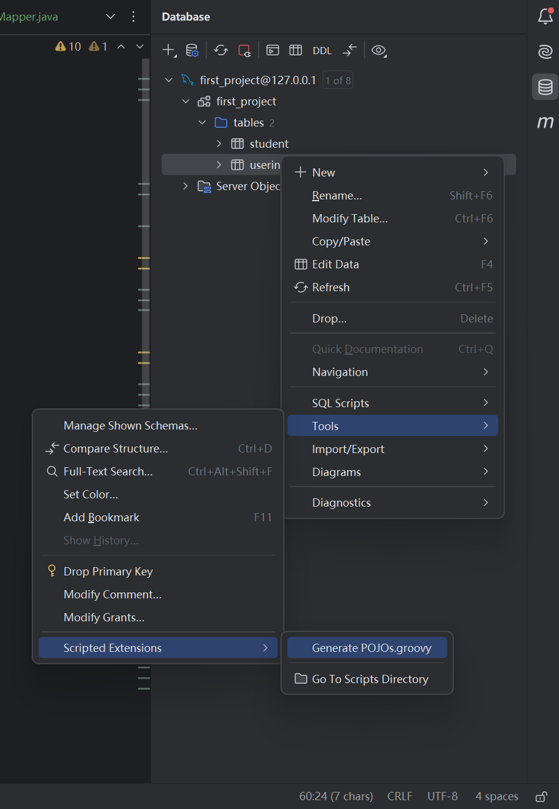

这里将会教会你如何从零学习网站后端开发, 基于 Java 语言

``` md
> 1. 如何从零开始网站后端开发?
- 1. 首先选择合适的代码编辑器(IDE 集成开发环境) - `Idea 代码编辑器`

- 2. 使用代码编辑器创建空项目或者拉去已有项目 - `使用 Idea 代码编辑器创建 springboot 后端框架项目`

- 3. 尝试运行项目, 等待成功运行项目后, 即可进行业务开发.
```

``` md
> 2. 如何按照 Idea 代码编辑器
- 1. 浏览器搜索后, 按照对应攻略按照即可
```

``` md
> 3. 如何使用 Idea 代码编辑器创建空的 SpringBoot 后端框架项目.
- 1. 打开 Idea 代码编辑器后选择新建项目, 后选择 springboot, 按照所列配置填写相应内容即可.
```
- [参考资料](https://blog.csdn.net/weixin_51309915/article/details/123349773)

``` md
> 4. SpringBoot 后端框架的空项目的目录结构你了解吗
```

``` md
> 5. pom.xml 配置文件你了解吗
```

``` md
> 6. Idea 如何配置 maven 自动导入
- 1. 通过设置偏好设置即可, preferences - 偏好设置 
```

``` md
> 7. maven 包管理工具, 那么它是如何确定一个包的?
- 1. maven 包管理工具是通过 groupId 组 ID, artifactId 模块 ID, version 版本 三者确定一个包的. 
```

``` md
> 8. Idea 如何更改 JDK java 语言开发工具以及如何更改 maven 包管理工具
- 1. 七七月 2-8 10:00 分钟处

- 2. 建议按需更改, 无需主动更改.
```

``` md
> 9. Idea 如何运行 SpringBoot 后端框架项目
- 1. 找到`主启动类`(或入口文件)后, 点击启动即可.
```

``` md
> 10. 通过 Idea 如何完整的开发一个 API 应用程序接口?
- `第一类. 基于 MVC 模式`, 应用程序接口在 controller 控制器层写, 业务逻辑和数据在 model 模型层写, 将 model 模型层分为 service 服务层(处理业务逻辑)和 mapper 映射层(处理数据).

- 1. 首先对 C 控制器的开发, 主要进行网络请求的映射. `在控制器层下进行 API 应用程序接口编写`(在`项目包`下新建 `controller 控制器包`, 在其内进行网络请求映射.)

- 2. 然后对 M 模型数据的处理, PO 持久化数据, BO 业务逻辑数据, VO 视图数据, DTO 浏览器传输数据， entity 实体类等.

- 3. 然后对 M 模型业务的处理, 编写 service 服务.

- 4. 最后完善控制器, 模型以及视图的处理.
```


``` md
> 11. springboot 后端框架项目目录结构中的 target 文件是什么?
- 1. 只是一个编译后的文件, 因为 Java 代码需要编译器编译后才能运行.
```

``` md
> 12. Idea 代码编辑器如何进行调试
- 1. 通过打断点实现调试
```

``` md
> 13. 如何测试自己的 API 接口
- 1. 通过 Postman 或者 编写单元测试
```

``` md
> 14. Idea 如何配置热重启?
- 1. 按需百度即可
```

``` md
> 15. 什么是 RestFul 表现出状态转移风格?
- 1. 一种进行 API 应用程序接口设计的风格. 使用 GET 获取数据, POST 修改数据, DELETE 删除数据, PUT 修改数据.
```

``` md
> 16. SpringBoot 后端框架常见注解有哪些
```
- [参考资料](https://pdai.tech/md/spring/springboot/springboot-x-hello-anno.html)

``` md
> 17. SpringBoot 后端框架如何连接数据库
- 1. 安装依赖, MySQL 关系型数据库管理系统和 JBDC Java 数据库连接.

- 2. 配置数据库连接配置

- 3. 编写相应的 API 应用程序接口接口.
```
- [参考资料](https://cloud.tencent.com/developer/article/2103223)

``` md
> 18. SpringBoot 如何使用 MyBatis - ORM 对象关系映射框架实现对数据库的增删改查操作
- 1. 安装 MyBatis 依赖

- 2. 资源配置文件处配置 MyBatis 配置

- 3. 编写 Model 模型数据(实体类和映射器)

- 4. 补充完善 Model 模型业务以及控制器即可.

- MyBatis 是什么? `MyBatis 对象关系映射框架`

- 映射器, 主要用于完成实体类和数据库之间的映射{`也即完成持久化对象和持久化数据库之间的映射`}, 即对数据库的增删改查.
```
- [参考资料](https://developer.aliyun.com/article/1095119)

``` md
> 19. 修改 pom 配置文件时需要注意什么?
- 1. 需要注意的就是你的依赖的版本是否正确.
```

``` md
> 20. 在进行后端开发的时候, `需要时刻理清你的数据层级`, 以及`抽象和封装`.
```

``` md
> 21. Sprig， SpringBoot， SpringMVC , SpringFramework之间的区别和联系 
- 1. SpringFramework 为基础后端框架, SpringMVC 后端框架为其子框架, SpringBoot 后端框架为 SpringMVC 后端框架的二次开发产物, 通过增加默认配置, 提高开发效率.

- 2. Spring 即 Spring 全家桶.

- 补充知识, 可以通过其模块图辅助理解.
```
- [参考资料](https://developer.aliyun.com/article/785548)

``` md
> 22. SpringBoot 后端框架的核心优势是什么
- 1. `自动配置`, `就是 SpringBoot 后端框架会自动将 Bean 实例加入容器中的过程`, 此处的 Bean 实例可以是自己的(即源码)也可以是第三方的 SDK 软件开发工具..
```

``` md
> 23. IOC 控制反转, DI 依赖注入, OCP 开闭原则 
- 1. IOC 控制反转, 即由容器去统一控制实例(即由容器负责创建和注入实例), 而不是由应用程序进行控制.

- 2. DI 依赖注入, 就是指应用程序依赖容器去创建并注入实例.

- 总结: `需要理清应用程序, 容器, 实例三者的关系`, IOC 控制反转是一种开发思维而非技术.

- 3. OCP 开闭原则, 即扩展是开放的, 修改是封闭的. 可以对现有代码进行扩展，以适应新的情况, 而不要对已有代码进行修改.
```
- [参考资料](https://developer.aliyun.com/article/680405)

- [参考资料](https://cloud.tencent.com/developer/article/1836753)

``` md 
> 24. SpringBoot 后端框架如何实现依赖注入?
- 1. 通过 XML 实现(不常用)

- 2. 通过注解实现{ 1. @Component 组件注解, 声明该类为组件类, 此后将会由容器负责其实例的创建和注入  2. @Autowire 自动注入注解, 就是声明该实例将会由容器进行自动注入. }
```

``` md
> 25. SpringBoot 后端框架的 Bean 实例化的时机
- 1. 默认是程序启动时容器以及执行了实例化, 但是可通过配置进行更改. @Lazy 惰性注解, 用于延迟实例化, 将实例初始化的过程推迟到首次被请求时才进行, 从而提高应用的启动速度和资源利用率. 但是此时就会导致由于实例化所导致的问题只有在允许时才会发现, 弊大于利, 因此无必须使用默认配置即可.
```

``` md
> 26. @Autowire 自动装配注解进行注入的属性注入和构造函数注入的优缺点是什么
- 1. 属性注入方便快捷

- 2. 构造函数注入规范.
```

``` md
> 27. 类中的构造函数的作用是什么
- 1. 用于在类的实例化的过程中, 初始化实例的值. 构造函数是一种特殊的成员函数, 它在对象创建时自动被调用, 构造函数可以有参数，也可以没有参数, 根据不同的需求进行重载.

- 补充知识, 构造函数是什么? 构造函数就指类中和类同名的一个函数, 其在类的实例化的过程中会被调用, 用于初始化实例的属性.
```

``` md
> 28. @Autowire 自动注入有那些类型?
- 1. 按类型注入(默认配置): 哪个类实现了该接口, 就会注入哪个类, 仅限一个实现类, 多个实现类则需要采用按姓名注入.

- 2. 按姓名注入
```

``` md
> 29. 一个接口有多个实现类, 此时为其使用 @Autowire 自动注入, 那么注入时, 会为其注入那个实现类?
- 1. 通过更改配置, 将按类型注入改为按姓名注入, 通过 @Qualifier("name") 限定注解, 去限定需要注入那个实现类的实例.
```

``` md
> 30. @Bean 注解和 @Configuration 配置注解
- 1. @Configuration 配置注解用于声明一个类为配置类

- 2. @Bean 实例注解, 声明一个方法的返回值会作为为 Bean 实例(`由容器管理的实例称作 Bean 实例`.), 并将其交予容器进行管理.
```

``` md
> 31. SpringBoot 后端框架如何将一个类加入容器, 让其管理其实例
- 1. 通过 @Component 组件注解.
```

``` md
> 32. 为什么喜欢将变化的部分集中在配置文件中?
- 1. 因为配置文件没有具体的业务逻辑.
```

``` md
> 33. SpringBoot 后端框架的配置文件有哪些
- 1. 资源配置文件, .yml 文件

- 2. .xml 文件, 比如 mapper.xml 映射器配置文件
```

``` md
> 34. @Value 值注解, 声明该属性的值为配置文件对应的值
```

``` md
> 35. @Configuration 配置注解的意义在哪里
- 0. 声明一个类为配置类的基础上, 

- 1. 搭配 @Bean 实例注解, `声明该方法的方法返回值会作为 Bean 实例`, 也可以用来`将应用程序变化的部分集成在配置文件中进行修改`.
```

``` md
> 36. @ComponentScan 组件扫描注解的作用
- 1. SpringBoot 的扫描机制, 默认只能扫描到启动类同级或子级下的类, 你可以通过 @ComponentScan 组件扫描注解, `用于指定需要扫描的包`, 扫描带有组件注解的类.
```

``` md
> 37. @Primary 优先注解
- 1. 声明当前类的实例为容器优先注入的实例.
```

``` md
> 38. 当一个接口有多个实现类时, 如何决定容器需要注入那个实例
- 1. 推荐使用 @Conditional 条件注解, 来决定是否将 Bean 实例加入容器.
```

``` md
> 39. SpringBoot 后端框架如何判断两个字符串是否相等
- 1. str1.equals(str2); 

- 2. 等...
```

``` md
> 40. `开发核心`, 1. 将变化的部分进行集成; 2. 数据流向; 3. 抽象和封装; 
```

``` md
> 41. @Conditional 条件注解的作用
- 1. 通过指定条件, 决定是否将 Bean 实例加入容器当中.
```

``` md
> 42. 成品的条件注解
- 1. @ConditionalOnProperty 基于配置的条件注解

- 2. @ConditionalOnBean 基于 Bean 实例的条件注解

- 3. 等...
```

``` md
> 43. SpringBoot 后端框架怎么实现的, 将第三方 SDK 软件开发工具或者包加入到容器中
- 1. 通过 @SpringBootApplication 注解实现
```

``` md
> 45. @EnableAutoConfguration 开启自动配置注解 
- 1. 将会把第三方 SDK 软件开发工具的 Bean 自动加入容器中.
```

``` md
> 46. 怎么自己编写一个 @SpringBootApplication SpringBoot 应用程序注解
```

``` md
> 47. 接口, 抽象类, 类
- 1. 类, 即普通类, 就是对一类事物的抽象

- 2. 抽象类, 是对类的抽象, 目的是得到普通类的通用属性和方法, 无法直接实例化, 只能作为其他类的基类(父类)使用.

- 3. 接口, 是为类所制定的一组规则, 告诉实现类可以做什么, 目的是为了限制普通类的属性和方法.

- 补充知识, 不要去细究概念, 你要根据你的用途选择合适的接口, 抽象类或者类, 而不是根据概念.
```
``` java
// 声明一个接口
interface Animal {
    void eat();
    void sleep();
}

// 声明一个抽象类
abstract class Mammal implements Animal {
    String name;

    public Mammal(String name) {
        this.name = name;
    }

    // 实现接口中的sleep方法
    @Override
    public void sleep() {
        System.out.println(name + " is sleeping");
    }

    // 抽象方法，具体实现由子类提供
    abstract void makeSound();
}

// 声明一个普通类，继承自抽象类并实现所有抽象方法
class Dog extends Mammal {
    public Dog(String name) {
        super(name);
    }

    @Override
    public void eat() {
        System.out.println(name + " is eating");
    }

    @Override
    void makeSound() {
        System.out.println(name + " says: Woof!");
    }
}

public class Main {
    public static void main(String[] args) {
        Dog dog = new Dog("Buddy");
        dog.eat();
        dog.sleep();
        dog.makeSound();
    }
}
```

``` md
> 48. SpringBoot 后端框架如何进行异常处理
- 1. 通过`统一异常拦截, 和统一异常格式`进行处理.

- 2. 统一异常格式: code 编码 + message 消息

- 3. 在进行异常处理的时候, 需要注意的是, 所有产生的异常都要处理, 不能只处理第一个.
```

``` md
> 49. Tomcat 网站服务器和 Nginx 网站服务器
- 1. Nginx 网站服务器负责处理`静态资源`和反向代理请求, 而 Tomcat 网站服务器则专注于处理`动态资源`, 比如和数据库的交互, 每次的数据都可能变化.
```

``` md
> 50. Java 语言中的异常分类
- 1. 编译时异常, 如果你提前就可以处理, 应该抛出编译时异常

- 2. 运行时异常, 如果无法提前处理, 应该抛出运行时异常
```

``` md
> 51. SpringBoot 后端框架如何进行参数校验
- 1. 首先需要接收到网络请求参数(`路径参数, 请求参数和请求体参数`)

- 2. 通过有效性解进行参数判断, 而不推荐在控制器编写逻辑代码进行参数校验.

- 3. 复杂的参数校验通过自定义有效性注解实现.
```

``` md
> 52. SpringBoot 后端框架如何接收路径参数
- 1. 通过 @PathVariable 路径变量注解接收路径参数
```

``` md
> 52. SpringBoot 后端框架如何接收请求参数
- 1. 通过 @RequestParam 请求参数注解接收请求参数
```

``` md
> 53. SpringBoot 后端框架如何接收请求体参数
- 1. 通过 @RequestBody 请求体注解接收请求体参数, 建议为每一个请求体参数定义一个 DTO 数据传输对象, 避免装箱降低性能.
```

``` md
> 54. DTO 数据传输对象的意义
- 1. 用于接收请求体参数的值(请求体参数一般为 JSON JS 对象格式), 
```

``` md
> 55. LomBok 工具库
- 1. 用于简化 getter, setter 等样板化代码的书写

- 2. 常用注解: @Data：数据注解，相当于同时添加了@Getter 获得器、@Setter 设置器、@ToString 转换为字符串、@EqualsAndHashCode 和 @RequiredArgsConstructor。 
```

``` md
> 56. Java 中的 public 共有的 private 私有的 final 不变的, 修饰符的中文含义
- 1. 这三个修饰符用于控制代码的访问权限和行为, 从而实现封装, 继承和多态等面向对象编程的核心概念.

- 2. public 共有的, 声明一个属性或者类为共有的, 可以被任何其他类访问

- 3. private 私有的, 声明一个属性或者类为私有的, 只可以在类内部被访问

- 4. final 不变的, 声明一个类或者属性是不变的, 即一旦赋值则无法改变也无法被继承.
```

``` md
> 57. 怎么通过 LomBok 工具库生成构造函数
- 1. @NoArgsConstructor 无参构造函数

- 2. @AllArgsConstructor 全参构造函数(所有参数必须传参, 因此不建议使用该注解, 因为大多数的时候并不是所有参数都是必须传递的), `需要注意的是, 只要有参构造函数一旦声明, 则默认的无参构造函数如果不声明则不会默认存在` .

- 3. `@RequiredArgsConstructor 有参构造函数, 用于解决全参构造函数和无参构造函数所带来的问题, 通过搭配 @NonNull 不为空注解指定那些参数是必须传递的.`
```

``` md
> 58. @Getter 获得器、@Setter 设置器
- 1. 用于获取或者设置实例中的属性.
```

``` md
> 59. @Builder 构造器注解
- 1. 声明该类可以通过构造器的方法去实例化并赋值, 简化了 setter 设置器的使用, 当需要给实例的很多属性赋值时. `但是有一个缺点, 就是将给一个类使用了 Builder 构造器注解, 那么后续实例化该类就只能按照 Builder 构造器提供的方法进行实例化了.` 无法实例化的原因在于 Builder 构造器会为该类默认生成一个私有的无参构造函数导致的, 所以可以通过自己声明一个共有的无参构造函数解决该问题.
```
``` java
import lombok.Builder;
import lombok.ToString;

@Builder
@ToString
public class User {
    private String name;
    private int age;
    private String email;
}

public class Main {
    public static void main(String[] args) {
        User user = User.builder()
                        .name("John Doe")
                        .age(30)
                        .email("john.doe@example.com")
                        .build();
        
        System.out.println(user);
    }
}
```

``` md
> 60. 使用 Autowire 自动注入注解的属性注入方式的时候, 由于构造函数为有参构造函数, 报错Could not autowire. No beans of 'Integer' type foun 的解决办法
- 1. 通过使用 Configuration 配置注解, 生成配置类, 搭配 Bean 实例注解, 将 Bean 实例加入到容器中去, 在搭配 Autowire 自动注入进行注入.

- 2. 遇到这个问题, 你需要有一个底层逻辑, Component 组件注解和 Configuration 配置注解都可以把实例加入容器成为 Bean, 但是 Component 组件注解加入的 Bean, 在自动注入的时候, 默认是采用无参构造器实现的, 如果你在类中只有有参构造器, 那么就无法完成自动注入了, 除非你声明了配置类, 来加入有参的 Bean 实例.
```

``` md
> 61. JSR java 语言规范学习
- 1. Java Specification Requests Java 规范请求
```

``` md
> 62. Idea 代码编辑器报错如何查找错误
- 1. 查找 Error 错误描述是什么

- 2. 查找 Exception 异常描述是什么

- 3. 查找 Cause 导致的异常是什么
```

``` md
> 63. Springboot 后端框架进行参数校验的时候 Validated 有效性注解和 valid 有效性注解的使用顺序
- 1. 优先使用 Validated 有效性注解.
```

``` md
> 64. Springboot 后端框架如何自定义有效性注解
- 1. 创建 Annotation 注解类

- 2. 确定其关联类, @ConstraintValidator 约束校验器注解

- 3. 
```

``` md
> 65. Idea 代码编辑器如何进行调试操作
```
- [参考资料](https://blog.csdn.net/weixin_44203609/article/details/134251194)

``` md
> 66. SpringBoot 后端框架如何遍历 List 列表
- 1. forEach 遍历方法
```

``` md
> 67. 微服务是什么
- 1. 就是指一种软件架构, 这种架构用于解决单体架构所带来的问题, 达到`轻量级软件开发`的目的.
```
- [参考资料](https://www.ruanyifeng.com/blog/2022/04/microservice.html)

- [参考资料](https://www.redhat.com/zh/topics/microservices/what-are-microservices)

``` md
> 68. 网站后端开发如何进行项目分层
- 1. 基于 MVC 模式进行分层
``` 

``` md
> 69. 基于 MVC 模式, 如何进行模型数据的处理
- 1. 通过`映射器`完成`实体类`和`数据库(表, 记录, 字段)`之间的对象关系映射.
```

``` md
> 70. 基于 MVC 模式的, 模式业务处理的 service 服务层, 需要需要声明接口和它的实现类来进行业务处理
- 1. 规范来说需要, 因为层于层之间应该依赖于接口而不是类, 可以避免由于某一层类的变动导致其他层也需要变动的问题. `但是`, `一般来说你直接用实现类也可以, 因为大多数业务都不需要划分粒度这么小, 你只需要确定你的类的职责, 单一职责原则`, 除非你后续在重构项目的时候感觉需要通过接口连接.

- 2. 为了实现 OCP 开闭原则, 层于层之间需要用接口连接.
```

``` md
> 71. 如何创建数据库
- 1. 建议通过可视化数据库管理工具创建数据库, 方便快捷.
```

``` md
> 72. 怎么去获取数据库中的数据到你的 SpringBoot 后端框架中去
- 1. 通过 ORM 对象关系映射框架, 比如 JPA, Mybatis 框架.
```

``` md
> 73. 数据库设计原则
```

``` md
> 74. 数据库表与表之间的关系
- 1. 一对一, 一对多, 多对多
```

``` md
> 75. 数据库的设计步骤
- 1. 首先是设计数据表，也即确定表对应的对象

- 2. 然后设计数据表之间的关系，即确定这些对象之间的关系.

- 3. 最后进行细节完善, 以及优性能优化.
```

``` md
> 76. 数据库的物理外键和逻辑外键
- 1. 在数据库中显示的设置外键, 就叫做物理外键, 在代码中只做逻辑上的处理, 就是逻辑外键.

- 2. `外键就是指表与表之间的约束`, 一般而言选择另一个表的主键或者唯一性约束字段. 为了保证数据的一致性, 但是会损耗性能.

- 3. `物理外键`提供了更强的`数据一致性保障`，适用于数据模型相对简单且对性能要求不是特别高的应用场景。而`逻辑外键`则提供了`更高的性能和灵活性`，适用于高并发、跨系统场景，但需要小心处理数据的一致性和完整性问题。
```

``` md
> 77. 数据库基本语法
```
- [参考资料](https://github.com/guanguans/notes/blob/master/MySQL/%E8%AF%AD%E6%B3%95.md)

``` md
> 78. 通过 SpringBoot 后端框架 + MySQL 数据库管理系统 + Mybatis 对象关系映射框架实现简单的 API 应用程序接口(增删改查)
- 1. 首先, 基于 MVC 架构进行开发: 假定此时以及配置好了代码编辑器和开发环境

- 2. 第一步, 设计 Controller 控制器, 设计增删改查四个控制器.

- 3. 第二步, 设计 Model 模型数据, 即进行实体类和数据库之间的映射.

- 4. 第三步, 设计 Model 模型业务, 即进行 service 服务层的设计, 处理业务逻辑.

- 5. 第四步, 完善以上步骤.
```

``` md
> 79. MySQL 数据库管理系统的事物概念
- 1. 数据库的`事物就是指对数据库的操作`, 其具有四大特性, 即 ACID, atom 原子性, consist 一致性, isolate 隔离性, durable 持久性

- 2. 原子性就是指数据的不可分割性, 一致性就是指数据的不可破环, 隔离性就是数据的独立性, 持久性就是指数据的永久性.
```

``` md
> 80. 面向对象和面向过程
- 1. 面向对象的粒度是类, 而面向过程的粒度是函数.
```

``` md
> 81. 项目的开发流程
- 1. 基于软件工程, 首先是`产品经理`进行需求分析, 然后是`开发人员`进行项目开发, 然后是`测试人员`进行测试验收, 最后`运维人员`负责运维上线.

- 2. 软件工程书籍阅读.
```

``` md
> 82. Idea 代码编辑器如何根据设计好的数据库逆向生成相应的 entity 实体类{或 PO 持久化对象}   
```


``` md
> 83. 数据库中的时间字段对应的数据类型
- 1. TimeStamp 时间戳

- 2. DateTime 日期时间 `推荐`
```

``` md
> 84. JPA 框架有 @Id 主键用于声明主键, 那么 Mybatis 框架呢
```

``` md
> 85. 数据表的创建时间, 更新时间, 删除时间三个字段的值如何得到
- 1. 方法一, 通过 Java 语言获取当前时间 `不推荐, 因为太繁琐, 因为这三个字段基本每一个表都会有`

- 2. 方法二, 使用数据库自带的功能, 根据当前时间戳自动更新. `推荐`
```

``` md
> 86. 如何将数据库的字段值设置为 Null
```


``` md
> 87. 如何将实体类中的公有字段抽离出来成为一个基类
- 1. 通过继承实现
```

``` md
> 88. Getter 获取器和 Setter 设置器的意义在哪里
- 1. `使得类可以拥有读写的特性`.
```

``` md
> 89. 一个类是否需要是抽象类
- 1. 取决于这个类是否需要被实例化, 需要则声明为普通类, 否则就可以声明为抽象类.
```

``` md
> 90. 为什么数据库的 createTime 有值但是通过 Mybatis 获取到 SpringBoot 中的就是 null
- 1. 因为你的实体类和数据库的表映射关系不正确, 可能是字段命名不对, 也可能是数据类型不对, 也可能是你的 mapper 映射器出错了, 也可能是 Mybatis 框架配置不对, 比如没有开启自动下划线转换驼峰. 

- 2. `核心原因是由于数据库和实体类之间的映射失败导致的`.
```
- [参考资料](https://www.cnblogs.com/yu-si/p/16704867.html)

``` md
> 91. SpringBoot 后端框架中的 jackson 序列化配置的作用是什么
- 1. 主要是为了优化和定制 JSON JS 语言对象格式数据的处理方式, 比如返回的日期时间格式

- 2. 在 SpringBoot 后端框架中，Jackson 序列化配置是一个用于处理 JSON JS 语言对象格式数据的配置
```

``` md
> 92. 数据库的扩展
- 1. 需要处理的问题, 

- 2. 第一点, 数据表的扩展

- 3. 第二点, 数据表记录的扩展

- 4. 最重要的是, 在设计数据库的时候, 尽量保证数据表和数据记录的完备性.

- 补充知识, 数据库的扩展, 需要知道的是, `字段本身不具备扩展, 但是数据表和数据记录是具备扩展的`. 因此尽量进行数据表和数据记录的扩展而不是字段(也即列)的扩展.
```

``` md
> 93. 静态资源托管服务器
- 1. 静态资源指的是不会动态变化的文件, ，如 HTML、CSS、JavaScript、图片、视频等, `静态资源托管服务器, 一种专门用于存储和传输静态资源的服务器`.

- 2. 标准托管方式

- 3. 方法一, 第三方托管服务器, 例如, 阿里提供的 OSS 静态资源托管服务器, 七牛, 码云等 `费用成本高`

- 4. 方法二, 本地托管服务器, 例如, minio 托管服务器. `运维成本高` 

- 5. 方法三, 直接放到自己的项目代码中. `自己开发时可以这么做, 好处就是方便, 缺点就是代码体积大, 导致带宽占比高`

- 6. 补充知识1, 使用静态资源托管服务器可以带来许多好处, `包括提高网站的加载速度、减轻服务器负载、节省带宽成本、提高用户体验等`. 此外，一些静态资源托管服务器还提供了额外的功能和服务，比如安全性增强、防止盗链、缓存策略控制等.

- 7. 补充知识2, `数据库本身不适合用来存储静态资源`, 只应该用来存储静态资源的地址.
```

``` md
> 94. MyBatis 映射框架中表之间的关系是如何映射的处理的？
- 1. resultType 结果类型: 使用多表查询我们经常会 resultType="java.utils.Map" ,我们不推荐这样写，但是这样写对自己比较有利。
好处：resultType 是直接将查询结果映射到 Java 对象，可以使用简单的类型（如 int、String）或复杂的自定义类型。它的好处是简单直观，易于使用。
弊端：对于复杂的关系映射，resultType 可能会变得冗长，并且无法处理一对多或多对多的关系映射。
- 2. resultMap 结果映射: resultMap 允许我们定义复杂的映射规则，将结果集中的多个字段映射到一个对象中。
好处：可以处理复杂的关系映射，支持一对多或多对多的关系映射。我们可以在 resultMap 中定义映射规则，指定字段与属性间的映射关系，并通过嵌套 resultMap 处理表之间的关系。
弊端：相对于 resultType，resultMap 的配置较为繁琐。
```

``` md
> 95. Mybatis 映射框架如何通过 SQL 语句进行连表查询
```
``` sql
-- 一对一
<resultMap id="HOrderItemVoMap" type="com.liwen.vo.HOrderItemVo">
    <result column="order_itemId" property="orderItemId"/>
    <result column="product_id" property="productId"/>
    <result column="quantity" property="quantity"/>
    <result column="oid" property="oid"/>
    <!--association是一对一的关系-->
    <association property="hOrder" javaType="com.liwen.model.HOrder">
        <result column="order_id" property="orderId"/>
        <result column="order_no" property="orderNo"/>
    </association>
</resultMap>
<select id="selectByHOrderId" resultMap="HOrderItemVoMap" parameterType="java.lang.Integer">
    select *
    from t_hibernate_order o,
            t_hibernate_order_item oi
    where o.order_id = oi.oid
        and oi.order_item_id = #{oiid}
</select>

-- 一对多
 <!--  resultType="com.liwen.vo.HOrderVo" 在多表的字段是无法使用的-->
<!--  我们要写一个 resultMap 结果映射-->
<resultMap id="HOrderVoMap" type="com.liwen.vo.HOrderVo">
    <!--   每个订单对应的属性，column：数据库属性名；property：实体类属性名     -->
    <result column="order_id" property="orderId"/>
    <result column="order_no" property="orderNo"/>
    <!--   我们设置hOrderItems数组里面的属性     -->
    <!--   collection是一对多的关系     -->
    <collection property="hOrderItems" ofType="com.liwen.model.HOrderItem">
        <result column="order_itemId" property="orderItemId"/>
        <result column="product_id" property="productId"/>
        <result column="quantity" property="quantity"/>
        <result column="oid" property="oid"/>
    </collection>
</resultMap>
<select id="byOid" resultMap="HOrderVoMap" parameterType="java.lang.Integer">
    select *
    from t_hibernate_order o,
            t_hibernate_order_item oi
    where o.order_id = oi.oid
        and o.order_id = #{oid}
</select>

-- 多对多
<resultMap id="HCategoryVo" type="com.liwen.vo.HCategoryVo">
    <result column="category_id" property="categoryId"/>
    <result column="category_name" property="categoryName"/>
    <collection property="hBooks" ofType="com.liwen.model.HBook">
        <result column="book_id" property="bookId"/>
        <result column="book_name" property="bookName"/>
        <result column="price" property="price"/>
    </collection>
</resultMap>

<select id="selectByCId" resultMap="HCategoryVo" parameterType="java.lang.Integer">
    select *
    from t_hibernate_book b,
            t_hibernate_book_category bc,
            t_hibernate_category c
    where b.book_id = bc.bid
        and bc.cid = c.category_id
        and c.category_id = #{cid}
</select>
```
- [参考资料](https://developer.aliyun.com/article/1372287)

``` md
> 96. SpringBoot 后端框架中如何进行对象的复制
- 1. 使用 SpringBoot 自带的工具集, BeanUtils.copyProperties(源实例对象, 目标实例对象), 缺点, 浅复制.

- 2. 使用第三方依赖, 比如 dozerMapper 依赖的工具集 
```

``` md
> 97. SpringBoot 后端框架如何进行分页处理
- 1. 有电脑端和移动端两种方式

- 2. 通过 Mybatis 映射框架提供的接口实现.
```

``` md
> 98. SPringBoot 后端框架如何给请求参数设置默认值
- 1. 通过 defaultValue 形参设置默认值
```

``` md
> 99. Java 语言中实参和形参的区别
- 1. 生命周期不一样, 实参不会因为函数调用的结束而结束, 而形参只会存在于函数调用期间.
```

``` md
> 100. Java 语言的数据类型
- 1. 简单数据类型

- 2. 复杂数据类型
```

``` md
> 101. Java 语言中的泛型
- 1. 泛型, 即指广泛的数据类型
```

``` md
> 102. Java 语言中的元类
- 1. 元类, 一个描述类的类 
```

``` md
> 103. MySQL 数据库管理系统如何实现树型结构存储
```

``` md
> 104. Java 语言的内聚性
- 1. 内聚性, 用来衡量一个类的设计的好坏的指标, 描述类中的属性和方法之间的密切程度, 越高越好.
```

``` md
> 105. JWT /ja/wan/t/ 网站令牌
- 1. JWT 网站令牌, JSON Web Token, 用于身份验证和信息交换. 
```
- [参考资料 JWT 网站令牌](https://cloud.tencent.com/developer/article/2148676)

``` md
> 106. Redis 缓存数据库
- 1. Redis 缓存数据库, 用来存储数据, 不过是通过键值对的形式来存储数据的非关系型数据库, `支持高性能的读写操作, 读性能更优秀`.
```
- [参考资料 Redis 缓存数据库](https://refblogs.com/article/754)

``` md
> 107. SpringBoot 后端框架中使用到的延迟消息队列
- 1. 在指定延迟时间后`返回`延迟消息给消费者, 叫做延迟消息队列.

- 2. SpringBoot 后端框架可以通过 RocketMQ 消息队列实现.
```

``` md
> 108. SpringBoot 后端框架中如何使用 Redis 缓存数据库
```
- [参考资料](https://refblogs.com/article/95)

``` md
> 109. SpringBoot 后端框架如何自动导入复制代码相关的依赖
```

``` md
> 110. Java 语言如何在控制台输出内容
- 1. System.out.println(Hello world);
```

``` md
> 111. Java 语言如何获取 Object 对象中的键和值
- 1. 通过声明一个类实现, 不建议直接声明 Object 对象类型的变量.
```

``` md
> 112. SpringBoot 后端框架中如何使用 RocketMQ 消息队列
- 1. RocketMQ 消息中间件, `主要用于集中管理消息`, 通过 Topic 主题来表示一类消息, 通过 Producer 生产者发送消息, Broker 经纪人存储消息, Consumer 消费者接受消息, NameServer 命名服务器注册 Broker 经纪人, Producer 生产者和 Consumer 消费者通过访问 NameServer 命名服务器就可以知道整个 Broker 经纪人集群的路由信息, 从而进行消息的投递和消费. 
```
- [参考资料](https://blog.lanweihong.com/posts/6599/)

- [参考资料](https://blog.csdn.net/u014374743/article/details/135982022?spm=1001.2014.3001.5502)

- [参考资料](https://blog.csdn.net/qq_45752401/article/details/118578874?ops_request_misc=%257B%2522request%255Fid%2522%253A%2522ea5927cbf5689979cac67ce1436568d5%2522%252C%2522scm%2522%253A%252220140713.130102334..%2522%257D&request_id=ea5927cbf5689979cac67ce1436568d5&biz_id=0&utm_medium=distribute.pc_search_result.none-task-blog-2~all~sobaiduend~default-1-118578874-null-null.142^v100^pc_search_result_base6&utm_term=windows%20%E5%AE%89%E8%A3%85RocketMQ%E6%95%99%E7%A8%8B&spm=1018.2226.3001.4187)

``` md
> 113. RocketMQ 消息队列如何查看日志
- 1. C:\Users\24871\logs
```