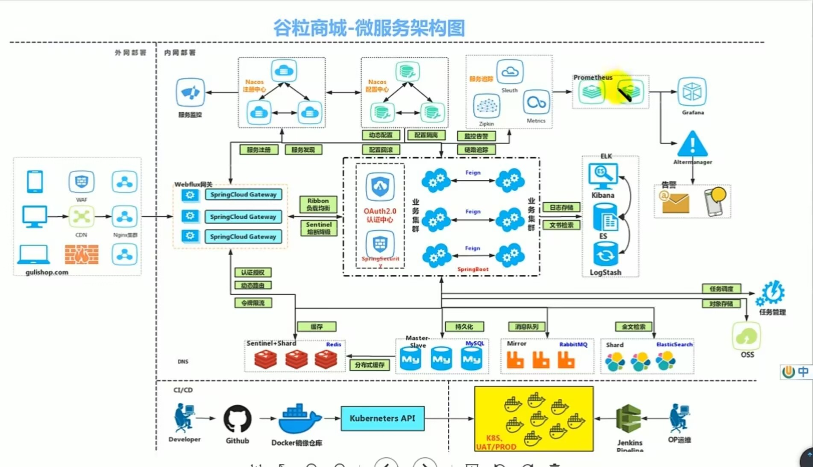
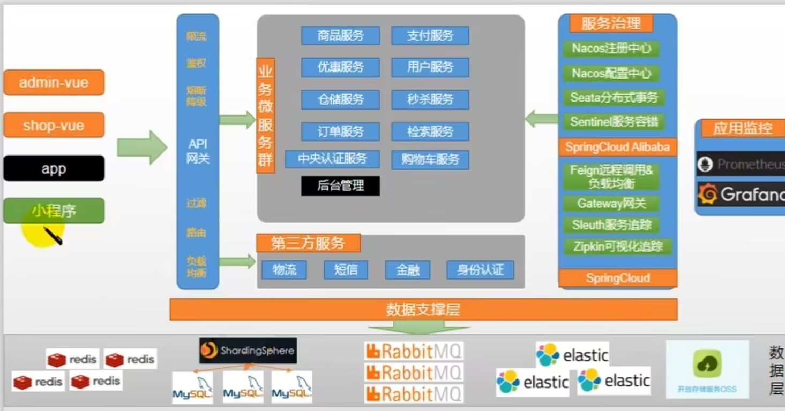

这里将会记录, 从零开始做架构师的学习路程.

## 微服务架构师 - 必备知识点
### 基本知识点
- [参考资料 分布式架构](https://developer.aliyun.com/article/1124229)
``` md
> 1. 常见的电商模式
- 2. 名词解释, `B - Businesses 企业; C - Customer 消费者; O - Online 线上; O - Off-line 离线`  

- 3. B2B(企业对企业), B2C(企业对消费者), C2C(消费者对消费者), C2B(消费者对商家), O2O(线上对线下)
```

``` md
> 2. 微服务架构
- 1. `微服务`, `指将一个大的服务拆分为多个独立的小服务, 由此来完成大服务的一种架构`, 就是微服务.
```
- [参考资料 微服务](https://www.ruanyifeng.com/blog/2022/04/microservice.html)

``` md
> 3. 单体架构
- 1. 单体架构, `指将所有的功能集合在一起进行开发`, 就是单体架构, 最终所形成的软件叫单体软件.

- 2. `单体软件存在的问题`, 随着功能越来越复杂, 面对的问题也会越来越复杂.
```
- [参考资料 单体架构](https://www.ruanyifeng.com/blog/2022/04/microservice.html)

``` md
> 4. 集群
- 1. 集群, `指用一组计算机作为一个整体来完成一个服务`.

- 2. 采用集群的好处就是, HA, HP, high available, 高可用性, high Perfermance, 高性能, 相对于单一计算机而言.
```
- [参考资料 集群](https://cloud.tencent.com/developer/article/1635349)

``` md
> 5. 分布式系统
- 1. 分布式, `指将一个大的服务所带来的大压力拆分到多个独立的节点上, 由此来保证大服务的正常进行的一种系统`, 就是分布式.

- 2. 分布式的 CAP 指标, 一致性, 可用性和分区容错性.
```
- [参考资料 分布式](https://www.cnblogs.com/xybaby/p/7787034.html)

``` md
> 6. 微服务和分布式
- 1. 需要明白的第一点, `分布式属于微服务的一种, 但是微服务并不是分布式`. 因为微服务是对大的`服务进行拆分`, 而分布式是对大的服务所带给单一节点的大的`压力进行拆分`.

- 2. 需要明白的第二点, `以上 5 点, 是对微服务和分布式的概念进行描述`, 至于`如何实现微服务和分布式`需要借助后续的工具和技术.(后面会提到)
```
- [参考资料 微服务和分布式](https://blog.csdn.net/qq_40585800/article/details/109095279)

``` md
> 7. 远程调用
- 1. `远程调用, 指实现了独立模块之间的相互通信的一种技术`. 比如微服务之间进行通信, 分布式节点之间进行通信, 都需要使用远程调用实现.
```

``` md
> 8. 负载均衡
- 1. 负载均衡, `均衡分布式节点所承担的压力, 使其不会过大也不会过小的一种技术`.
```

``` md
> 9. 服务注册中心
- 1. 服务注册中心, `用于统一的进行服务的注册和发现的一种技术`, 保证独立服务之间的可用性. 因为微服务的独立性, 因此需要一个统一的注册中心来管理这些服务.
```

``` md
> 10. 服务配置中心
- 1. 服务配置中心, `用于统一进行服务的配置的一种技术`, 由于将单体软件的功能拆分为了多个独立的微服务, 因此其配置会相应的变多, 所以需要统一的配置中心进行配置.
```

``` md
> 11. 服务熔断
- 1. 服务熔断, 熔断发送给该服务的网络请求的一种机制, 因为该服务无法响应其余服务的请求.
```

``` md
> 12. 服务降级
- 1. 服务降级, 降低该服务被接收网络请求的优先级的一种机制, 因为此时其余服务的优先级更高.
```

``` md
> 13. API 接口网关
- 1. 统一进行网络请求的接收, 处理和转发的一种中间件.
```
- [参考资料 Gateway 网关](https://blog.csdn.net/weixin_41793160/article/details/136222756)

``` md
> 14. 微服务架构图
```


- [参考资料](https://cloud.tencent.com/developer/article/1529880)

``` md
> 15. 微服务划分图
```


- [参考资料](https://cloud.tencent.com/developer/article/1529880)

``` md
> 16. SpringCloud 后端框架
- 1. SpringCloud 后端框架是进行微服务开发的一种后端框架, 是对 SpringBoot 后端框架的二次封装.
```

``` md
> 17. SpringBoot 后端框架
- 1. SpringBoot 后端框架是进行 Java 语言后端开发的一种后端框架.
```

``` md
> 18. 一次完整的网络请求的发送过程
- 1. 以浏览器作为客户端, Nginx 网站服务器作为服务端为例: https://ogads-pa.clients6.google.com/$rpc/google.internal.onegoogle.asyncdata.v1.AsyncDataService/GetAsyncData (`网址由域名+资源地址两部分组成`)
  首先, 浏览器发送网络请求.
  然后, 进行域名解析.(先进行浏览器解析, 在进行浏览器 DNS 域名系统解析, 在进行本地系统解析, 最后进行 DNS 域名系统解析)
  然后, 建立客户端和服务器之间的连接通道.(TCP 传输控制连接, TLS 传输层安全连接)
  然后, 进行客户端和服务端之间的数据通信.
  最后, 断开连接.
```
- [参考资料 网络请求的发送过程](https://qclog.net/article/http-request)
- [参考资料](https://cloud.tencent.com/developer/article/1500463)
- [参考资料](https://github.com/Moosphan/Android-Daily-Interview/issues/94)

``` md
> 19. TCP 传输控制三次握手建立连接, 四次挥手断开连接
```
- [参考资料](https://javaguide.cn/cs-basics/network/tcp-connection-and-disconnection.html#%E5%BB%BA%E7%AB%8B%E8%BF%9E%E6%8E%A5-tcp-%E4%B8%89%E6%AC%A1%E6%8F%A1%E6%89%8B)


### 微服务前端开发

### 微服务后端开发
