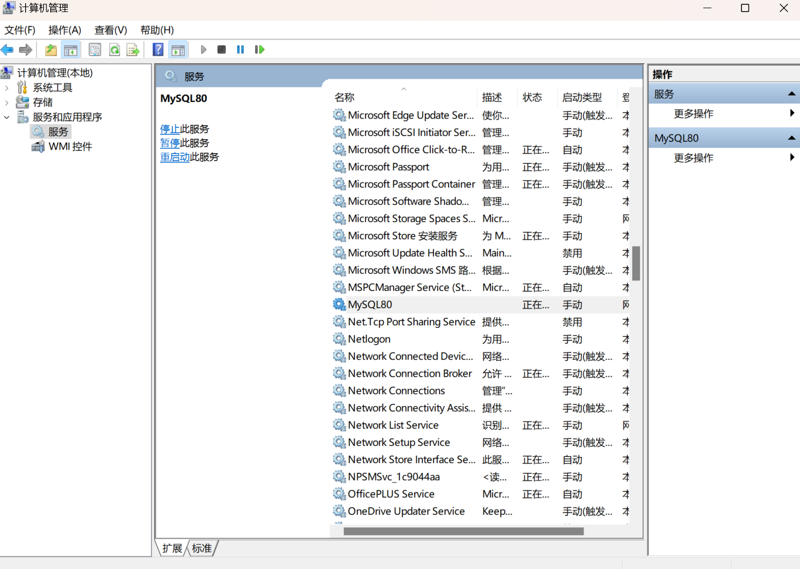

这里将会教会你如何从零搭建个人网站, 以及如何部署至线上平台.

## 需要掌握的相关技术栈
``` md
> 1. Vue Web 前端框架

> 2. Springboot Web 后端框架

> 3. Vite 快速的前端构建工具

> 4. Jenkins 持续集成工具

> 5. CMS 内容管理系统

> 6. MySQL 数据库管理系统

> 7. Redis 远程字典服务器 读音: /rɪˈ/dɪ/s/

> 8. Element Plus 元件+
```

## 个人网站相关问题
``` md
> 1. 什么是门户网站?
- 1. 门户网站 聚合搜索网站, 即是指将网络上庞大的各种信息资源加以整理分类并提供搜索引擎, 让不同的使用者能够快速查询信息的网站.
```
- [参考资料 门户网站](http://www.news.cn/globe/2022-09/07/c_1310659244.htm)

- [参考资料 门户网站排名](https://top.chinaz.com/hangye/index_zonghe_menhu.html)

``` md
> 2. 什么是个人网站?
- 1. 自己用的网站就是个人网站.
```

``` md
> 3. 如何搭建个人网站?
- 1. 搭建本地个人网站

- 2. 构建并部署至线上平台
```

``` md
> 4. 如何搭建本地个人网站?
- 1. 软件的定义阶段, 需求分析.

- 2. 软件的开发阶段, 系统建模, 编程实现.

- 3. 软件的维护阶段, 软件维护.
```

``` md
> 5. 软件的定义阶段 - 需求分析过程
- 1. 问题分析

- 2. 可行性分析

- 补充知识1: 问题分析的目的, 是为了确定问题是否值得去解决, 是否可以解决.

- 补充知识2: 需求分析的过程, 建议参考已有的类似软件.
```
- [参考资料 软件工程导论]

- [参考资料 软件工程]

``` md
> 6. 此次搭建个人网站所参考的网站如下
```
- [参考资料2 类似网站](https://www.mojie.pw/#/knowledge)

``` md
> 6. 软件的开发阶段 - 系统建模过程
- 1. 此次仿照参考网站设计
```

``` md
> 7. 软件的开发阶段 - 编程实现过程
- 1. 前端开发 - Vue Web 前端框架

- 2. 后端开发 - Springboot Web 后端框架
```

``` md
> 8. 如何将个人网站构建并部署至线上平台
- 1. Vite 快速的前端构建工具, 一个前端构建工具.

- 2. Jenkins 持续集成工具, 提供超过 1000 个插件来支持构建, 部署, 自动化, 来满足任何项目的需要.
```
- [参考资料1 部署至线上平台](https://cli.vuejs.org/zh/guide/browser-compatibility.html)

- [参考资料2 部署至线上平台](https://cn.vuejs.org/guide/best-practices/production-deployment.html)

- [参考资料 Vite 快速的前端构建工具](https://cn.vitejs.dev/guide/migration.html)

- [参考资料 Jenkins 持续集成工具](https://www.jenkins.io/zh/)

``` md
> 9. 前端开发 - Vue Web 前端框架阶段该做什么？
- 1. 选择合适的 CMS 内容管理系统辅助开发.

- 2. 基于 CMS 内容管理系统进行业务开发.

- 补充知识1: 此次选择 RuoYi CMS 内容管理系统, 因为 RouYi 是基于 JS 开发的, 便于直接上手开发业务, 
而其余的 CMS 内容管理系统大多是基于 TS 开发的.
```
- [参考资料 一些开源的 CMS 内容管理系统](https://github.com/webguosai/vue3_admin_favorites)

- [参考资料 PureAdmin CMS 内容管理系统](https://pure-admin.github.io/vue-pure-admin/#/welcome)

- [参考资料 RuoYi CMS 内容管理系统](https://doc.ruoyi.vip/ruoyi-vue/)

``` md
> 10. 后端开发 - Springboot Web 后端框架阶段该做什么?
- 1. 选择合适的 CMS 内容管理系统辅助开发.

- 2. 基于 CMS 内容管理系统进行业务开发.
```

## Vue Web 前端框架相关问题
``` md
> 1. Vue Web 前端框架是什么?
- 1. Vue Web 前端框架, 基于 JS 的 Web 前端开发框架. 
```

``` md
> 2. Vue3 和 Vue2 的区别?
- 1. Vue 3 提供了更小的包体积, 更好的性能, 更好的可扩展性和更好的 TypeScript/IDE 支持.

- 2. 使用的 API 类型不同.

- 3. 双向数据绑定的底层原理不同.
```
- [参考资料 Vue3 和 Vue2 的主要区别](https://cn.vuejs.org/about/faq.html)

``` md
> 3. 你怎么理解 xs、sm、md、lg 和 xl 这五个响应尺寸?
- 1. xl extra large 超大屏幕 >= 1920px

- 2. lg large 大屏幕 >= 1200px

- 3. md middle 中屏幕 >= 992px

- 4. sm small 小屏幕 >= 768px

- 5. xs extra small 超小屏幕 < 768px

- 补充知识1: 响应式尺寸是为了支持电脑、平板、手机等所有主流设备而出现的.
```
- [参考资料1 响应尺寸：xs、sm、md、lg 和 xl](https://www.cnblogs.com/Ning-Blog/p/15718079.html)

- [参考资料2 响应尺寸：xs、sm、md、lg 和 xl](https://blog.51cto.com/u_15119353/4953743)

``` md
> 4. JS 怎么获取屏幕尺寸?
- 1. 利用 window.screen 屏幕对象.
```
- [参考资料 window.screen 屏幕对象](https://developer.mozilla.org/zh-CN/docs/Web/API/Screen)

## Element Plus 元件+相关问题
``` md
> 1. Element Plus 是什么?
- 1. Element Plus 元件+, 基于 Vue 3，面向设计师和开发者的组件库.
```
- [参考资料 Element Plus 元件+](https://element-plus.org/zh-CN/)

## RuoYi CMS 内容管理系统相关问题
``` md
> 1. RuoYi 是什么?
- 1. RuoYi 若依, 一款 CMS 内容管理系统, 用于辅助开发人员开发, 使其专注于业务逻辑.
```
- [参考资料 RouYi 若依 CMS 内容管理系统](https://ruoyi.vip/)

``` md
> 2. RuoYi 若依是如何实现动态路由的?
- 1. 
```

## Springboot Web 后端框架相关问题
``` md
> 1. Springboot Web 后端框架是什么?
- 1. Springboot Web 后端框架, 是基于 Java 的 Web 后端开发框架.
```

``` md
> 2. 本地如何创建 MySQL 数据库?
- 1. 使用 Navicat 可视化数据库管理构建创建数据库

- 补充知识1: 使用 Navicat 可视化数据库管理工具创建数据库, 必须先运行 MySQL 数据库管理系统.
```

``` md
> 3. 本地如何连接到 MySQL 数据库?
- 1. 在 Springboot 中的 application.yml 文件中配置 jdbc 连接.
```

``` md
> 4. 如何在本地运行 MySQL 数据库管理系统?
- 1. 右键我的电脑 - 管理 - 服务 - MySQL - 手动启动

- 2. 如图:
```


``` md
> 5. 如何查看本地 MySQL 数据库管理系统的用户名和密码?
- 1. 最好不要忘记了, 不然不好搞哦. 
```

``` md
> 6. Redis 是什么?
- 1. Redis 远程字典服务器, Remote Dictionary Server, 是一个开源的高性能`键值对存储系统`，具有快速、灵活和可扩展的特性。它是一个基于内存的数据结构存储系统，可以用作数据库、缓存和消息代理。
```
- [参考资料 Redis 远程字典服务器](https://redis.com.cn/redis-intro.html)

``` md
> 7. 如何使用 Redis 远程字典服务器?
- 1. 在 windows 系统上按照 Redis 远程字典服务器

- 2. 右键我的电脑 - 管理 - 服务 - Redis - 手动启动
```
- [参考资料 Redis 远程字典服务器使用](https://redis.com.cn/redis-installation.html)