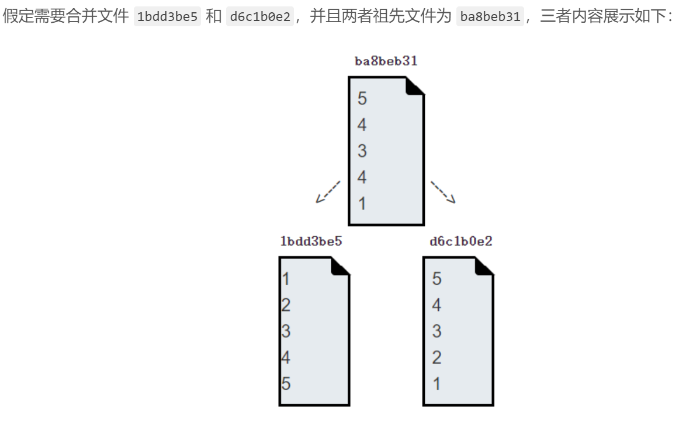
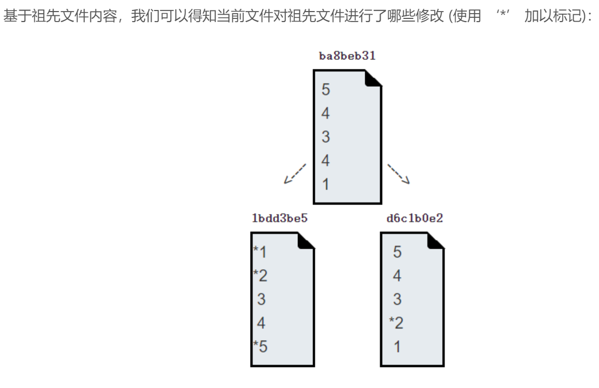
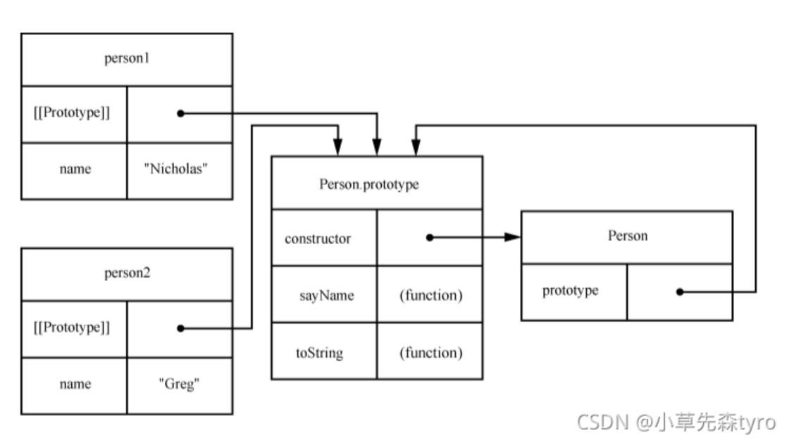

这里会记录非系统性的内容, 临时记录, 用于后期查漏补缺.

- [参考资料 讯飞星火](https://xinghuo.xfyun.cn/desk)

``` md
> 1. 你怎么理解正向代理和反向代理?
- 1. 正向代理, 你知道你要访问的目标服务器的真实地址, 只是借由正向代理服务器去访问目标服务器.

- 2. 反向代理, 你不知道你要访问的目标服务器的真实地址, 只能通过访问反向代理服务器, 让反向代理服务器访问目标服务器.

- 补充知识1, 代理服务器就是一个中介, 如果你事先知道目标服务器, 则此时的代理就是正向代理, 反之则为反向代理.
```

``` md
> 2. 后端常说的 B 端项目和 C 端项目是什么?
- 1. B 端项目, 面向商家的项目, B business 商家.

- 2. C 端项目, 面向消费者的项目, C customer 消费者.
```
- [参考资料1 B 端和 C 端](https://juejin.cn/post/7032286415819898911)

- [参考资料2 B 端和 C 端](https://www.lmdouble.com/1505342288.html)

``` md
> 3. 你怎么理解架构?
- 0. 架构, 就是指一种结构, 一种用于解决复杂问题的结构. 其解决问题的思路有从大到小和从通用到专用.

- 1. 以 Pig4Cloud 微服务架构图为例

- 补充知识1, 要了解架构, 首先需要知道是什么类型的架构. 例如此处的架构, 是指软件架构.

- 补充知识2, 微服务架构, 是指一种将单个应用解耦分为多个独立的组件进行开发和部署的软件架构.
```
- [参考资料 Pig4Cloud](https://paper.pig4cloud.com/#%E5%85%B3%E4%BA%8E-pig-%E5%95%86%E4%B8%9A%E7%89%88)

- [参考资料 微服务架构](https://www.ibm.com/cn-zh/topics/microservices)

``` md
> 4. 基于 Pig4Cloud 的学习资料
```
- [参考资料 学习资料](https://www.yuque.com/pig4cloud/pig/fyecgc)

``` md
> 5. 系统架构设计参考
```
- [参考资料 系统架构](https://juejin.cn/post/7081481794909896712)

``` md
> 6. 比如我本地做好后台接口了
本地通过http://localhost:8080/MyProject/hello能访问。
但是怎么发布出去呢？怎么让别人也能访问？
我不是要发布域名之类的，就是让别的手机可以访问http://localhost:8080/MyProject/hello这个接口。
小弟我做app开发的，最近刚学后台技术。ssh整合学的好累，那个struts现在还有公司用么？感觉spring mvc注解好爽啊。

- 1. http://localhost:8080/MyProject/hello是你在自己电脑上访问的URL
别人访问就是把localhost改成你电脑的IP（用了路由器的话，要设置路由器映射地址），在电脑里配置8080端口可以访问。
```

``` md
> 7. localhost 本地主机是什么？
- 1. localhost 127.0.0.1， 是一个 IP 地址， 是为计算机的本地服务器保留的，所以你永远不会找到其他以 127 开头的 IP 地址。
```
- [参考资料 localhost 127.0.0.1](https://www.freecodecamp.org/chinese/news/what-is-localhost/)

``` md
> 8. Vue 网站前端框架启动项目后提供的那个 Network IP 网络地址是什么?
- 1. Vue 项目启动后所提供的 Local 本地和 Newwork 网络两个地址可以用来在本地或者同一局域网下访问你的项目.
```
- [参考资料](https://blog.csdn.net/m0_67372185/article/details/127706725)

``` md
> 9. Git 分布式版本控制需求如何将远程仓库从 ssh 协议连接切换为 https 协议连接?
- 1. 相关命令
```
``` git
- 1. git remote remove origin // 删除远程仓库

- 2. git remote add origin <https 地址> // 利用 https 协议添加远程仓库
```

``` md
> 10. Git 分布式版本控制系统怎么创建分支?
- 1. git branch <branch_name>

- 2. git switch <branch_name>
```

``` md
> 11. Git 分布式版本控制系统, 怎么查看远程仓库的信息?
- 1. git remote -v
```

``` md
> 12. 解决 element 组件库中 el-select 选择框与 el-input 输入框的输入框宽度不一致的问题
- 1. 默认情况就是 input 输入 和 select 选择表单项的长度不同, select 选择的表单项比 input 输入表单项宽度小, 所以设置样式即可
```
``` css
style="width: 100%"
```
- [参考资料 解决element中el-select与el-input的输入框宽度不一致的问题](https://blog.csdn.net/omroji/article/details/135717993)

``` md
> 13. 为什么实例化后的对象实例, 访问原型对象是 undefined 未定义
- 1. 通过 new 实例化得到的一个对象实例, 当该对象访问其 prototype 原型对象时, 需要显示的设置其 __proto__ 原型属性. 如果你直接访问一个对象的原型对象，而该对象并没有显式地设置其原型，那么它的原型对象将是 undefined 未定义.

- 2. 代码示例:
```
``` js
// 创建一个构造函数
function Person(name) {
  this.name = name;
}

// 创建一个原型对象
const personPrototype = {
  sayHello: function() {
    console.log('Hello, my name is ' + this.name);
  }
};

// 创建一个Person实例
const person1 = new Person('Alice');

// 使用Object.setPrototypeOf()方法设置person1的原型为personPrototype
Object.setPrototypeOf(person1, personPrototype);

// 现在可以调用sayHello方法了
person1.sayHello(); // 输出： Hello, my name is Alice
```

``` md
> 14. git merge 合并中的快速合并和非快速合并你理解吗？
- 1. git merge 合并有两种合并方式, 一种是 fast-forward 快进合并, 一种是非快进合并, fast-forward 快进合并只有当当前分支是待合并分支的直接上游时会进行 fast-forward 快进合并, 否则就是非快速合并. fast-forward 快进合并只是单纯的 HEAD 指针移动, 而不会创建新的提交对象. 但是 not-fast-forward 非快进合并会创建新的提交对象, 并指向其父提交对象.

- 补充知识1, git merge 合并分支时会产生冲突的原因, 是因为你在进行 not-fast-forwar 非快进合并的时候, 对当前的分支和待合并分支的同一文件的同一地方都进行了不同的修改, 则会产生合并冲突, 需要手动解决冲突. `因此, 建议创建新分支的时候, 应该从最后一次提交对象处创建分支`.

- 补充知识2, git merge not-fast-forwar 非快进合并本质是进行`三方合并`, 首先会创建一个新的提交对象, 然后在当前分支, 待合并分支和新的提交对象之间进行`增量合并(即在比较差异后, 将其中增加的部分进行合并, 需要注意的是, 修改本质是进行删除然后在增加, 因此才产生的增量合并和减量合并两种合并算法)`. 不理解增量的含义, 你可以看看 VSCode 的 Git 插件中可视化的文件改动, + 和 - 部分, + 表示的是增加的地方, - 表示是删除的地方.
```

``` md
- 2. 代码示例
```
``` git
git branch <feature-name> <hash> // 创建分支

git merge <feature-name> // 合并分支

git push <origin> <feature-name> // 推送分支
```
- [参考资料 git merge 合并](https://blog.csdn.net/qq_42780289/article/details/97945300)

``` md
> 15. line wrap 换行的含义
- 1. line wrap 表示的是换行.
```

``` md
> 16. href 的中文含义
- 1. hyperlink reference 超链接引用. 用于指定一个 URL 统一资源定位器.
```

``` md
> 17. 计算机的硬件主要包括那几个部分?
- 1. 主要由 10 个硬件组成. CPU /sen/p/u/中央处理单元, GPU /ɡræ/p/u/图像处理单元, RAM 随机存取存储器, SSD /ˈsɒ/s/d/固态硬盘, HDD /hɑːr/di/d/ 机械硬盘, Network card 网卡, Sound card 声卡, Motherboard 主板, keyboard 键盘, Monitor 显示器, Mouse 鼠标. 
```

``` md
> 18. iframe /ɪn/freɪm/内联框架的中文翻译
- 1. HTML 超文本标记语言中的 iframe 内联框架.
```

``` md
> 19. git merge 合并的 not-fast-forward 非快进合并逻辑
- 1. not-fast-forward 非快进合并会进行三方合并(当前分支最新提交对象, 待合并分支的最新提交对象, 以及最近的公共祖先, 然后比较差异, 再进行增量合并, 有冲突则解决冲突)
```
- 

- 

- [参考资料 not-fast-forward 非快进合并](https://yanglei253.github.io/2020/12/21/git/gitintroduce1-mergeStrategy/)

``` md
> 20. git log 日志 和 git reflog 引用日志的区别?
- 1. git log 日志, 是用来查看当前分支的提交记录. 而 git reflog 引用日志, 是用来查看所有分支的提交记录. 且它们展示的数据格式也不相同. 
```

``` md
> 21. Git 分布式版本控制系统分支的最佳实践
- 1. 首先, git branch 创建分支, 首先要去拉取最新的生产分支的代码, 然后在最新提交记录处创建新的 feature 特性分支.

- 2. 然后, git merge 合并分支, 是由生产分支去合并 feature 特性分支或者 fix 修复分支. `切记不要合并 test 测试分支`

- 补充知识1, 遵守最佳实践的目的, 是为了防止合并冲突, 以及避免污染生产分支.
```

``` md
> 22. 如何查看 Git 分布式版本控制系统的分支图?
- 1. 通过 git log --graph 日志的图形化来查看当前分支的提交日志.

- 补充知识1, 你还可以通过 git reflog --all 引用日志, 查看所有分支的提交记录.
```

``` md
> 23. 如何进行纯函数编程?
- 1. 通过柯里化函数, 组合函数等实现纯函数编程, 但是重点在于纯函数的思想, 即`一个输入对应一个输出, 且没有副作用`.
```
- [参考资料 纯函数编程](https://llh911001.gitbooks.io/mostly-adequate-guide-chinese/content/)

``` md
> 24. 在 element 组件库中的 select 选择框中, 显示的是 label 标签, 但是值是 value 值, 因此赋值时只需要给 value 即可.
```

``` md
> 25. 开发过程中, 有人问你, 你的项目是在那个服务, 你该怎么回答?
- 0. `根据该问题可知, 你们公司用的软件架构是微服务架构, 因此此处的服务就是指你当前开发的项目是什么, 具体而言就是你的项目是那个服务的那个模块.`

- 1. 首先, 你要有一个基本概念, 就是软件架构分为单体架构和面向服务架构. 因此一个服务就是指一个独立的功能单元, 一个软件是由多个服务组成, 每个服务又是由多个模块组成的. 因此在需求分析阶段, 你就需要知道当前项目是那个的服务的哪个模块.

- 2. 回答, 需要根据你的实际情况回答, 我个人而言, 开发过的服务有 TPC 流程中心, UD 统一用户, VFORM 原型设计, ECL 问题管理. 而我开发过的模块有年休假考勤, PRD 流程审批, 法规及技术标准...等.

- 补充知识1, 微服务架构, 一种服务不耦合的软件架构. `优点就是更小更易维护`. 

- 补充知识2, 软件架构, 一种软件的开发结构, 分为单体架构(紧耦合) => 面向服务架构(松耦合) => 微服务架构(不耦合).
```
- [参考资料 软件架构](https://www.ruanyifeng.com/blog/2022/04/microservice.html)

``` md
> 26. 什么时候使用 Map 映射?
- 1. 三种情况吧, 1. 当 key 键是复杂数据类型时, 2. 或者需要频繁的增删改查的时候, 3. 或者是需要计算 key 键的数量的时候, 建议使用 Map 映射.

- 补充知识1, 可以通过 entries 条目将 Object 对象转换为 Map 映射, 通过 fromEntries 可以将 Map 映射转换为 Object 对象.
```
``` js
const obj = {
  a: '我是obj.a',
  b: '我是obj.b',
  c: '我是obj.c',
}
console.log(obj)
const map = new Map(Object.entries(obj))
console.log(map)
console.log(map.get('a'), '我是map 属性名')
console.log(map.get('b'), '我是map 属性名')

const arr = [1, 2, 3];
obj = { a: '1', b: 2 };
const map = new Map()
map.set(arr, '我是map的第1个值，我是数组')
map.set(obj, '我是map的第2个值，我是对象')
const newObj = Object.fromEntries(map.entries())
console.log(newObj, '我是新对象')
console.log('新对象类型', typeof newObj)
```
- [参考资料1 Map 字典](https://juejin.cn/post/6981995678327111717#heading-2)

- [参考资料2 Map 字典](https://blog.csdn.net/weixin_46112649/article/details/126038160)

``` md
> 27. syntaxError, Unexpected reserved word ‘await‘ 的原因是什么?
- 1. 我会产生这种异常的原因是因为, 没有给匿名函数添加 async 异步, 而直接使用了 await 等待. 

- 补充知识1, await 等待, 等待的是一个 Promise 期约, 因此, 如果没有 Promise 期约, 则会根据情况安排异步函数的执行顺序, 而非你 await 等待的顺序.

- 补充知识2, 正确使用 async/await 异步/等待的效果图如下: 看 waterfall 瀑布图可知, 在执行完第一个请求后才会执行下一个, 体现了 await 等待的效果.
```

``` js
async handleDelete() {
  let folderFilesIds = [1, 2]
  this.$confirm('此操作将永久删除文件, 是否继续?', '提示', {
    confirmButtonText: '确定',
    cancelButtonText: '取消',
    type: 'warning'
  }).then(() => {
    await this.confirmHandleFiles(folderFilesIds)
  }).catch(() => {
    this.$message({
      type: 'info',
      message: '已取消删除'
    });
  });
},

// 修改
handleDelete() {
  let folderFilesIds = [1, 2]
  this.$confirm('此操作将永久删除文件, 是否继续?', '提示', {
    confirmButtonText: '确定',
    cancelButtonText: '取消',
    type: 'warning'
  }).then(async () => {
    await this.confirmHandleFiles(folderFilesIds)
  }).catch(() => {
    this.$message({
      type: 'info',
      message: '已取消删除'
    });
  });
}

// 必须返回 Promise 期约, 如果使用了 await 等待, 否则实践效果并非你所想象的那样按顺序等待.
// 不建议返回 Promise.resolve(); 来返回 Promise 期约, 因为不好理解, 代码不好维护. 
confirmHandleFiles(folderFilesIds){
  return new Promise((resolve, reject)=>{
    // ... 逻辑代码
    return resolve();
  })
}
```
- [参考资料 syntaxError, Unexpected reserved word ‘await‘ 的原因是什么?](https://blog.csdn.net/m0_37714008/article/details/119349924)

- [参考资料 await 等待, 等待的结构是 Promise 期约还是非 Promise 期约的不同效果](https://blog.csdn.net/weixin_42880088/article/details/118525117)

``` md
> 28. 声明式编程和命令式编程的区别?
- 0. `声明式编程写的是你要做什么, 命令式编程写的是你要怎么做. 编程的粒度是不一样的.`

- 1. 声明式编程在于目的, 命令式编程在于步骤.
```

``` md
> 29. 你怎么理解网络请求的 5 方式方式
- 1. GET 获取资源请求, 用于获取数据, POST 发送资源请求, 用于发送数据, PUT 更新资源请求, 用于更新数据, PATCH 更新资源请求, 用于局部更新数据. DELETE 删除资源请求, 用于删除数据.

- 补充知识1, 这只是发送网络请求的最佳实践, 当然, 你不想遵守也完全可以, 只是会被别人不待见.
```

``` md
> 30. 你知道什么是面向对象编程吗?
- 1. 面向对象编程即编程的最小粒度是对象, 通过对象来解决问题. 同理, 面向函数编程, 则编程的最小粒度为函数.
```

``` md
> 31. 类, 对象实例和对象之间的关系
- 1. `类是一类对象的抽象化`, 而`对象实例是类的具象化`. 所以面向对象编程, 就是指其编程的最小粒度是对象, 面向对象编程是`先又对象, 再有类, 最后有对象实例`. 所以创建类的过程, 就是抽象化对象的过程. 创建对象实例的过程, 就是实例化类的过程.

- 补充知识1, 对象实例和实例对象是一个概念.
```

``` md
> 32. 如何设置英文自动补齐**在 VScode 代码编辑器中不可行**
- 1. 在设置栏中的时间和语言中添加英文, 最后切换输入法即可.
```
- [参考资料 如何添加win11自带的英文输入法实现自动补全/校对功能](https://blog.csdn.net/m0_73345433/article/details/134917240)

- [参考资料 VScode 代码编辑器英文自动补齐](https://blog.csdn.net/billy145533/article/details/109787830)

``` md
> 33. VSCode 代码编辑器如何导入导出扩展？
- 1. 找到 .vscode 文件即可.
```

``` md
> 34. 你有使用过 Vue 网站前端框架中的 mixins /ˈmɪksɪnz/混入吗?
- 1. 有, 通过 mixins 混入制定混入模板, 然后将混入模板混入到需要混入的组件, 可以增加代码的可维护性, 属于行为模式中的模板模式.
```
- [参考资料 mixins 混入](https://v2.cn.vuejs.org/v2/guide/mixins.html)

``` md
> 35. 你了解 RESTFul 表现层状态转移吗?
- 0. `RESTFul 表现层状态转移, 是一种网络请求的设计风格.` 其中的表现层是指 view 视图层.

- 1. Restful 表现出状态转移风格, 定义了网络请求的格式. 即使用 GET 获取请求, 用于获取数据, POST 发送请求, 用于发送数据, PUT 更新请求, 用于更新数据, PATCH 更新请求, 用于局部更新数据. DELETE 删除请求, 用于删除数据.
```

``` md
> 36. 异步任务队列的执行顺序?
- 1. 在 JS 语言中, 异步任务队列是按照入队先后执行的, `但是为什么有的网络请求先执行但是却后响应?` 这个问题出现的原因是你没有理解清楚网络请求和网络响应的区别, `请求时客户端发送的`, 异步任务队列决定了请求的顺序, `但是网络响应式是服务器发送的`, 所以网络响应起始和 JS 语言的异步任务队列没啥关系的, 不要把自己搞混了.
```

``` md
> 37. 你怎么理解网络请求和网络响应?
- 1. 由客户端发送给服务器的是网络请求, 服务器发送给客户端的是网络响应. 它们是网络通信过程中的两个重要组成部分, 它们共同构成了客户端与服务器之间的交互过程.
```

``` md
> 38. 你怎么理解函数?
- 1. 在数学概念中, 函数就是指一种映射关系, 由`集合 A 到集合 B 的映射关系`. 映射关系可以是一对一, 也可以是一对多. 而 JS 语言中的函数，本质就是数学概念中函数的具象化.
```

``` md
> 39. 你怎么理解编程范式这一概念?
- 1. `编程范式就是一种编程规范`. 开发人员通过遵循一系列特定的概念, 原则和实践, 它塑造了程序员使用编程语言解决问题的方式.
```

``` md
> 40. 你怎么理解编程语言?
- 1. 编程语言就是一种工具, 一种帮助开发人员和计算机交互的工具. 目的是为了更好的完成某项任务. 选择合适的编程语言对于项目的成功至关重要. 
```

``` md
> 41. 函数式编程中的纯函数是什么?
- 1. `纯函数是指一个输入对应一个输出即引用透明, 且该函数不依赖于外部环境即无副作用`.

- 补充知识1, 为什么纯函数不能依赖于外部环境? 为了防止产生副作用.
```

``` md
> 41. 函数和方法一样吗?
- 1. 不一样, 函数本身就是一个独立的功能单元, 而方法是依赖于对象. 所以函数和方法是不一样的但又有相同点.
```

``` md
> 42. git switch 切换分支和 git checkout 检出分支的区别是什么?
- 1. 首先, 就是支持的 Git 版本不同, git switch 切换分支是 Git 新版本支持的新命令, 推荐使用 git switch 切换分支来进行分支切换, 因为该命令切换分支只会更新当前分支和新分支之间不同的部分, 而 git checkout 检出会检出所有的内容, 无论新旧分支是否相同.
```

``` md
> 43. 通过 git branch 创建分支, 是在那个提交记录创建的分支?
- 1. 在当前分支的最新提交记录处创建分支, 你还可以通过 git branch <branch_name> <commit_hash> 来在指代的提交记录处创建分支.
```

``` md
> 44. 自定义 forEach 遍历和 forEachObject 遍历数组函数.
- 1. 
```

``` md
> 45. 什么是闭包?
- 1. 闭包就是内部函数. `闭包有两个特点`, 首先是它可以访问外部函数的变量, 并且保存改变了的值, 因为它可以记住它的上下文.
```

``` md
> 46. Vue 网站前端框架中的 `vBind 单项数据绑定, 允许你绑定对应属性的对应数据类型的响应式数据或者是一个返回对应数据类型的 IIFE /ɪnˈ/fe/立即执行函数`.
- 1. 个人建议使用 IIFE 立即执行函数, 因为代码更易维护.
```

``` md
> 47. 在 ES6 第六版 JS 语言规范中如何一个函数如何接受可变参数? **不推荐, 不易维护**
- 1. 通过使用 spread 扩展运算符实现.
```
``` js
function sum(...variableParams) {
  console.log(variableParams);
}
```

``` md
> 48. 你怎么理解函数式编程中的 pipe 管道的?
- 1. pipe 管道, 管道的数据流是从左到右, 和 compose 组合的区别就在此, compose 组合的数据流是从右到左.

- 补充知识1, 此处的数据流指 pipe 管道和 compose 组合函数所接受的函数的数据流向即函数的执行顺序.
```

``` md
> 49. 怎么进行函数式编程?
- 1. 首先需要了解纯函数的概念, 其次需要掌握相关的编程技术.
```

``` md
> 50. 你了解 functor 函子吗？
- 1. functor 函子, 实现了 map 映射的函数就是 functor 函子. 在函数式编程中一种用于错误处理.
```

``` md
> 51. 对象实例和构造器以及原型对象之间的关系
```


``` md
> 52. 函数式编程的原则
- 1. 小, 更小, small, smaller. 第一个原则是要小, 第二个原则是要更小.
```

``` md
> 53. 你怎么理解 API 应用程序接口?
- 1. API 应用程序接口, 就是指 A 和 B 进行通信所指定的一组规则. (A, B 指两个系统, 比如后端服务端和前端客户端) 
```

``` md
> 54. 数据结构中的数组和列表的区别是什么？
- 1. 从数据结构的角度来说, 数组, 是线性的, 连续的存储空间, 而列表, 是线性的, 离散的存储空间.

- 补充知识1. 在 Java 语言中, arrayList 就相当于是动态数组, 其于 array 数组的区别就在于, 前者大小可变, 后者大小不可变.

- 补充知识2, `你要注意区分数据结构和数据类型之间的关系`, 数据结构是用来存储数据类型的, 所以你要先确定你的数据的数据类型, 然后去选择合适的数据结构. `比如: 我需要一个字符串类型的数组`.

- 补充知识3, 计算机术语, `定义`变量, 定义函数, `使用`数组, 使用对象. 定义表示一开始不存在, 此后才存在, 而使用则表示一开始就存在, 只是刚好此时需要用. 
```

``` md
> 55. 多维数组理解
- 1. 一维数组, 表示一行. 二维数组表示 m 行, n 列的矩阵, 三维数组表示多个矩阵.

- 2. 代码示例:
[1,2,3]

[
  [1,2,3],
  [1,2,3],
]

[
  [
    [1,2,3],
    [4,5,6]
  ],
]
```

``` md
> 56. Git 分布式版本控制系统如何删除分支?
- 1. Git 分布式版本控制系统删除分支有安全删除和强制删除两种, 使用安全删除, 如果你的分支没有合并到其上游分支, 则会提示无法删除, 而强制删除则是直接删除.

- 命令: 
// 安全删除: 当前分支未合并到上游分支时是无法删除的
git branch -d <branch_name>

// 强制删除: 直接删除
git branch -D <branch_name>
```