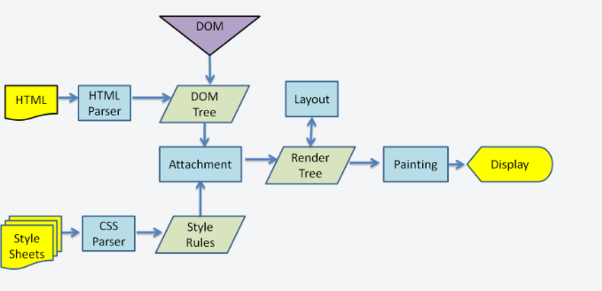

这里将会记录 CSS 层叠样式表的相关面试题, 用于测试你对 CSS 层叠样式表的理解.

- [参考资料 讯飞星火](https://xinghuo.xfyun.cn/desk)

- [参考资料1 CSS 面试题系列](https://cchroot.github.io/interview/pages/interview%20questions/CSS%E7%B2%BE%E9%80%89%E9%9D%A2%E8%AF%95%E9%A2%98.html)

- [参考资料2 CSS 面试题系列](https://www.arryblog.com/interview/htmlcss/)

``` md
> 1. 元素水平垂直居中的方式
- 1. 元素水平居中的方式, 我个人比较喜欢使用 Flex 弹性容器, 
当然你还可以通过 Grid 网格容器, Position 定位, 以及 TableCell 表格布局...等实现.

- 补充知识1, 对于行内元素的水平垂直居中, 通过设置 LineHeight 行高和 TextAlign 文本对齐实现.
```
- 

``` md
> 2. 为什么尽量使⽤ transform 转换（为什么不使⽤ marginLeft/Top 外边距）
- 1. 因为使用 transform 转换操作元素时, 首先, 并不会触发渲染引擎的回流, 其次 transform 转换可以触发 GPU 图形处理单元加速.

- 2. 代码示例
```
``` css
.element {
  transform: rotate(45deg); /* 将元素顺时针旋转45度 */
}
.element {
  transform: scale(1.5); /* 将元素的尺寸放大到原来的1.5倍 */
}
.element {
  transform: skew(20deg, 10deg); /* 将元素沿X轴倾斜20度，沿Y轴倾斜10度 */
}
.element {
  transform: translate(50px, 100px); /* 将元素沿X轴向右移动50像素，沿Y轴向下移动100像素 */
}
.element {
  transform: rotate(45deg) scale(1.5) skew(20deg, 10deg) translate(50px, 100px);
  /* 依次应用旋转、缩放、倾斜和平移变换 */
}
```

``` md
> 3. CSS3 层叠样式表实现动画的方式有哪些，动手写一下将一个 div 在 1s 内移动 300px?
- 1. CSS 层叠样式表实现动画的方式, 主要有 transform 转换 + transition 过渡动画 和 animation 动画 + keyframes 关键帧. 

- 2. 代码示例
```
``` css
/* transition属性动画结合transform变化属性，实现元素移动一段距离的动画 */
#transitonDiv:hover {
    transition: all 1s ease-in-out;
    -webkit-transition: all 1s ease-in-out;
    -moz-transition: all 1s ease-in-out;
    -o-transition: all 1s ease-in-out;

    transform: translateX(300px);
    -ms-transform: translateX(300px);
    -moz-transform: translateX(300px);
    -webkit-transform: translateX(300px);
    -o-transform: translateX(300px);
}

/* 通过animation属性，实现逐帧动画 */
#animationDiv:hover {
    animation: animName 1s ease-in-out;
    -webkit-animation: animName 1s ease-in-out;
    -moz-animation: animName 1s ease-in-out;
    -o-animation: animName 1s ease-in-out;
}

/* 定义关键帧 */
@keyframes animName {
    0% {
        transform: translateX(0px);
    }
    30% {
        transform: translateX(100px);
    }
    60% {
        transform: translateX(200px);
    }
    100% {
        transform: translateX(300px);
    }
}
```

``` md
> 4. 所有 css3 层叠样式表的动画都能用 GPU 图形处理单元加速么？
- 1. 只有搭配了以下 4 个样式才能触发 GPU 图形处理单元加速, transform 转换, 
will-change 将要改变, opacity 透明度, 或者时 filter 滤镜的样式才会开启 GPU 图形处理单元加速.
```

``` md
> 5. 如何画一个三角形
- 1. 使用 CSS 层叠样式表实现. 一些简单图形推荐使用 CSS 层叠样式表. 

- 2. 使用 SVG 可伸缩矢量图形实现. 一些复杂图形则推荐使用 SVG 可伸缩矢量图形.

- 补充知识1, <embed></embed> 嵌入元素是什么?(一个用于引入外部资源的元素).

- 补充知识2, 使用 CSS 层叠样式表绘制简单图形, 就是用 div 元素搭配伪元素去实现.
```
- [参考资料1 CSS 层叠样式表绘制图形](https://vue3js.cn/interview/css/triangle.html#%E4%BA%8C%E3%80%81%E5%AE%9E%E7%8E%B0%E8%BF%87%E7%A8%8B)

- [参考资料2 CSS 层叠样式表绘制图形](https://www.zhangxinxu.com/wordpress/2019/01/pure-css-shapes/)

- [参考资料1 SVG 可伸缩矢量图形](https://svgontheweb.com/zh/)

- [参考资料2 SVG 可伸缩矢量图形](https://www.freecodecamp.org/chinese/news/what-is-an-svg-file/)

- [参考资料 <embed></embed> 嵌入元素](https://developer.mozilla.org/zh-CN/docs/Web/HTML/Element/object)

- [参考资料1 SVG 可伸缩矢量图像绘制工具](https://pixso.cn/app/drafts?from=identity) `个人第一个绘制 SVG 可伸缩矢量图形绘制工具, 但是不推荐， 因它的文本绘制使用的是 path 路径而不是 text 文本元素, 导致后续更改文件很麻烦`

- [参考资料2 SVG 可伸缩矢量图形绘制工具](https://www.jyshare.com/more/svgeditor/)

- [参考资料 ConvertIO 转换工具](https://convertio.co/document-converter/)

``` md
> 6. css 层叠样式表选择器分类
- 1. 常见的 CSS 层叠样式表选择器有, ID 选择器 # , 元素选择器 div, 类选择器 .class , 
兄弟选择器 + , 子代选择器 > , 后代选择器 &nbsp, 伪类选择器 : , 伪元素选择器 :: , ... 等
```

``` md
> 7. 使元素消失的方法有哪些？
- 1. 常见的有 4 中方法, 分别是 opacity 透明的, display 显示, visibility 可见性, z-index z 轴索引.
```

``` md
> 8. 如何开启 GPU 图形处理单元加速?
- 1. CSS 层叠样式表可以通过设置 transform 转换, animate 动画, opacity 透明度或者 will-change 将要改变来开启 GPU 图形处理单元加速.
```

``` md
> 9. 你了解 position 定位吗?
- 1. position 定位共 5 中, 即 static 静态定位, relative 相对定位, absolute 绝对定位, fixed 固定定位以及 sticky 粘性定位.

- 2. 使用 position 定位时, 需要搭配 top 顶部 right 右侧 bottom 底部 left 左侧偏移使用.
```
- [参考资料 position 定位](https://www.ruanyifeng.com/blog/2019/11/css-position.html)

``` md
> 10. 你了解盒模型吗?
- 1. 盒模型分为标准盒子和怪异盒子, 标准盒子就是 box-content 内容盒子, 
怪异盒子就是 border-box 边框盒子. 即标准盒子以 content 内容的 width 宽作为盒子的 width 宽,
而怪异盒子则不然. 怪异盒子的 width 宽和其 padding 内边距和 margin 外边距有关.

- 补充知识1, 你可以通过 box-sizing 盒模型设置当前盒子是何种盒子. 
box-sizing 盒模型的取值有 content-box 内容盒子（default）, border-box 边框盒子.
```

``` md
> 11. 你知道什么是 BFC 么?
- 1. BFC /b/fɔ:/c/块级格式化上下文, 就是指块级元素的布局发生改变后形成的区域. 
对于 float 浮动的元素或者 position 定位的元素, 建议为其创建一个 BFC 块级格式化上下文来清除 
float 浮动和 position 定位所带来的副作用. 创建 BFC 的方式一般是为其父元素设置 
overflow 溢出为 auto 自动, 或者 display 显示为 flow-root 流动根.

- 补充知识1, document flow 文档流, 是指默认情况下 HTML 超文本标记语言元素的排列和布局. 
你可以使用 float 浮动或者 position 定位破坏 document flow 文档流.
```
- [参考资料 BFC 块级格式化上下文](https://developer.mozilla.org/zh-CN/docs/Web/CSS/CSS_display/Block_formatting_context)

``` md
> 12. 你对 Flex 弹性容器的了解
- 1. Flex 弹性容器, 就是通过 justify 主轴和 align 交叉轴实现的容器布局. 
一个 Flex 弹性容器内部可以有多个 Flex 弹性项.
```

``` md
> 13. 清除 float 浮动的方法有哪些?
- 1. 通过创建 BFC 块级格式化上下文.
```

``` md
> 14. 说说你对 HTML 超文本标记语言语义化的理解 ？
- 1. HTML 超文本标记语言语义化, 就是赋予每个元素以特定的含义, 
表示该元素是用来做什么的. 提高代码的可维护性.
```

``` md
> 15. 了解过不同图片格式的区别吗
- 1. 现在的图片格式常见的有 gif 图形交换格式, 动图, 
jpg /dʒɔ/pɪ/g/ 联合图形组, 有损压缩, 
png /pɔ/ne/g/ 便携式网络图形, 无损压缩, svg 可伸缩矢量图形, 以及 webp 网站图形.
```

``` md
> 16. 说说你对 Canvas 画布的理解
- 1. canvas 画布, 可以在网页中绘制图像.
```

``` md
> 17. Canvas 画布和 SVG 可伸缩矢量图形有什么区别 ？
- 1. canvas 画布是依据像素矩阵实现的, 而 svg 可伸缩矢量图形是依据矢量图形实现的, 
因此 canvas 画布更适合做网页动画或者游戏开发, 而 svg 可伸缩矢量图形更适合用来绘制复杂图形.
```

``` md
> 18. “ data- *” 数据属性的作用是什么 ？
- 1. data-* 数据, 是用来自定义数据属性的, 可以用来存储数据, 但是不应该将敏感信息存储在 data-* 数据属性中.

- 补充知识1, 在 Vue 网站前端框架中, 当你的组件使用了 scoped 作用域限定, 
那么就会给当前组件添加一个 data-v-* 数据属性来作为唯一标识, 这样子做是为了保证每个组件之间的 CSS 层叠样式表样式不会互相影响.
```
- [参考资料 为什么 vue 网站前端框架中会有 data-v-* 数据属性](https://blog.csdn.net/fengjingyu168/article/details/79769608)

``` md
> 19. margin 外边距纵向重叠问题？
- 1. margin 外边距的纵向重叠问题, 是一种浏览器默认的样式规则所导致的现象. 
`就是指当两个垂直方向的块级元素之间，当它们相邻且没有边框、内边距或行内内容分隔时, 它们的外边距会合并成一个较大的外边距`. 
你可以通过设置元素的 display 显示为 inline-block 行内块解决这一问题.
```

``` md
> 20. margin 外边距负值问题及应用场景
- 1. margin 外边距是可以去负值的, 当你设置了元素的 width 宽度, 
得到的效果就是和设置正值时的效果相反. 但是当你没有设置元素的宽度时, 
设置负值会增加其自身宽度. 通过 margin 外边距可以实现等高布局.
```

``` md
> 21. 你了解哪些布局方式？
- 1. 从 CSS 层叠样式表的角度来说, 有 5 种, Flex 弹性容器布局, Grid 网格容器布局, 
table-cell 表格单元容器布局, position 定位布局, 响应式的尺寸布局.

- 2. 从最终实现效果来说, 有 一行多列布局 和 多行多列布局.
```

``` md
> 22. 单行文本省略，多行文本省略分情况实现
```
``` css
/*
* 单行文本省略
*/
div {
  white-space: nowrap; /*禁止换行*/
  text-overflow: ellipsis; /*超出范围的文本内容用省略号显示*/
  overflow: hidden; /*超出部分隐藏，只有设置了这个属性，text-overflow:ellipsis才生效*/
}

div:hover {
  width: auto;
}

/*
* 多行文本省略
*/
div {
  text-overflow: ellipsis; /*超出范围的文本内容用省略号显示*/
  overflow: hidden; /*超出部分隐藏，只有设置了这个属性，text-overflow:ellipsis才生效*/
  display: -webkit-box; /*对象作为弹性盒子模型显示*/
  -webkit-line-clamp: 2; /*来限制一个块元素显示文本的行数*/
  -webkit-box-orient: vertical; /*必须结合的属性，设置伸缩盒子对象的子元素的排列方式*/
}

div:hover {
  text-overflow: inherit;
  overflow: visible;
  -webkit-line-clamp: inherit;
}
```

``` md
> 23. 使用 Flex 弹性容器实现两栏布局
- 1. 关键在于要设置 Flex 项的 flex-grow 弹性增长率.
```
``` css
<style>
        html,body{
            margin:0;
            height: 100%;
        }
        .container{
            width:100%;
            height: 100%;
            display: flex;/*弹性容器*/
        }
        .container .left{
            width:300px;
            height: 100%;
            background-color: pink;
        }
        .container .right{
            flex-grow: 1;/*占满所有剩余空间*/
            height: 100%;
            background-color: skyblue;
        }
    </style>
</head>
<body>
    <div class="container">
        <div class="left"></div>
        <div class="right"></div>
    </div>
</body>
```

``` md
> 23. 使用 Flex 弹性容器布局实现三栏布局
- 1. 关键在于要设置 Flex 项的 flex-grow 弹性增长率.
```
``` css
<style>
  html,
  body {
    margin: 0;
    height: 100%;
  }
  .container {
    width: 100%;
    height: 100%;
    display: flex; /*弹性容器*/
  }
  .container .left {
    width: 250px;
    height: 100%;
    background-color: pink;
  }
  .container .middle {
    height: 100%;
    background-color: thistle;
    flex-grow: 1; /*占满剩余空间*/
  }
  .container .right {
    width: 200px;
    height: 100%;
    background-color: skyblue;
  }
</style>
<body>
  <div class="container">
    <div class="left"></div>
    <div class="middle"></div>
    <div class="right"></div>
  </div>
</body>
```

``` md
> 24. 如何解决 flex 弹性容器 7 个元素使用 space-between 最后一行两边分布的问题？
- 1. 如果我们每一行显示的个数为 n，那我们可以最后一行子项的后面加上 n-2 个 span 元素，span 元素的宽度和其它子项元素宽度一样，但不用设置高度。
```

``` md
> 25. flex 弹性实现 8 个元素分两行排列 每行 4 个平均分布-自适应
- 1. 关键在于设置 flex-basis 弹性基本宽度, 
```
``` css
<style>
  .container {
    display: flex; // 弹性容器
    flex-wrap: wrap; // 弹性换行
  }
  .item {
    flex: 0 0 25%; /*0 不放大  0 不收缩  子项大小为父容器25%*/
    box-sizing: border-box; /*怪异盒子*/
    border: 1px solid red;
    height: 100px;
    padding: 10px; /*内容与文字有点间距*/
  }
</style>
<body>
  <div class="container">
    <div class="item">1</div>
    <div class="item">2</div>
    <div class="item">3</div>
    <div class="item">4</div>
    <div class="item">5</div>
    <div class="item">6</div>
    <div class="item">7</div>
    <div class="item">8</div>
  </div>
</body>
```

``` md
> 26. Flex 弹性容器画色子
```

``` md
> 27. 说说你对 Grid 网格容器的理解？
- 1. Grid 网格容器, 就是指通过 row 行和 column 列搭建 grid 网格, 
进而实现 grid 网格布局. 优点是灵活, 更适合二维精确布局.
```

``` md
> 28. CSS 单位 px em remvw vh 的区别和联系
- 1. px /pɪks/像素, em 相对大小, rem 根元素相对大小, vw /vju/wɪ/视口宽度, vh /vju/haɪ/视口高度
```

``` md
> 29. rem 根元素相对大小怎么实现页面等比例放大/缩小 ？
- 1. 屏幕尺寸和 rem 根元素相对大小的比例推荐为 10:1.
```

``` md
> 30. 响应式布局如何实现及原理？
- 1. 通过 Flex 弹性容器, Grid 网格容器, 响应式尺寸均可实现响应式布局.

- 补充知识1, 响应式布局尺寸阀点, 共 6 个等级.
< 576px （Extra small --- xs）
>= 576px （Small --- sm）
>= 769px （Medium --- md）
>= 992px （Large --- lg）
>= 1200px （X-Large --- xl）
>= 1400px （XX-Large ---- xxl）
```

``` md
> 31. 说说你最不熟悉的 3 个 css 层叠样式表属性
- 1. 对于 CSS 层叠样式表来说, 我可以说说我熟悉的一些样式, 比如 box-sizing 盒模型, 布局样式以及视觉样式.

- 2. 不熟悉的就是 transform 转换样式和 animate 动画样式.
```

``` md
> 32. CSS 中 background 背景的属性
```
- [参考资料 background 背景样式](https://developer.mozilla.org/zh-CN/docs/Web/CSS/background)

``` md
> 33. min-width 最小宽度, max-width 最大宽度, width 宽度的包含（优先级）关系
- 1. 首先, 三者的优先级是 min-width > max-width > width. 即 min-width 最小宽度存在, 
则以改宽度为标准, 否则是 max-width 最大宽度, 否则就是 width 宽度.

- 补充知识1, min-width 和 max-width 的优先级都高于 width。即使 width 后面加上!important。
当浏览器缩小导致元素宽度小于 min-width 时，元素的 width 就会被 min-width 的值取代，
浏览器出现滚动条来容纳元素。当浏览器放大导致元素的宽度大于 max-width 时，
元素的 width 就会被 max-width 值取代。当 min-width 值大于 max-width 时，则以 min-width 值为准。
```

``` md
> 34. 描述块级元素、行内块级 、 行内元素的区别
- 1. 说一下常见行内元素吧：<a>、<strong>、<b>、<em>、<i>、<del>、<s>、<ins>、<u>、<span>, 
其余元素就基本属于块级元素了. 可以通过设置 display 显示, 切换块级元素为 inline-block 行内块元素.
```
- 

``` md
> 35. line-height 行高的继承问题 ？
- 1. 继承父元素的 line-height 行高, 但是如果父元素的 line-height 行高是百分比, 则继承的是百分比计算后的尺寸.
```

``` md
> 36. CSS 层叠样式表选择器权重和优先级
- 1. CSS 层叠样式表选择器按照权重可以划分为五个等级. 1. id 选择器(1000), 2. 类选择器(100), 3. 元素选择器(10), 4. 组合选择器(1) 5. 继承得来的选择器
```
- 

``` md
> 37. CSS 选择器的优先级比较规则
- 1. 首先优先行内样式, 然后依次是第一级, 第二级, 第三级和第四级选择器. 
需要注意的一点是, 选择器最终都是要选择到元素本身才可以, 否则元素本身的样式都是继承过来, 则其权重最低.
```

``` md
> 38. !important 重要度声明提升 css 层叠样式表优先级
- 1. `不推荐使用`, 不利于 CSS 层叠样式表调试.
```

``` md
> 39. 类选择器、伪类、伪元素的区别及优先级？
- 1. 优先级是类选择器高于元素选择器, 即优先级：类选择器 = 伪类 > 伪元素

- 补充知识1, 需要注意的是, 伪元素是不存在于 DOM 文档对象模型当中的, 
它们是由浏览器在计算样式和布局时动态生成的，并且不会成为DOM的一部分。因此，伪元素的样式和行为不会影响 DOM 文档对象模型。 
```

``` md
> 40. css 层叠样式表样式隔离, 怎么解决样式隔离
- 1. CSS 层叠样式表一旦生效, 就会应用于全局, 所以很容易出现冲突, 
所以需要进行样式隔离. CSS 层叠样式表隔离是将 CSS 层叠样式表样式通过特殊方法安置在独立环境中, 
暂时避免和其他 CSS 层叠样式表污染.

- 2. 常用的有四种方法, 但是推荐使用 Shadow DOM 影子文档对象模型, 
```
- [参考资料 Shadow DOM 影子文档对象模型](https://zh.javascript.info/shadow-dom)

``` md
> 41. 浏览器如何确定哪些元素与 CSS 选择器匹配 ？
- 1. CSS 层叠样式表选择器的匹配规则是, 就近匹配, 即从右到左, 依次匹配. 
因此, 选择器链的长度越短, 浏览器可以越快地确定该元素是否与选择器匹配.
```

``` md
> 42. CSS 在浏览器底层是如何工作的 ？
- 1. 简单来说, 共有 4 步, 代码`解析`, render 渲染树`构建`, 页面`布局`, 页面`绘制`.
```
- 

``` md
> 43. 为什么我们更推荐外部 CSS 层叠样式表或 Javascript 语言而不是内联样式？
- 1. 主要是两个原因, 一个是代码可维护性, 一个是浏览器缓存, 
因为 HTML 超文本标记语言不会被浏览器缓存, 但是CSS 层叠样式表文件和 JS 语言文件会被浏览器缓存, 
这可以提高页面加载速度，并减少服务器的负担. 
```

``` md
> 44. CSS 层叠样式表有什么缺点？
- 1. 我们可以通过和 Sass 语法很棒的样式表做对比知道, 直接使用 CSS 层叠样式表, 无法使用函数和变量, 也无法内嵌选择器.
```
- [参考资料 Sass 语法很棒的样式表](https://sass.nodejs.cn/guide/#nesting)

``` md
> 45. CSS 层叠样式表优化、提高性能的方法有哪些 ？
- 1. 首先是使用外部 CSS 层叠样式表, 其次就是写的越少越好. 
```

``` md
> 46. Reset CSS 重置层叠样式表与 Normalize CSS 标准化层叠样式表的区别？它们有何不同？
- 1. 一个是重置样式, 一个是标准化样式. 
```

``` md
> 47. 如何计算 CSS 层叠样式表选择器的权重
- 1. 通过利用 CSS 层叠样式表的层叠性计算权重. `需要注意的是, 选择器必须要选择到元素本身才可以开始计算`. 
通过选择器权重(id, 类, 元素)选择器权重进行比较.
```
``` css
<style>
  /* id 权重 > class权重 > 标签权重 */

  /* （2,0,1）权重 */
  #box1 #box2 p {
    color: red;
  }
  /* （2,1,2）权重 三个中，此复合样式权重最高，生效*/
  #box1 div.box2 #box3 p {
    color: green;
  }
  /* （0,3,1）权重 */
  .box1 .box2 .box3 p {
    color: blue;
  }
</style>
<body>
  <h2>复杂选择器权重计算</h2>
  <div class="box1" id="box1">
    <div class="box2" id="box2">
      <div class="box3" id="box3">
        <p>我是一个段落标签</p>
      </div>
    </div>
  </div>
</body>
```