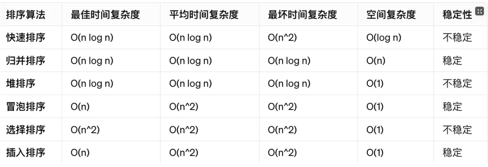

这里会记录数据结构的相关问题, 用于你自测对数据结构的理解.


## 参考资料
- [参考书籍1 数据结构书籍-大话数据结构]

- [参考资料2 数据结构面试题](https://fecommunity.github.io/front-end-interview/%E6%95%B0%E6%8D%AE%E7%BB%93%E6%9E%84%E4%B8%8E%E7%AE%97%E6%B3%95/1.%E6%95%B0%E6%8D%AE%E7%BB%93%E6%9E%84.html)

- [参考资料3 数据结构面试题](https://www.aliyun.com/sswb/510109.html)

- [参考资料4 数据结构理解](https://github.com/labuladong/fucking-algorithm/blob/master/%E7%AE%97%E6%B3%95%E6%80%9D%E7%BB%B4%E7%B3%BB%E5%88%97/%E5%AD%A6%E4%B9%A0%E6%95%B0%E6%8D%AE%E7%BB%93%E6%9E%84%E5%92%8C%E7%AE%97%E6%B3%95%E7%9A%84%E9%AB%98%E6%95%88%E6%96%B9%E6%B3%95.md)

- [参考资料5 数据结构理解](https://github.com/ShannonChenCHN/algorithm-and-data-structure/blob/master/Introduction/%E5%A6%82%E4%BD%95%E5%AD%A6%E5%A5%BD%E6%95%B0%E6%8D%AE%E7%BB%93%E6%9E%84%E5%92%8C%E7%AE%97%E6%B3%95%EF%BC%9F.md)

- [参考资料6 数据结构的学习](https://labuladong.online/algo/data-structure-basic/array-basic/#%E9%9D%99%E6%80%81%E6%95%B0%E7%BB%84)

## 自测题目
``` md
> 1. 你怎么理解数据结构?
- 1. `数据结构, 就是指数据元素的逻辑结构和物理结构, 物理结构即存储结构`. `其中数据元素在计算机中又被称作记录`. `逻辑结构分为线性结构和非线性结构`, `物理结构分为顺序存储和链式存储`. `基本数据结构分为数组和链表`, 其余的属于复杂数据结构.
```

``` md
> 2. 你怎么理解数组
- 1. 数组就是指`逻辑结构是线性结构`, `物理结构是顺序存储的`, `数据元素是为任意类型的.` 的一种`基本`数据结构
```

``` md
> 2. 你怎么理解列表
- 1. 列表就是指`逻辑结构是线性结构`, `物理结构是链式存储的`, `数据元素是有序的.` 的一种数据结构
```

``` md
> 3. 你怎么理解栈
- 1. 栈就是指`逻辑结构是线性结构`, `物理结构是顺序存储的或者链式存储的`, `数据元素是先进后出的.`的一种数据结构
```

``` md
> 4. 你怎么理解队列
- 1. 队列就是指`逻辑结构是线性结构`, `物理结构是顺序存储的或者链式存储的`, `数据元素是先进先出的.`的一种数据结构
```

``` md
> 5. 你怎么理解链表
- 1. 链表就是指`逻辑结构是线性结构`, `物理结构是链式存储的`, `数据元素是链表节点形式的, 由数据域和指针域组成.`的一种`基本`数据结构
```

``` md
> 6. 你怎么理解字典
- 1. 字典就是指`逻辑结构是线性结构`, `物理结构是顺序存储的或者链式存储的`, `数据元素是键值对形式的.`的一种数据结构
```

``` md
> 7. 你怎么理解哈希表(哈希映射)
- 1. 哈希表就是指`逻辑结构是线性结构`, `物理结构是顺序存储的`, `数据元素是由哈希函数进行的键值对映射.`的一种数据结构
```

``` md
> 8. 你怎么理解集合
- 1. 集合就是指`逻辑结构是集合结构`, `物理结构是顺序存储的或者链式存储的`, `数据元素是无序的, 不重复的.`的一种数据结构
```

``` md
> 9. 你怎么理解树
- 1. 集合就是指`逻辑结构是树形结构`, `物理结构是顺序存储的或者链式存储的`, `数据元素是节点形式的`的一种数据结构
```

``` md
> 10. 你怎么理解图
- 1. 集合就是指`逻辑结构是图形结构`, `物理结构是顺序存储的或者链式存储的`, `数据元素是节点形式的`的一种数据结构
```

``` md
> 11. 数组与链表的区别
- 1. 首先, 数组的逻辑结构是线性结构, 物理结构是顺序存储的, 数据元素是任意的. 而链表的逻辑结构是线性结构, 物理结构是链式存储的, 数据元素是链表节点形式的.
所以, 数组的增删改查中的改查快, 但是增删慢.
```

``` md
> 12. 栈和队列的区别
- 1. 栈的逻辑结构是线性的, 物理结构是顺序存储或者链式存储的, 数据元素是先进后出的. 而队列则是逻辑结构是线性的, 物理结构是顺序存储或者链式存储的, 数据元素是先进先出的.
```

``` md
> 13. 二叉树的遍历方法
- 1. 二叉树的遍历共有 4 中方法, 先根遍历, 中根遍历, 后根遍历和层次遍历.
```

``` md
> 14. 图的表示方法
- 1. 通过邻接矩阵或者邻接列表表示.
```

``` md
> 15. 哈希表的工作原理及碰撞解决办法
- 1. 哈希表就是散列表, 其逻辑结构是线性结构, 物理结构是顺序存储或者链式存储, 数据元素为键值对, 且映射关系有散列函数决定. 发生碰撞后的解决办法有三种, 即插空, 链接, 和双散列.
```

``` md
> 16. 常见的排序算法及其复杂度
- 1. 按照时间复杂度来说, 分为 n(logn) 和 n^2 两大类.
```


``` md
> 17. 什么是红黑树？
- 1. 红黑树, 就是一种平衡二叉树.
```

``` md
> 18. 你怎么理解算法?
- 1. 算法就是指问题的解决办法. `后续讨论的算法为数据结构的算法`, 即利用数据结构解决问题的方法.
```

``` md
> 19. 你怎么理解静态数组和动态数组?
- 1. `静态数组是指, 数组的大小在创建之后就不可变了`. 而`动态数组是指, 在静态数组的基础上, 实现了自动扩容`.
```
- [参考资料](https://labuladong.online/algo/data-structure-basic/array-implement/#%E5%87%A0%E4%B8%AA%E5%85%B3%E9%94%AE%E7%82%B9)

``` md
> 20. 你怎么理解时间复杂度和空间复杂度?
- 1. 时间复杂度`指输入规模(数据规模)和运行时间的关系`, 空间复杂度指`输入规模(数据规模)和运行内存之间的关系`.
```

``` md
> 21. 你怎么理解大 O 表示法表示时间复杂度?
- 1. O(n^2)为例: `表示输入规模和运行时间的关系为 n^2 的关系`.(n 表示输入规模), O(n^2) 的计算方式是, `因为直接计算时间不方便, 因此通过核心代码的执行次数间接输入规模和运行时间之间的关系`.

- 2. `横轴为输入规模 n, 纵轴为运行时间.`
```

``` md
> 22. 你怎么理解泛型?
- 1. 泛型, 即`广泛的数据类型`.
```

``` md
> 23. 你怎么理解环形数组?
- 1. 环形数组就是指`逻辑结构是环形结构`, `物理结构是顺序存储的`, `数据元素是任意类型的. 通过双指针实现的逻辑上的环形结构.` 一种数据结构.
```
- [参考资料 环形数组](https://labuladong.online/algo/data-structure-basic/cycle-array/#%E7%8E%AF%E5%BD%A2%E6%95%B0%E7%BB%84%E5%8E%9F%E7%90%86)

``` md
> 24. 为什么`环形数组的区间`被定义为左闭右开的 [start , end )?
- 1. `为了减少心智负担`, 因为此时最为简单方便. 如果你是左闭右闭, 则 [0, 0] 表示你最开始就已经存在一个元素了, 但是本来是不应该有的, 如果你是左开右开, 则 (0, 1) 时又表示没有元素, 因此, 需要对这种情况做特殊处理. 但是你是, 左闭右开, 则区间 [0, 0) 表示没有元素, 区间 [0, 1) 则表示有一个元素, 不需要做特殊处理.
```

- [参考资料 环形数组](https://labuladong.online/algo/data-structure-basic/cycle-array/#%E7%8E%AF%E5%BD%A2%E6%95%B0%E7%BB%84%E5%8E%9F%E7%90%86)

``` md
> 25. 如何用数组实现队列?
- 1. 首先得到一个抽象数组, 在通过抽象数组, 以及队列的相关属性和方法, 实现抽象队列. `以 JS 语言为例, 通过构造函数或者类实现抽象数组, 继而实现抽象队列`

- 补充知识1, `类似于这种问题中的数据结构都是指抽象的数据结构`, 而非实例化后的数据结构, 因为如果已经有了实例化后的队列, 那还需要你来实现吗. 这就是为什么不会让你去实现一个数组的原因, 因为数组属于基本数据结构.
```

``` md
> 26. 如何用数组实现一个哈希表呢？
- 1. 通过抽象数组搭配相应的方法和属性实现抽象的哈希表. 
```
- [参考资料 如何用数组实现一个哈希表呢？](https://labuladong.online/algo/data-structure-basic/hashmap-basic/#key-%E6%98%AF%E5%94%AF%E4%B8%80%E7%9A%84-value-%E5%8F%AF%E4%BB%A5%E9%87%8D%E5%A4%8D)

``` md
> 27. 你怎么理解哈希冲突以及哈希冲突的解决办法?
- 1. 哈希冲突不可能避免，只能在算法层面妥善处理出现哈希冲突的情况. 解决办法分为纵向延伸(拉链法)和横向延伸(开放地址法). `但是`, 拉链法和线性探查法虽然能解决哈希冲突的问题，但是它们会导致性能下降. 因此我们会引入负载因子这一概念, 从而即避免哈希表装太满, 进而避免哈希冲突出现的概率过大.
```
- [参考资料 哈希冲突](https://labuladong.online/algo/data-structure-basic/hashmap-basic/#%E5%93%88%E5%B8%8C%E5%86%B2%E7%AA%81)

- [参考资料 负载因子](https://labuladong.online/algo/data-structure-basic/hashmap-basic/#%E6%89%A9%E5%AE%B9%E5%92%8C%E8%B4%9F%E8%BD%BD%E5%9B%A0%E5%AD%90)

``` md
> 28. 为什么不能依赖哈希表的遍历顺序
- 1. 因为哈希表的数据元素是键值对形式的, 且键值对之间的映射关系由哈希函数决定, 因此哈希表中的数据元素的本身就是无序的, 且因为负载因子的原因, 导致哈希表的容量是可变的, 进一步使得数据元素的顺序无序, 导致遍历无意义.
```

``` md
> 29. 为什么不建议在 for 循环中增/删哈希表的 key?
- 1. 同上. 由哈希表的实现原理＋负载因子, 因此不建议.
```

``` md
> 30. 为什么我们常说，哈希表的增删查改效率都是 O(1)？
- 1. 因为哈希表的逻辑结构是线性结构, 物理结构是顺序存储的, 数据元素是键值对形式的, 且键值对的映射关系由哈希函数决定. 哈希表的增删查改效率都是 O(1), 顺序存储表示哈希表是通过数组实现的, 而数组的增删查改效率就是O(1). `需要注意的一点是, 此处的哈希表是指 HashMap 哈希映射, 因此你可以说复杂度为 O(1), 但是如果是 TreeMap 树型映射, 则就不是了.`
```
- [参考资料](https://labuladong.online/algo/data-structure-basic/hashmap-basic/#%E6%80%BB%E7%BB%93)

``` md
> 31. 你怎么理解二叉树?
- 1. 二叉树就是指, `在树的基础上, 这个树的最大度数为 2 的一种树`, 就是二叉树.
```
- [参考资料 二叉树](https://labuladong.online/algo/data-structure-basic/binary-tree-basic/)

``` md
> 32. 你怎么理解满二叉树? `perfect binary tree`
- 1. 满二叉树就是指, 在二叉树的基础上, `每一层都是满的二叉树`.
```
- [参考资料](https://labuladong.online/algo/data-structure-basic/binary-tree-basic/#%E5%AE%8C%E5%85%A8%E4%BA%8C%E5%8F%89%E6%A0%91)

``` md
> 33. 你怎么理解完全二叉树? `complete binary tree`
- 1. 完全二叉树就是指, `在二叉树的基础上, 每一层都是都是满的, 但是最后一层的叶子节点可以不满, 但是必须是紧凑排列的.`
```
- [参考资料](https://labuladong.online/algo/data-structure-basic/binary-tree-basic/#%E5%AE%8C%E5%85%A8%E4%BA%8C%E5%8F%89%E6%A0%91)

``` md
> 34. 你怎么理解满的二叉树? `full binary tree`
- 1. 满的二叉树就是指, `在二叉树的基础上, 要么没有子节点, 要么就有两个子节点.`
```
- [参考资料](https://labuladong.online/algo/data-structure-basic/binary-tree-basic/#%E5%AE%8C%E5%85%A8%E4%BA%8C%E5%8F%89%E6%A0%91)

``` md
> 35. 你怎么理解二叉搜索树?(BST /baɪ/s/triː/)
- 1. 二叉搜索树就是指, 在二叉树的基础上, 其`该节点的左子树的每个节点的值都要小于这个节点的值`，`该节点的右子树的每个节点的值都要大于这个节点的值`。
```

``` md
> 36. 你怎么去实现一颗二叉树呢?
- 1. 可以通过数组实现或者通过链表实现(最常见的方式), `链表实现方式是通过定义链表节点实现的`, 树型节点分为数据域和指针域, 指针域指向其子节点. `数组实现, 是通过邻接表或者邻接矩阵实现的.`
```

``` md
> 37. 遍历二叉树的方法有哪些?
- 1. 层序遍历和递归遍历(前中后三种). `需要注意的是, 在遍历二叉树的时候, 建议还是头脑中具有一颗树形结构后在开始遍历.`

- 2. `层序遍历的思路, 通过二叉树和队列实现的遍历`, 先访问第一层, 将其推入队列当中去, 然后开始遍历队列, 没出队一个, 就将其对于的左右子节点入队, 以此类推.
```
- [参考资料 二叉树的遍历](https://labuladong.online/algo/data-structure-basic/binary-tree-traverse-basic/#%E9%80%92%E5%BD%92%E9%81%8D%E5%8E%86-dfs)

- [参考资料 层序遍历](https://labuladong.online/algo/data-structure-basic/binary-tree-traverse-basic/#%E5%B1%82%E5%BA%8F%E9%81%8D%E5%8E%86-bfs)

``` md
> 38. 如果让你去实现一个复杂数据结构, 你会怎么做?
- 1. 基本思路就是, 首先, `确定底层使用的是何种数据结构(数组或者链表)`, 然后在确定改复杂数据结构的相关特性, 进行实现即可.
```

``` md
> 39. 二叉树的高度和深度一样吗?
- 1. 不一样, `高度是从叶子节点到根节点`, `深度是从根节点到叶子节点`.
```

``` md
> 40. 怎么实现图?
- 1. `图是指逻辑结构是图形结构, 物理结构为顺序存储或者链式存储, 数据元素为图形节点和边的`一种数据结构. 如果要实现图, 需要`先实现图的存储结构`, 即顺序存储或者链式存储, `然后实现对数据元素的操作`.
```
- [参考资料 图](https://labuladong.online/algo/data-structure-basic/graph-basic/#%E6%97%A0%E5%90%91%E5%8A%A0%E6%9D%83%E5%9B%BE-%E9%82%BB%E6%8E%A5%E8%A1%A8-%E9%82%BB%E6%8E%A5%E7%9F%A9%E9%98%B5%E5%AE%9E%E7%8E%B0)

``` md
> 41. 怎么实现数据结构?
- 1. `想要实现数据结构, 首先实现他的物理结构, 然后实现他的基本操作.`
```

``` md
> 42. 你怎么理解深度优先和广度优先算法?
- 1. 深度优先就是递归遍历, 广度优先就是层序遍历.
```
- [参考资料 深度优先和广度优先](https://labuladong.online/algo/data-structure-basic/graph-traverse-basic/)

``` md
> 43. 你怎么理解二叉堆(优先级队列)?
- 1. 二叉堆就是指在二叉树的基础上, 任意节点的值都要比起左右子树大/小, 分别表示大顶堆或者小顶堆.
```
- [参考资料 二叉堆](https://labuladong.online/algo/data-structure-basic/binary-heap-basic/#%E5%8F%A6%E4%B8%80%E7%A7%8D%E5%BA%94%E7%94%A8-%E5%A0%86%E6%8E%92%E5%BA%8F)

``` md
> 44. 你怎么理解堆排序?
- 1. 堆排序就是指利用二叉堆的特性实现的排序.
```

``` md
> 45. 二叉堆和堆内存一样吗?
- 1. `不一样, 完全不一样`, `不要纠结`. 首先, 二叉堆是一种数据结构, 而堆内存是一种内存分配机制, 是一块由程序员手动管理的(申请和释放)的内存空间, 是离散的. 栈内存是一块由系统自动管理(申请和释放)的内存空间, 是连续的. `至于堆内存为什么叫做堆, 是因为堆的汉字意思就是表示的就是无序. 符合堆内存的特点, 即离散的`
```

``` md
> 46. 怎么学习数据结构算法呢?
- 1. `知行合一`, 首先需要知道自己要做什么, 也就是要去`阅读`或者说是`翻译`, 用自己的话表述出来, 然后在去做.
```

``` md
> 48. 链表问题题目分析示例:
- 1. 将两个升序链表合并为一个新的 升序 链表并返回。新链表是通过拼接给定的两个链表的所有节点组成的。

- 2. `阅读(翻译)题目`: 已知, 有两个链表, list1 和 list2, 要求合并为一个新的链表 list3, 并返回. 所以我们首先是定义这三个链表, 在去操作这些链表.
```
- [参考资料 合并两个有序链表](https://labuladong.online/algo/essential-technique/linked-list-skills-summary/#%E5%90%88%E5%B9%B6%E4%B8%A4%E4%B8%AA%E6%9C%89%E5%BA%8F%E9%93%BE%E8%A1%A8)

``` md
> 49. 你怎么理解动态规划?
- 1. 动态规划就是利用`状态转移方程`和`动态规划数组`获得`最优子结构`的过程, 就是动态规划.

- 补充知识1, 对于状态转移方程, 的关键点在于根据当前状态, 推导出其上一个状态是什么, 可以借助树结构来确定当前状态和其上一个状态的关系.
```
- [参考资料 动态规划 DP](https://labuladong.online/algo/essential-technique/dynamic-programming-framework/#dp-%E6%95%B0%E7%BB%84%E7%9A%84%E8%BF%AD%E4%BB%A3-%E9%80%92%E6%8E%A8-%E8%A7%A3%E6%B3%95)