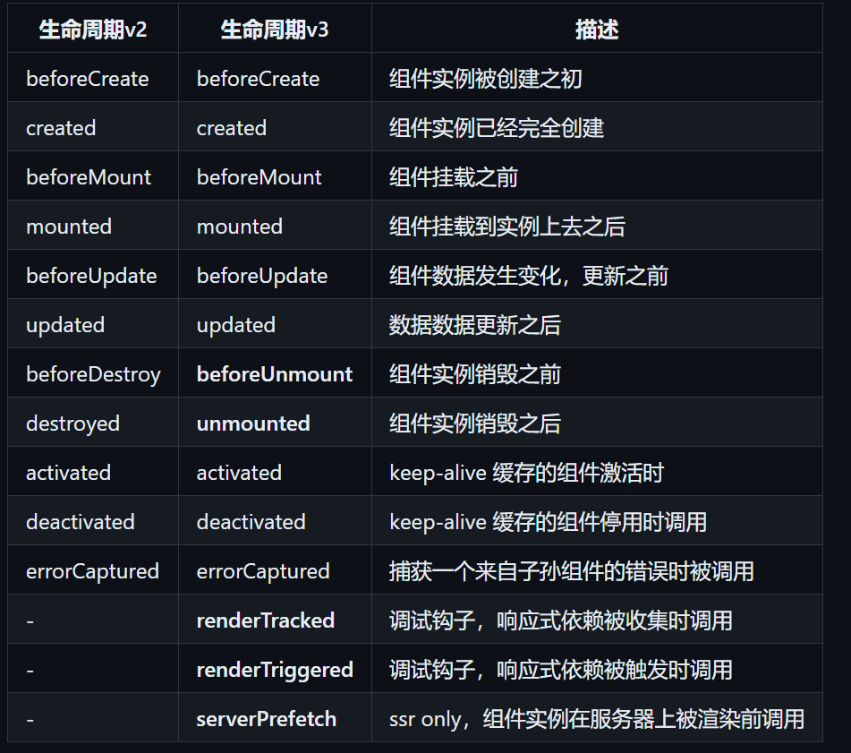
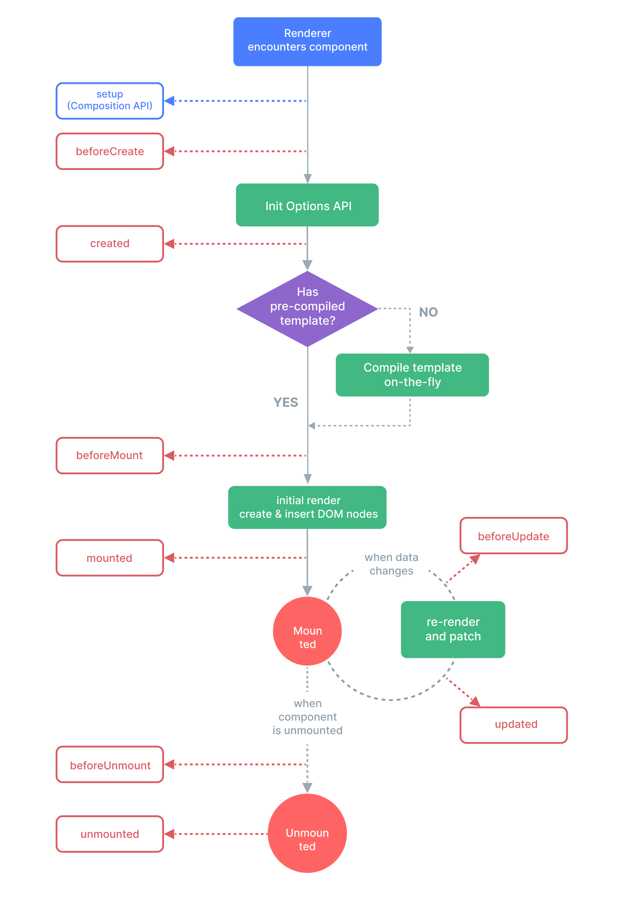

这里将会记录 Vue Web 网站前端框架的相关面试问题, 用于测试你对 Vue Web 网站前端框架的理解程度. 建议先不看简析, 说出自己的答案, 然后在看简析确认自己的答案.
我们在遇到一个题目时, 首先需要"翻译", 即将一些专业名词翻译成我们能理解的意思. 例如: `Vue 翻译后就是: Web 网站前端框架.`

## Vue Web 网站前端框架面试题系列
- [参考资料 讯飞星火](https://xinghuo.xfyun.cn/desk)

- [参考资料 Vue Web 网站前端框架面试题系列](https://github.com/57code/vue-interview)

- [参考资料 Vue Web 网站前端框架面试题系列](https://cchroot.github.io/interview/pages/interview%20questions/vue%E5%9F%BA%E7%A1%80%E9%9D%A2%E8%AF%95%E9%A2%98.html)

``` md
> 1. v-if 条件渲染和 v-for 列表渲染哪个优先级更高？
- 1. 首先, 官方不建议一起使用. 其次 vIf 条件渲染和 vFor 列表渲染的优先级取决于你使用的 Vue 版本, 在 Vue2 中 vFor 列表渲染高, 在 Vue3 中则 vIf 条件渲染高.
```

``` md
> 2. 你知道 key 键的作用吗？
- 1. 在 Vue Web 网站前端框架中, key 键的作用是为了维护虚拟 DOM 文档对象模型的渲染和更新, 保证其性能和准确性. 通过 key 键唯一标识元素, 如果 key 键没有改变, 则会复用该元素, 反之则会新增一个元素. 减少渲染次数，提高性能.
```

``` md
> 3. 能说说双向绑定以及它的实现原理吗？
- 1. vModel 双向绑定, 就是在单向数据绑定的基础上, 实现了 view 视图层和 model 模型层的数据绑定. 本质是一个语法糖, 一个 vBind 单向数据绑定加一个 input 事件.
```

``` md
> 4. v-model 双向数据绑定和 sync 同步修饰符有什么区别?
- 1. vModel 双向数据绑定常用于表单控件, 而 sync 同步常用于父子组件之间, 用于数据同步.
```

``` md
> 5. 自定义组件使用 v-model 双向数据绑定, 如果想要改变事件名或者属性名应该怎么做?
- 1. 我现在没有理解这一操作的意义是什么, 因此没有进一步了解.

- 2. 代码示例:
```
``` js
model: {
  prop: 'myValue', // 修改属性名为 myValue
  event: 'input'
},
```

``` md
> 6. 你了解 diff 比较差异算法吗？
- 1. diff 比较差异算法, 在 Vue Web 网站前端框架中, 是为了比较新旧虚拟 DOM 文档对象模型之间的差异, 去维护虚拟 DOM 文档对象模型的渲染和更新.
```

``` md
> 7. vue Web 前端框架中组件之间的通信方式？
- 1. 父子组件

- 2. 兄弟组件

- 3. 跨层组件

- 4. 状态管理仓库
```

``` md
> 8. 简单说一说你对 vuex 状态管理仓库理解？
- 1. vuex 状态管理仓库, 一个集中管理 state 状态的地方. 你可以通过 mutations 突变去改变 state 状态, 可以通过 actions 动作去提交 mutation 突变, 进行异步操作, 通过 getter 获取器去获取 state 状态, 通过 module 模块, 去分割 state 状态. 

- 2. 代码示例
```
``` js
// 导入 Vue 和 Vuex
import Vue from 'vue';
import Vuex from 'vuex';

// 安装 Vuex 插件
Vue.use(Vuex);

// 创建 store
const store = new Vuex.Store({
  state: {
    count: 0
  },
  mutations: {
    increment(state) {
      state.count++;
    }
  },
  actions: {
    incrementAsync({ commit }) {
      setTimeout(() => {
        commit('increment');
      }, 1000);
    }
  }
});

// 创建一个 Vue 实例，并将 store 注入到根组件中
new Vue({
  el: '#app',
  store,
  render: h => h(App)
});
```
- [参考资料 Vuex 状态管理仓库](https://vuex.vuejs.org/zh/guide/)

``` md
> 9. vue-router 路由是如何保护路由的？
- 1. 通过设置路由守卫, 共三种守卫. 全局守卫, 路由独享守卫, 组件内守卫.
- 1. 全局守卫, beforeEach 前置守卫, beforeResolve 解析守卫, afterEach 后置守卫.

- 2. 路由独享守卫, beforeEnter 进入守卫.

- 3. 组件内守卫, beforeRouteEnter 路由进入守卫, beforeRouteUpdate 路由更新守卫, beforeRouteLeave路由离开守卫.

- 2. 通过设置路由 meta 元信息.

- 补充知识1, to 目标路由, from 来源路由, next 路由导航.

- 补充知识2, 路由解析成功但是未生效, 是指 router 路由器解析成功了 route 路由, 但是对应的 component 组件并未渲染.
```
- [参考资料 路由导航](https://router.vuejs.org/zh/guide/advanced/navigation-guards.html)

``` md
> 10. 能不能说说全局守卫、路由独享守卫和组件内守卫区别？
```

``` md
> 11. 你项目中的路由守卫是怎么做的？
- 1. 使用的是全局守卫. beforeEach 前置守卫.
```

``` md
> 12. 前后端路由一样吗？
- 1. 不一样. 首先, 前端路由是通过客户端进行处理, 后端路由是通过服务器进行处理. 前端路由以 Vue-Router 路由器来说, 它的路由请求获取的是 Component 组件. 后端路由以 Springboot Web 网站后端框架来说, 它的路由请求获取的是 controller 控制器层所返回的资源.  
```

``` md
> 13. 前端路由是用什么方式实现的？
- 1. Vue Web 网站前端框架是通过的 VUe-Router 路由实现的.
```

``` md
> 14. 你前面提到的 next 路由导航方法是怎么实现的？
- 1. next() 表示跳转到 to 目标路由;

- 2. next(false) 表示中端当前路由导航.

- 3. next("./login") 表示重定向到 ./login 路径对应的组件. 
```

``` md
> 15. 你了解哪些 Vue Web 网站前端框架的性能优化方法？
- 1. 首先, 性能优化, 主要集中在两点, 即 DOM 文档对象模型的`重复渲染`和`大量渲染`.
- 1. DOM 文档对象模型元素的`重复渲染`, 设置路由懒加载, 使用 keep-alive 保持连接.

- 2. DOM 文档对象模型元素的`大量渲染`, 分页展示数据, 虚拟滚动, 父子组件和图片懒加载(超级表格, 超级表单...等)
```

``` md
> 16. 你知道 nextTick 下一个更新周期吗，它是干什么的，实现原理是什么？
- 1. nextTick 下一个更新周期, 使得我们可以提前操作下一个更新周期的 DOM 文档对象模型元素. 它的本质就是一个异步微任务, 会将接受的回调函数作为一个异步微任务放入任务队列当中去, 等待执行.
```
``` js
// 修改数据
vm.msg = 'Hello'
// DOM 还没有更新
Vue.nextTick(function () {
// DOM 更新了
})
```

``` md
> 17. 说一说你对 vue Web 前端框架响应式理解？
- 1. Vue Web 网站前端框架的响应式数据, 是指 view 视图层和 model 模型层数据的响应式变化和更新. 其中响应式的变化是通过 MVVM 机制实现的, 响应式的更新是通过 diff 比较差异算法实现的.

- 补充知识1, 在 Vue2 中的响应式数据是通过的 defineProperty 定义属性实现的, 而 Vue3 中的响应式数据是通过 Proxy 代理实现的.
```

``` md
> 18. 你如果想要扩展某个 Vue Web 前端框架组件时会怎么做？
- 1. 首席理解原组件, 然后确认自己的需求, 最后在决定其他.
```

``` md
> 19. Vue.extend Vue Web 前端框架的继承方法你用过吗？它能用来做组件扩展吗？
- 1. 了解过一些, 但是并没有在实际开发中使用过.
```

``` md
> 20. nextTick 下一个更新周期的实现原理?
- 1. 本质是一个异步微任务, 会将接受的回调函数作为微任务放入任务队列当中去等待执行.
```

``` md
> 21. 你平时什么时候会用到 nextTick 下一个更新周期？
- 1. 使用 nextTick 下一个更新周期的目的, 是为了提前操作下一个更新周期的 DOM 文档对象模型元素. 
```

``` md
> 22. Vue2 Web 前端框架和 Vue3 Web 前端框架中的响应式原理对比, 以及的具体实现思路
- 1. Vue2 Web 网站前端框架使用的是 defineProperty 定义属性, 而 Vue3 Web 网站前端框架使用的是 Proxy 代理.
```

``` md
> 23. 说说 vue2/vue3 Web 前端框架的生命周期异同
- 1. 大致来说, 组件的生命周期, 分为 8 个阶段, 即 create 创建, mount 挂载, update 更新, destroy 销毁, 各有 before/after 前后, 共 8 个阶段.

- 2. 区别在于, 最后的 destroy 销毁在 Vue3 中替换为了 unmount 卸载. 并且 Vue3 额外提供了一个 setup 设置, 在 create 创建之前被调用.

- 补充知识1, setup 设置有两个参数 props 属性和 context 上下文, props 属性可以获取来自父组件的消息, context 上下文可以获取当前组件的实例. 需要注意的是, vue2 中的 this 对象可以访问当前组件实例的所有属性而 context 上下文只能访问官方暴漏的属性. 因此二者并不等同.
```

``` md
> 24. setup 设置和 created 创建后谁先执行？
- 1. setup 设置在 create 创建之前被调用.
```

``` md
> 25. setup 设置中为什么没有 beforeCreate 创建前和 created 创建后？
- 1. 因为 setup 设置不是生命周期函数, 只是在 create 创建之前被调用的一个特殊的函数.
```

``` md
> 26. watch 监视和 computed 计算的区别以及怎么选用?
- 1. watch 监视用来监视响应式数据, 可以处理复杂的逻辑. 而 computed 计算, 用于计算响应式数据. 因此, 复杂逻辑处理使用 watch 监视, 简单计算使用 computed 计算.
```

``` md
> 27. watch 监视会不会立即执行？
- 1. 不会, 只有当监视的响应式数据发生改变时, 才会执行 watch 监视. 你可以通过 immediate 立即的进行立即执行.
```
``` js
new Vue({
  data: {
    message: 'Hello, Vue!'
  },
  watch: {
    message: {
      handler(val, oldVal) {
        console.log('c changed')
      },
      deep: true,
      immediate: true
    }
  }
});
```

``` md
> 28. watch 监视和 watchEffect 监视效应有什么差异
- 1. watchEffect 监视效应, 是 Vue3 Web 网站前端框架, 新增的 API 应用程序接口, 其功能比 watch 监视更强大. watchEffect 监视效应可以使用一种更简洁和直接的方式来监视响应数据的变化, 而不需要明确指定所依赖的数据属性. 
```
``` js
import { ref, watchEffect } from 'vue';

export default {
  setup() {
    const count = ref(0);

    watchEffect(() => {
      console.log(count.value); // 每次 count 变化时打印
    });

    return {
      count
    };
  }
}
```

``` md
> 29. 说一下父组件和子组件的创建和挂载顺序
- 1. 先 create 创建父组件, 然后判断是否有子组件, 有则在 create 创建子组件. 创建子组件结束后, 就会 mount 挂载子组件, 在 mount 挂载父组件. 之所以会这样是因为Vue创建过程是一个递归过程.
```

``` md
> 30. Vue Web 前端框架的组件为什么只能有一个根元素?
- 1. Vue2 Web 网站前端框架中, template 模板只能有一个根元素, 是因为 Vue2 Web 网站前端框架中的 VDom 虚拟文档对象模型是一个单根结构. 而现在 Vue3 Web 网站前端框架中引入了 Fragment 片段概念, 使得 template 组件可以支持多根元素, 如果发现组件是多根的，就创建一个Fragment节点，把多个根节点作为它的children。将来patch的时候，如果发现是一个Fragment节点，则直接遍历children创建或更新。需要注意的是 Fragment 片段, 是一个抽象节点, 并不会渲染未真实的 DOM 文档对象模型元素.
```

``` md
> 31. 你知道哪些 vue3 Web 前端框架的新特性
- 1. Vue3 Web 网站前端框架的新特性, 就是组合式的 API 应用程序接口, 以及更快, 更小, 更易维护, 更易扩展.
```

``` md
> 32. 简述 Vue Web 前端框架的生命周期以及每个阶段做的事
```




``` md
> 33. 说说你对虚拟 DOM 文档对象模型的理解
- 1. VDOM 虚拟文档对象模型是对真实 DOM 文档对象模型的抽象, 目的为了减少操作真实 DOM 文档对象模型的次数, 提高效率. 同时也方便实现跨平台, 相同的 VDOM 虚拟文档对象模型, 通过不同的 render 渲染器得到不同的真实 DOM 文档对象模型.
```

``` md
> 34. 怎么缓存当前的组件？缓存后怎么更新？
- 1. 通过 keep-alive 保存连接去缓存组件. 组件缓存后, 通过 activated 激活, 在组件被激活时执行某些操作.
```

``` md
> 35. 说说从 template 模板到 render 渲染的处理过程
- 1. 通过 compiler 编译器得到的 render 渲染函数.

- 2. compiler 编译器会进行 parse 解析和 transform 转换. parse 解析是将 template 模板解析得到 AST 抽象语法树, transform 转换是将 AST 抽象语法树转换为一个可执行的 render 渲染函数.  
```

``` md
> 36. Vue Web 前端框架中 compiler 编译器何时执行？
- 1. 在你构建项目时, 会执行 compiler  编译器.
```

``` md
> 37. react Web 前端框架有没有 compiler 编译器？
- 1. 没有, Vue Web 网站前端框架有内置的 compiler 编译器的原因是因为 Vue Web 网站前端框架是通过 template 模板开发的组件, 因此需要 compiler 编译器, 但是 react Web 网站前端框架, 是通过 JS 语言直接编写的组件, 因此不需要 compiler 编译器进行解析和转换.
```

``` md
> 38. 如果让你从零开始写一个 vue Web 前端框架的路由，说说你的思路
- 1. 首先是需求分析, 确认你的需求, 然后才会进行开发. 
```

``` md
> 39. Vue 3.0 Web 前端框架的设计目标是什么？做了哪些优化?
- 1. `更快, 更小, 更易维护, 更好扩展`, 用组合式 API 应用程序接口替换了选项式 API 应用程序接口, 同时对响应式数据的底层实现逻辑进行变动, 有 defineProperty 定义属性变为了 Proxy 代理. 
```

``` md
> 40. Vue3 Web 前端框架做了哪些编译优化？
- 1. `更快`(指更快的编译速度, compiler 编译器采用了"静态提升"的技术, 通过分析 template 模板中的静态内容，将其提升到渲染函数之外，从而减少了运行时的计算量), `更小`(更小的打包体积, 通过使用按需导入), `更易维护`(更好的 TS 语言支持), `更好扩展`(更灵活的 API 应用程序接口, 使用组合式 API 应用程序接口替换选项式 API 应用程序接口)
```

``` md
> 41. Proxy 代理和 defineProperty 定义属性有什么不同？
- 1. Proxy 代理更加强大, Proxy 代理是 ES6 JS 语言规范中的新特性, Proxy 代理可以代理整个 Object 对象, 并进行相应的操作, 但是 defineProperty 定义属性能对 Object 对象的属性进行相应的操作, 因此 Proxy 代理更加强大且灵活.
```

``` md
> 42. 你有使用过 vuex 状态管理仓库的 module 模块吗？
- 1. 有使用过 module 模块, 使用 module 模块的目的是为了分模块的管理 state 状态.

- 2. 代码示例:
```
``` js
// vuex 状态管理仓库
import Vue from 'vue';
import Vuex from 'vuex';

Vue.use(Vuex);

const store = new Vuex.Store({
  modules: {
    moduleA: {
      state: {
        count: 0
      },
      mutations: {
        increment(state) {
          state.count++;
        }
      },
      actions: {
        incrementAsync({ commit }) {
          setTimeout(() => {
            commit('increment');
          }, 1000);
        }
      },
      getters: {
        doubleCount(state) {
          return state.count * 2;
        }
      }
    }
  }
});

// 组件
<template>
  <div>
    <p>Count: {{ count }}</p>
    <p>Double Count: {{ doubleCount }}</p>
    <button @click="increment">Increment</button>
    <button @click="incrementAsync">Increment Async</button>
  </div>
</template>

<script>
import { mapState, mapMutations, mapActions, mapGetters } from 'vuex';

export default {
  computed: {
    ...mapState('moduleA', ['count']),
    ...mapGetters('moduleA', ['doubleCount'])
  },
  methods: {
    ...mapMutations('moduleA', ['increment']),
    ...mapActions('moduleA', ['incrementAsync'])
  }
};
</script>
```

``` md
> 43. 你用过 pinia 状态管理仓库吗？都做了哪些改善？
- 1. 有过了解, pinia 也是一种状态管理仓库, 相较于 vuex 官方的状态管理仓库, pinia 状态管理仓库的优点在于`轻量级`. 

- 补充知识1, 对于 pinia 状态管理仓库和 Vuex 状态管理仓库的选择, `取决于你的需求是什么`, 如果是个小项目且追求效率, 那么可以使用 pinia 状态管理仓库, 如果是个大项目且追求更多的功能, 则推荐使用 vuex 状态管理仓库.  

- 2. 代码示例:
```
``` js
// 安装 Pinia
npm install pinia

// main.js
import { createApp } from 'vue'
import { createPinia } from 'pinia'
import App from './App.vue'

const app = createApp(App)
app.use(createPinia())
app.mount('#app')

// store.js
import { defineStore } from 'pinia'

export const useCounterStore = defineStore({
  id: 'counter',
  state: () => ({
    count: 0
  }),
  actions: {
    increment() {
      this.count++
    },
    decrement() {
      this.count--
    }
  }
})

// App.vue
<template>
  <div>
    <p>{{ count }}</p>
    <button @click="increment">增加</button>
    <button @click="decrement">减少</button>
  </div>
</template>

<script>
import { useCounterStore } from './store'

export default {
  setup() {
    const counterStore = useCounterStore()
    return {
      count: counterStore.$state.count,
      increment: counterStore.increment,
      decrement: counterStore.decrement
    }
  }
}
</script>
```

``` md
> 44. 怎么实现路由懒加载呢？
- 1. 你可以通过使用 import 动态导入实现按需导入.

- 补充知识1, 你需要明白的一点是, 对于前端路由, 尤其是 SPA 单页面应用的路由, 实现路由懒加载的目的就是为了减少对 DOM 文档对象模型的渲染. 

- 2. 代码示例:
```
``` js
// 将
// import UserDetails from './views/UserDetails'
// 替换为
const UserDetails = () => import('./views/UserDetails')

const router = createRouter({
  // ...
  routes: [{ path: '/users/:id', component: UserDetails }],
})
```

``` md
> 45. ref 引用和 reactive 响应式的异同
- 1. 首先, ref 引用会接受一个基本数据类型作为传参, 并返回一个响应式对象. reactive 响应式会接受一个引用数据类型作为传参, 并返回一个响应式对象. 然后, 对于 ref 引用而言, 是通过 RefImpl 引用实现实现的响应式数据, 而 reactive 响应式是通过的 Proxy 代理实现的响应式数据.
```

``` md
> 46. SPA 单页面应用、SSR /sɜ/si/ri/ 服务端渲染的区别是什么
- 1. SPA 单页面应用属于 CSR /k/si/ri/ 客户端渲染, 优点在于, 单次请求, 具有良好的交互性, 缺点也很明显, 由于一次请求所有的 HTML 超文本标记语言文件, 所以首屏加载时间长, 然后是对 SEO 搜索引擎优化不良好.  
```

``` md
> 47. 你写过自定义指令吗？使用场景有哪些？
- 1. Vue Web 网站前端框架中编写自定义指令, 是通过编写指令对象实现的(指令对象具有自己的 API 应用程序接口).

- 2. 常用的自定义指令, debounce 防抖, throttle 节流, copy 复制, drag 拖拽, longPress 长按, waterMask 水印...等
```

``` md
> 48. 说下 $attrs 属性和 $listeners 监听器的使用场景
- 1. 常用于爷孙组件的传递.

- 2. attrs 属性, 常用于属性透传的, 即跨层级传递属性. 而 listeners 监听器, 在 Vue3 中已经废弃, 在 Vue2 中用于事件透传, 即跨层级传递事件. 个人感觉不好用.
```

``` md
> 49. v-once 单次渲染的使用场景有哪些？
- 1. vOnce 单次渲染, 适用于那些不需要改变 DOM 文档对象模型元素, 减少 DOM 文档对象模型的渲染次数.

- 2. vOnce 单次渲染, 即只渲染一次组件(即使在 update 更新阶段也不会再次渲染). 

- 补充知识1, 在 Vue3 中新增了 vMemo 缓存绑定, 只要 props 属性没有发生改变, 则绑定了 vMemo 缓存绑定的元素或组件就不会被重新渲染. 一次 vMemo 缓存绑定比 vOnce 更灵活了.
```

``` md
> 50. 什么是 recursive 递归组件？举个例子说明下？
- 1. recursive 递归组件, 就是一个组件在内部自己调用了自己, 那么该组件就是一个 recursive 递归组件.

- 代码示例: 
```
``` js
// 递归组件实现 Tree 树型结构
```
- [参考资料 recursive 递归组件](https://blog.csdn.net/small_cutey/article/details/121995073)

``` md
> 51. 异步组件是什么？使用场景有哪些？
- 1. 首先, 异步组件是指该组件是在组件内部异步导入的, 那么这个组件就是异步组件, 又因为异步组件不会被立即加载而是按需加载, 因此可以有效的减少真实 DOM 文档对象模型的渲染次数, 进而提高浏览器的效率. 

- 补充知识1, 异步组件, 即不会被立刻加载的组件.

- 补充知识2, 你要注意区分异步路由和异步组件的区别, 异步路由, 是在 route 路由中异步导入组件, 而异步组件, 是在一个组件内部异步导入组件.

- 补充知识3, 异步导入的方法, `推荐使用 import 动态导入实现`, 但是也可以通过使用 Promise 期约实现.

- 2. 代码示例
```
``` js
import { defineAsyncComponent } from 'vue'
// defineAsyncComponent定义异步组件
const AsyncComp = defineAsyncComponent(() => {
  // 加载函数返回Promise
  return new Promise((resolve, reject) => {
    // ...可以从服务器加载组件
    resolve(/* loaded component */)
  })
})
// 借助打包工具实现ES模块动态导入
const AsyncComp = defineAsyncComponent(() =>
  import('./components/MyComponent.vue')
)
```

``` md
> 52. 你是怎么处理 vue Web 前端框架项目中的错误的？
- 1. 首先, 对于前端而言, 异常主要分为两大类, 一个是网络请求异常, 一个是代码逻辑异常. 网络请求异常是指前端发送网络请求时, 后端返回的响应异常, 需要和后端联调解决. 对于代码逻辑异常, 就是指前端编写的代码逻辑本身出错. Vue Web 网站前端框架中的常用异常有, referenceError 引用异常, typeError 类型异常,  syntaxError 语法异常...等.
```
- [参考资料 前端常见异常](https://juejin.cn/post/7048450212431396878)

``` md
> 53. 子组件可以直接改变父组件的数据么，说明原因
- 1. 不可以, 因为在 Vue 网站前端框架中, 父子组件之间的数据是通过 props 属性实现的是单向数据绑定. 因此无法进行修改, 也不建议修改. 如果你非要改, 当然也可以改.  
```

``` md
> 54. Vue Web 前端框架要做权限管理该怎么做？控制到按钮级别的权限怎么做？
- 1. 前端的权限管理, 一般而言分为三种, menu 菜单权限, page 页面权限, 以及 button 按钮权限. 那么, 要实现这些权限的动态管理, 通常是配合着后端一起实现的, 是通过动态路由实现的.

- 补充知识1, 那动态路由如何实现? 简单而言, 就是 route 路由数据保存在后端, 每次登录成功后都会去获取 route 路由数据, 根据角色的不同获取的 route 路由数据不同. 
```

``` md
> 55. 从 0 到 1 自己构架一个 vue Web 前端框架项目，说说有哪些步骤、哪些重要插件、目录结构你会怎么组织
- 1. 首先, 对于我而言, 如果要我去从 0 开发一个项目, 首先肯定是需求分析, 知道我要做什么, 然后才会进行开发, 那么, 到了开发阶段, 首先是进行系统建模, 是为了进一步的理解需求, 之后才会进入编程阶段, 此时, 我会去选择一个合适的 CMS 内容管理系统辅助我进行项目开发, 然后开始业务开发. 因此, 对于此题中的 0 的定义, 是说真实项目开发还是从零开发 CMS 内容管理系统, 回答是不同的. 现在, 假设我已经有了一个 CMS 内容管理系统, 那么我直接根据官方文档运行按照, 然后进行后续的业务开发. 对于 Vue 网站前端框架来说, 他的目录组织一般而言都大同小异, 在 src 源代码文件夹下储存源代码.
```

``` md
> 56. 实际工作中，你总结的 vue Web 前端框架的最佳实践有哪些？
```
- [Vue3 风格指南](https://juejin.cn/post/722442621892917663)

- [Vue3 官方风格指南](https://cn.vuejs.org/style-guide/rules-strongly-recommended#component-name-casing-in-js-jsx)

- [Vue 网站前端框架的最佳实践](https://cn.vuejs.org/guide/best-practices/performance)

``` md
> 57. Vue Web 前端框架的实例挂载的过程中发生了什么?
- 1. Vue 网站前端框架的挂载过程, 就是指 mount 挂载阶段, 该阶段会把 vDOM 虚拟文档对象模型挂载到 el 元素指定的真实 DOM 文档对象模型上. 此时你才可以访问 DOM 文档对象模型的元素.
```

``` md
> 58. 响应式数据怎么创建
- 1. 在 Vue2 网站前端框架中, 响应式数据是通过 data 数据选项创建的. 但是在 Vue3 网站前端框架中, 响应式数据是通过 ref 引用或者 reactive 响应式创建的.
```

``` md
> 59. 依赖关系如何建立
- 1. 在 Vue 网站前端框架中的依赖关系, 是通过发布订阅模式建立的...待补充 
```

``` md
> 60. vue-loader 加载器是什么？它有什么作用？
- 1. vue-loader 加载器, 就一个是 Webpack 网站打包工具的加载器, 为了更好的将 Vue 网站前端框架的文件打包为浏览器可执行的文件.
```

``` md
> 61. 怎么定义动态路由？怎么获取传过来的动态参数？
- 1. 通过动态导入组件定义动态路由. 

- 2. 通过 route 路由获取当前路由的数据.

- 补充知识1, 路由组件传参的意义是什么? 现阶段的我感觉没有什么作用, 因为我直接使用 route 路由和 router 路由器不好吗.
```

``` md
> 62. 如果让你从零开始写一个 vuex 状态管理仓库，说说你的思路
- 1. vuex 状态管理仓库的核心就是 state 状态. 所以如何设计 state 状态很关键.
```

``` md
> 63. vuex 状态管理仓库中的 actions 动作 和 mutations 突变有什么区别？
- 1. mutations 突变可以直接改变 state 状态, actions 动作可以定义异步任务.
```

``` md
> 64. 使用 vue Web 前端框架去渲染大量数据时应该怎么优化？说下你的思路！
- 1. 分页或者虚拟滚动.

- 补充知识1, 虚拟滚动如何实现?
```

``` md
> 65. 怎么监听 vuex 状态管理仓库数据的变化？
- 1. 通过 watch 监视或者 watchEffect 监视效应监视 Vuex 状态管理仓库的数据变化.
```

``` md
> 66. router-link 路由链接和 router-view 路由视图是如何起作用的？
- 1. route-link 路由链接, 用于定位 URL 统一资源定位器.

- 2. router-view 路由视图, 用于给路由组件占位.
```

``` md
> 67. 谈谈你对 SPA 单页面应用模式的理解，优缺点 ？
```

``` md
> 68. mvc 模型-视图-控制器模式和 mvvm 模型-视图-视图模型模式的理解
```

``` md
> 69. 生命周期函数
```

``` md
> 70. Vue Web 前端框架中的组件中 data 数据为什么必须是一个函数 ？
```

``` md
> 71. vue Web 前端框架给对象新增属性页面没有响应
```

``` md
> 72. v-if 条件渲染和 v-show 条件显示的区别
```

``` md
> 72. v-if 条件渲染与 v-for 列表渲染为什么不建议一起使用 ？
```

``` md
> 73. scoped 作用域限定的作用
```

``` md
> 74. scoped 作用域限定的样式穿透
```

``` md
> 75. ref 引用的作用
```

``` md
> 76. vue Web 前端框架的路由有几种模式
```

``` md
> 77. 组件之间的传值通信
```

``` md
> 78. Vue Web 前端框架的组件间通信有哪几种方式？
```

``` md
> 79. computed 计算和 watch 监视有什么区别及运用场景?
```

``` md
> 80. Vue Web 前端框架和 React Web 前端框架中的 key 键到底有什么用？
```

``` md
> 81. Vue Web 前端框架中 key 键值为什么不能用索引
```

``` md
> 82. $route 路由和 $router 路由器有什么区别 ？
```

``` md
> 83. vue Web 前端框架的组件延迟加载的原理是什么
```

``` md
> 84. VueJS Web 前端框架与 ReactJS Web 前端框架相比有什么优势 ？
```

``` md
> 85. ReactJS Web 前端框架与 VueJS Web 前端框架相比有什么优势 ？
```

``` md
> 86. 介绍一下 Vue Web 前端框架的内部运行机制
```

``` md
> 87. 说说 Vue Web 前端框架的渲染过程
```

``` md
> 88. 能简单说下 vue Web 前端框架的响应式原理么
```

``` md
> 89. Vue Web 前端框架是如何实现数据双向绑定的？
```

``` md
> 90. Vue Web 前端框架怎么实现数组的监听（变异）？
```

``` md
> 91. 说说你对虚拟 DOM 文档对象模型的了解，虚拟 DOM 文档对象模型是怎么生成的？为什么要用虚拟 DOM 文档对象模型?
```

``` md
> 92. Vue Web 前端框架中的 nextTick 下一个周期的原理
```

``` md
> 93. 说一下 Vue Web 前端框架的 keep-alive 保持连接是如何实现的，具体缓存的是什么？
```

``` md
> 94. 实现一个简单的 v-model 双向数据绑定
```

``` md
> 95. 双向绑定和 vuex 状态管理仓库是否冲突？
```

``` md
> 96. 页面刷新后 vuex 状态管理仓库的 state 状态数据丢失怎么解决？
```

``` md
> 97. 为啥要有 vuex 状态管理仓库，使用 localStorage 本地存储不行么？
```

``` md
> 98. vue Web 前端框架的组件里写的原生 addEventListeners 添加事件监听器监听事件，要手动去销毁吗？为什么？
```

``` md
> 99. diff 比较差异算法时间复杂度多少，为什么
```

``` md
> 100. 网上都说操作真实 DOM 文档对象模型慢，但测试结果却比 React Web 前端框架更快，为什么？
```

``` md
> 101. ssr 服务端渲染怎么实现，你们怎么做【描述】【举例】
```

``` md
> 102. Vue Web 前端框架中父组件可以监听到子组件的生命周期吗？
```

``` md
> 103. 怎么给 Vue Web 前端框架定义全局方法
```

``` md
> 104. 在实际项目中，vue Web 前端框架的组件通信有哪些注意点 ？
```

``` md
> 105. Vue Web 前端框架有了数据响应式，为何还要 diff 差异？
```

``` md
> 106. vue3.0 Web 前端框架为啥不需要时间分片
```

``` md
> 107. vue3.0 Web 网站前端框架为什么要引入 CompositionAPI 组合式 API 应用程序接口？
```

``` md
> 108. Proxy 代理与 Object.defineProperty 对象定义属性的优劣对比 ?
```

``` md
> 109. Vue Web 网站前端框架响应式数据原理（Vue2.x & Vue3.0）有什么区别 ？
```

``` md
> 110. 说一下对 vue3.0 Web 网站前端框架的了解？
```

``` md
> 111. vm.$set() 设置的实现原理是什么?
```

``` md
> 112. 谈谈 Vue Web 网站前端框架的事件机制,手写 $on 监听, $off 销毁, $emit 发布, $once 单次
```

``` md
> 113. computed 计算的计算值为什么还可以依赖另外一个 computed 计算的计算值？
```

``` md
> 114. computed 计算的运行原理
```

``` md
> 115. Vue Web 网站前端框架中的 watch 监视的实现原理
```

``` md
> 116. 说一下 vm.$set 设置的原理
```